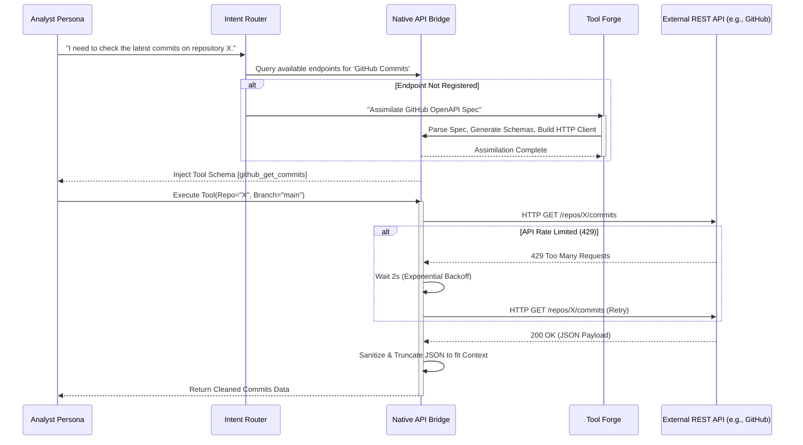

# Document 31: Native API Bridges - SillyTavern's Interface to the Real World

## 1. Introduction to Native API Bridges

While Cross-Platform Native Integrations (Doc 28) focus on bridging SillyTavern to major ecosystems like Discord or the local OS, "Native API Bridges" deal with the granular, highly specific, and infinitely expansive realm of external REST, GraphQL, and gRPC endpoints. This is how agents order pizza, check the weather, query genomics databases, or spin up cloud infrastructure.

A Native API Bridge is not merely a hardcoded `fetch` command. In the Mythic architecture of Project Ember, it is a dynamic, self-documenting, and resilient conduit that allows the Tool Forge to rapidly assimilate any external API based solely on its OpenAPI specification or semantic description.

## 2. The Dynamic Assimilation Protocol

Hardcoding specific tools for specific APIs (e.g., writing a specific tool for the Twitter API, another for the GitHub API) is an unscalable anti-pattern. SillyTavern employs the Dynamic Assimilation Protocol to instantly bridge APIs.

### 2.1. OpenAPI (Swagger) Ingestion
When an agent expresses a need to access a service, the system can be provided with an OpenAPI (Swagger) JSON/YAML file. The API Bridge module instantly parses this specification.
It automatically:
1. Generates the OpenAI-compatible JSON schemas for every endpoint.
2. Synthesizes the underlying HTTP client logic (handling headers, auth, and pagination).
3. Registers these newly assimilated endpoints into the Tool Forge registry as a new temporary Skill Constellation.

### 2.2. Zero-Shot API Integration
In cases where no OpenAPI spec exists, the system utilizes a specialized "Scout Agent." The Scout is given the URL to API documentation. It reads the docs, understands the required authentication and payload structures, and dynamically writes a custom Adapter script on the fly. This allows SillyTavern to bridge with obscure, undocumented, or proprietary internal APIs seamlessly.

## 3. Resilience and Fault Tolerance

Interacting with the real world implies interacting with chaos. External APIs experience downtime, return malformed JSON, and enforce brutal rate limits. Native API Bridges must shield the fragile context windows of the core agents from these networking failures.

### 3.1. Exponential Backoff and Jitter
The Bridge layer automatically handles HTTP 429 (Too Many Requests) and 5xx (Server Error) responses. Instead of instantly returning an error to the agent (which might cause the agent to panic and hallucinate), the Bridge implements transparent exponential backoff with jitter, attempting to resolve the network issue silently before conceding failure.

### 3.2. Semantic Error Translation
When an API returns a complex error (e.g., a massive stack trace or an obtuse XML error payload), passing this raw data to the agent wastes precious tokens and confuses the persona. The Bridge layer includes a lightweight semantic translation module. It converts obtuse errors into clean, actionable instructions: 
*(Raw Error: `{"code": 401, "msg": "Token expired or malformed signature"}` -> Translated: "The API rejected the request because your authentication token is expired. Please use the tool to refresh your token and try again.")*

## 4. Mermaid Diagram: Dynamic API Assimilation and Execution

## 5. Security and Data Exfiltration Prevention

When agents have dynamic access to the internet, the risk of data exfiltration (either malicious or accidental) skyrockets. The API Bridge acts as a strict firewall.

### 5.1. Domain Whitelisting and Egress Filtering
The Native API Bridge operates on a default-deny network policy. Agents cannot arbitrarily `curl` any URL. Endpoints must be explicitly whitelisted by the user or pre-approved by the Validation Crucible during the assimilation phase.

### 5.2. Payload Inspection (DLP)
Before an outbound request is sent, the Bridge inspects the payload using Data Loss Prevention (DLP) heuristics. If an agent attempts to send a string that matches the pattern of the user's private SSH key or a system password to an unverified external API, the Bridge intercepts the request, blocks it, and alerts the user immediately.

## 6. Webhooks and Asynchronous Callbacks

Many modern APIs are asynchronous. An agent requests a video render, and the API pings a webhook 10 minutes later when it's done.

The Native API Bridge hosts a lightweight reverse-proxy (e.g., using ngrok or a local cloudflare tunnel) to expose a secure webhook endpoint. When the external service pings this endpoint, the Bridge translates the payload into a standard `SillyTavernEvent` and injects it into the Global Event Bus (Doc 26). This allows the agent to go to sleep or perform other tasks, only to be "woken up" when the external API completes its job.

## 7. Conclusion

Native API Bridges are the tentacles of the SillyTavern ecosystem, reaching out into the vast expanse of the internet. By utilizing Dynamic Assimilation Protocols, rigorous fault tolerance, and strict egress security, Project Ember ensures that its agents can interact with any digital service with the speed and reliability of a native integration, entirely redefining the boundaries of what a roleplay environment can accomplish.
