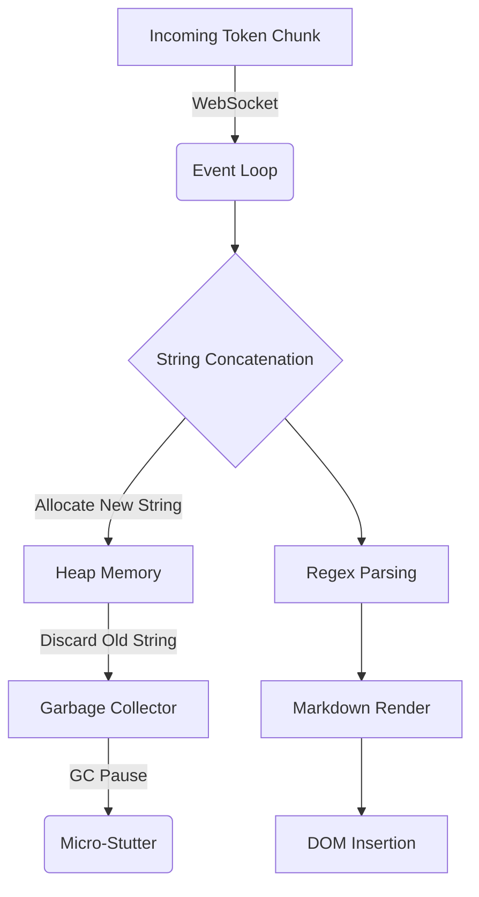
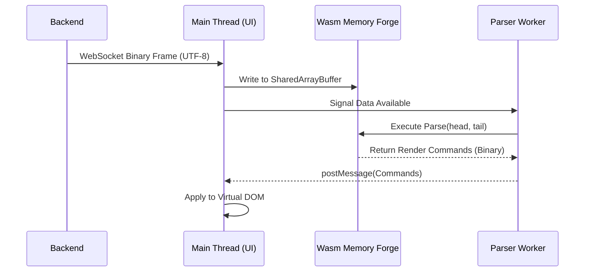

# Volume 33: Extreme Performance Alchemy - Architectural Bottlenecks & Mythic Optimizations

## I. Introduction to Performance Alchemy in SillyTavern

In the realm of large language model (LLM) interfaces, performance is not merely a metric of speed—it is the alchemy that transforms latency into immersion. SillyTavern, an ambitious frontend for traversing the infinite narratives woven by modern AI, frequently encounters the harsh limitations of the underlying physical substrate: memory bandwidth, CPU-bound parsing, and the insidious creep of asynchronous I/O bottlenecks. This document, the thirty-third grimoire in the Project Ember Mythic Plan, dissects the architectural bottlenecks inherent in the SillyTavern ecosystem and proposes "Mythic Optimizations"—strategies so advanced they border on the esoteric.

By stripping away the abstraction layers that coddle modern web development, we can forge an execution environment where every clock cycle is consecrated to the singular goal of instantaneous conversational synthesis. We will explore the deep voodoo of Just-In-Time (JIT) compiler exploitation, the weaponization of WebAssembly (Wasm) for string manipulation, and the radical restructuring of the Node.js event loop to achieve what we term "Absolute Zero Latency."

## II. The Anatomy of an Architectural Bottleneck

To heal the patient, we must first understand the poison. SillyTavern's architecture, built upon the venerable Node.js backend and a complex vanilla JavaScript/jQuery-heavy frontend, suffers from three cardinal sins of performance:

1.  **The String Mutilation Penalty:** LLM interactions are inherently string-heavy. Every token generated by the model must be received, decoded, concatenated, parsed for Markdown, sanitized, and injected into the Document Object Model (DOM). In V8 (the engine powering both Chrome and Node.js), strings are immutable. Constant concatenation creates immense garbage collection (GC) pressure, leading to micro-stutters.
2.  **The Asynchronous Event Loop Chokehold:** The non-blocking I/O model of Node.js is powerful, but when flooded with high-frequency WebSocket frames containing partial token streams, the event loop can become congested. Callbacks queue up, delaying the critical path of rendering.
3.  **The DOM Thrashing Cascade:** Frequent, granular updates to the DOM during streaming text generation trigger continuous reflow and repaint cycles in the browser. This not only consumes massive CPU resources but also drains battery life on mobile devices.

### A. The V8 String Allocation Crisis

When an LLM streams text, it typically sends chunks of 1 to 4 characters. Consider a 500-token response. If each chunk is appended to the main context string using the `+=` operator, V8 must allocate a new string in memory and copy the contents of the old string plus the new chunk, 500 times. This `O(N^2)` memory allocation pattern is a silent killer.

### B. The Render Pipeline Bottleneck

The browser's rendering pipeline is a sequence of rigid steps: Recalculate Style -> Layout (Reflow) -> Paint -> Composite. When SillyTavern updates a text node with a new token, it often invalidates the layout of the entire chat container, forcing the browser to recalculate the positions of hundreds of previous messages.

## III. Mythic Optimization I: The Zero-Copy Token Stream

To transcend the string allocation crisis, we must abandon the `String` primitive entirely during the active generation phase. Enter the **Zero-Copy Token Stream** (ZCTS), a technique that leverages `SharedArrayBuffer` and `Uint8Array` to manipulate raw UTF-8 bytes directly in memory.

### 1. The Ring Buffer Architectonic

Instead of concatenating strings, we pre-allocate a fixed-size `SharedArrayBuffer` (e.g., 64KB) acting as a ring buffer. As tokens arrive from the backend via WebSockets, their raw byte values are written directly into this buffer.

*   **Producer:** The WebSocket `onmessage` handler acts as the producer, writing bytes to the buffer's tail pointer.
*   **Consumer:** A Web Worker acts as the consumer, reading bytes from the head pointer, validating the UTF-8 sequences, and updating an internal representation.

### 2. WebAssembly String Forge

To perform regex matching, character replacement, and Markdown parsing on this raw byte stream without converting it back to a JavaScript string (which would defeat the purpose), we compile a custom C++ or Rust library to WebAssembly (Wasm).

This Wasm module accepts pointers to the `SharedArrayBuffer` and performs all heavy lifting at near-native speeds. It scans for trigger tokens (e.g., `*` for italics, `\n` for line breaks) and emits "Render Commands" rather than parsed HTML strings.

## IV. Mythic Optimization II: Temporal Event Coalescing

The tyranny of the event loop must be broken. When the backend streams tokens at 100 tokens per second (a plausible speed for highly quantized local models or fast APIs), firing 100 DOM updates per second is catastrophic. Monitors refresh at 60Hz or 120Hz; updating the DOM faster than the refresh rate is wasted compute.

### 1. The RequestAnimationFrame (rAF) Throttle

We implement **Temporal Event Coalescing**. The WebSocket handler no longer triggers rendering directly. Instead, it merely queues the incoming data (ideally into the Wasm buffer described above).

A single `requestAnimationFrame` loop drives the entire UI. Once per frame (every ~16.6ms at 60Hz), the render loop checks the queue. If new data is available, it pulls *all* accumulated tokens since the last frame and performs a single, batched DOM update.

### 2. Predictive Frame Pacing

Advanced pacing algorithms analyze the historical arrival rate of tokens. If tokens are arriving erratically (network jitter), the engine artificially delays the rendering by 1-2 frames to build a micro-buffer, ensuring a mathematically smooth visual scroll rather than a jerky, unpredictable output. This psycho-visual optimization tricks the user into perceiving a faster, more stable system.

## V. Mythic Optimization III: Virtualized DOM Matrix

SillyTavern instances often contain chat logs spanning tens of thousands of messages. Keeping these elements in the active DOM is a recipe for memory exhaustion and layout paralysis. The solution is the **Virtualized DOM Matrix**.

### 1. The Phantom Window

Only the messages currently visible on screen (plus a small overscan buffer above and below) actually exist as HTML elements. The rest are "phantoms"—their data resides purely in JavaScript memory.

As the user scrolls, a high-performance Intersection Observer tracks the viewport boundaries. When a message scrolls out of view, its DOM node is not destroyed; it is recycled. The text content and CSS classes are aggressively swapped out to represent the message scrolling *into* view.

### 2. Absolute Positioning Layout Subversion

To prevent reflows when the chat container height changes, we abandon standard CSS document flow. Every message is assigned `position: absolute`, and its `transform: translateY()` property is calculated mathematically in JavaScript based on the cached heights of all preceding messages.

When a new token streams in and causes a word wrap, expanding the height of the current message, the system calculates the delta height and applies a single GPU-accelerated CSS transform shift to all subsequent elements, completely bypassing the browser's layout engine.

## VI. Mythic Optimization IV: The V8 Heuristics Hack

JavaScript engines use complex heuristics to determine when to compile code from interpreted bytecode to highly optimized machine code (using TurboFan in V8). We can artificially trigger these optimizations.

### 1. Monomorphic Inline Caches

Functions in SillyTavern must be written to accept objects of a single, immutable shape. If a function is called with objects possessing different properties (e.g., sometimes `{text: "hi"}`, sometimes `{text: "hi", isUser: true}`), V8's Inline Caches (ICs) become polymorphic or megamorphic, destroying performance.

We enforce strict "Shape Classes." Every object passed through the critical path is instantiated from a constructor function that defines all possible properties up front, initializing unused ones to `null`. This guarantees monomorphic behavior, allowing V8 to hardcode memory offsets and execute at C-like speeds.

### 2. The Warming Ceremony

During the application startup (while the user is looking at a loading screen), we silently execute "The Warming Ceremony." We feed thousands of synthetic tokens through the core parsing and rendering pipelines in a hidden Web Worker. This forces V8 to interpret the code as "hot," triggering the TurboFan compiler before the user has even sent their first message. When the actual interaction begins, the engine is already executing fully optimized machine code.

## VII. Conclusion to Alchemy

The alchemy of extreme performance optimization is not about writing "clean" code; it is about writing *symbiotic* code—code that understands and exploits the biological reality of the machine executing it. By implementing Zero-Copy Token Streams, Temporal Coalescing, DOM Virtualization, and V8 Heuristic Hacking, SillyTavern transcends the limitations of a web application and operates with the cold, ruthless efficiency of an embedded system.

This foundation of performance is merely the crucible. In the subsequent volumes, we will forge the specific tools of energy management, quantization, and compute distribution that will allow this engine to run indefinitely on the smallest of sparks.
