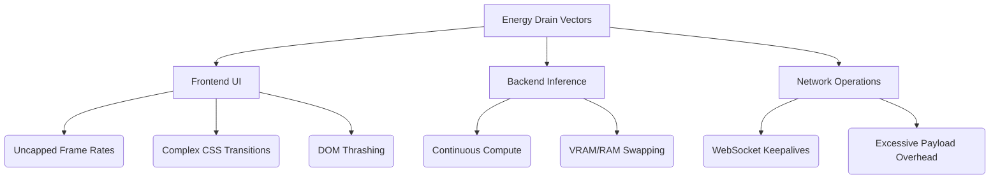

# Volume 34: Battery and Thermal Management - V-Sync for LLM Interfaces & Energy-Aware Scheduling

## I. The Thermodynamics of Thought

The generation of synthetic intelligence is a physical process. The transmutation of floating-point matrices into coherent language extracts a tangible toll in the form of heat and electrical drain. As SillyTavern expands its dominion from desktop workstations to mobile devices, tablets, and embedded systems under Project Ember, raw performance must be chained to the realities of thermodynamics and battery chemistry. 

A high-performance application that drains a device's battery in thirty minutes or forces the CPU into thermal throttling is fundamentally flawed. This thirty-fourth document establishes the dogmas of Energy-Aware UI design, introducing revolutionary concepts such as "LLM V-Sync," thermal-predictive scheduling, and power-state adaptive rendering. 

## II. The Invisible Drain: Identifying Thermal Culprits

To optimize energy consumption, we must identify where the joules are being squandered. In a local LLM ecosystem, the backend inference engine (e.g., llama.cpp, Koboldcpp) is the primary consumer. However, the frontend is far from innocent. 

1.  **The Rendering Furnace:** Continuously painting new text to a high-resolution display at 120Hz while parsing complex Markdown and managing CSS animations requires sustained GPU and CPU engagement.
2.  **The Polling Plague:** Frequent network requests, WebSocket ping/pongs, and active state polling prevent the network interface controller (NIC) and the CPU from entering low-power sleep states (C-states).
3.  **Memory Churn:** The aggressive garbage collection cycles detailed in Volume 33 do more than cause stutter; memory allocation and deallocation operations are highly energy-intensive.



## III. The Core Concept: LLM V-Sync

In video games, V-Sync (Vertical Synchronization) caps the frame rate to match the monitor's refresh rate, preventing screen tearing and wasted GPU cycles. We propose an analogue: **LLM V-Sync**.

LLM V-Sync divorces the rate of token generation from the rate of visual presentation, synchronizing the rendering engine not to the display, but to the user's cognitive reading speed and the device's thermal envelope.

### 1. Cognitive Frame Pacing

Human reading speeds rarely exceed 400-500 words per minute (roughly 10-12 tokens per second). However, modern local LLMs can generate at 50, 80, or 100+ tokens per second. 

Instead of aggressively updating the UI every time a token arrives (which costs energy), LLM V-Sync buffers the incoming tokens. It updates the screen in larger "cognitive chunks" (e.g., rendering a full sentence or a line break at once) rather than character by character. 

If the model is generating at 100 t/s, rendering 100 times a second is an egregious waste of battery. LLM V-Sync throttles the DOM updates to a maximum of 5 or 10 updates per second, saving massive amounts of CPU time while remaining visually fluid to the reader.

### 2. Saccadic Masking Exploitation

The human eye essentially goes blind during rapid movements called saccades (e.g., when moving from the end of one line to the beginning of the next). By tracking eye movement (via device cameras if permitted, or via heuristic prediction based on scroll velocity and text length), the rendering engine can completely halt DOM updates during these micro-seconds of blindness, further conserving micro-joules of energy.

## IV. Energy-Aware Scheduling and Thermal Throttling

Project Ember must not merely react to the operating system's battery saver mode; it must proactively manage its own power state.

### 1. The Power Matrix State Machine

SillyTavern will implement an internal Power Matrix, observing the `navigator.getBattery()` API (where available) and internal performance counters to classify its state:

*   **State 0: Overdrive (AC Power, High Thermal Headroom):** Uncapped animations, real-time token streaming, speculative background pre-fetching.
*   **State 1: Sustained (Battery > 50%, Normal Temp):** LLM V-Sync engaged (max 15fps UI updates), CSS blur filters disabled, background tasks scheduled to coalesce.
*   **State 2: Endurance (Battery < 20% OR High Temp):** Hard UI cap at 5fps. "Chunked" text rendering only (updates only on punctuation). UI elements switch to purely flat colors. WebSockets switch to aggressive long-polling to allow the radio to sleep.
*   **State 3: Survival (Battery < 5%, Critical Temp):** Pure text mode. No avatars, no CSS styling beyond basic layout. Network requests heavily batched.

### 2. Thermal Predictive Halting

Modern processors throttle themselves when they get too hot, ruining the token generation rate. A smart frontend can predict this. By analyzing the time-delta between incoming tokens, the frontend can detect the onset of backend thermal throttling (as generation latency increases non-linearly).

When thermal throttling is detected, the frontend can actively send a signal to the backend (via API) to pause generation for a micro-sleep period (e.g., 500ms), allowing the CPU/GPU to shed heat before resuming. This "pulse-width modulated" inference ultimately results in higher average throughput and lower peak temperatures than grinding against the thermal ceiling.

## V. CSS and Paint Optimization for OLEDs

A significant portion of energy drain on mobile devices originates from the display panel, specifically OLED screens where each pixel emits its own light.

### 1. True Black Dominance

While "Dark Mode" is standard, "True Black Mode" is essential for OLED power management. Every pixel assigned `#000000` is physically turned off, consuming zero power. Project Ember mandates an automated OLED optimization pass that strips deep grays (e.g., `#1A1A1A`) and forces them to absolute black, increasing contrast while drastically reducing milliampere draw.

### 2. The Cost of Compositing

Certain CSS properties require the GPU to create off-screen textures and composite them, drawing massive power. The worst offenders are `box-shadow`, `backdrop-filter: blur()`, and `filter: drop-shadow()`.

In Endurance and Survival states, an injected global stylesheet instantly invalidates all expensive compositing operations.

```css
/* Energy-Aware Fallback Stylesheet */
.energy-saver-mode * {
    box-shadow: none !important;
    backdrop-filter: none !important;
    text-shadow: none !important;
    border-radius: 0 !important; /* Reduces math required for clipping */
    animation: none !important;
    transition: none !important;
}
```

## VI. Re-architecting the Network Layer for Low Power

Radios (Wi-Fi and Cellular) are power-hungry beasts. When a WebSocket connection is held open, it prevents the modem from entering Deep Sleep.

### 1. The Heartbeat Paradox

WebSockets require "ping/pong" heartbeats to prevent idle timeouts. If the user is staring at a long message, reading it for two minutes, these heartbeats continue to wake the radio.

We implement an **Intelligent Disconnect Protocol**. If no active generation is occurring, and the user hasn't typed for 15 seconds, the WebSocket is deliberately severed. The application falls back to a dormant state. The exact moment the user focuses the text input field, the WebSocket is aggressively re-established in the background, making the connection appear seamless while saving minutes of radio uptime.

## VII. Synthesis: The Cold Engine

Performance without restraint is a brief, fiery explosion. Performance governed by intelligent thermal and battery management is an enduring, relentless engine. By implementing LLM V-Sync, dynamic power states, and aggressive radio management, SillyTavern transitions from a heavy web application to a lightweight, symbiotic entity that respects the physical constraints of its host vessel. 

The heat of the forge is necessary to build the sword, but in battle, the steel must remain cold.
