# Volume 35: Model Quantization Mastery - Offloading Strategies & Precision-Driven Resource Tuning

## I. The Imperative of Compression

The ambition of Project Ember is to untether the large language model from the server rack and bind it to the personal device. However, the sheer mathematical mass of modern LLMs—often spanning tens of billions of parameters—presents an existential threat to local execution. An uncompressed 70-billion parameter model demands hundreds of gigabytes of VRAM, a luxury unavailable to consumer hardware.

The thirty-fifth volume of the Mythic Plan delves into the arcane arts of Model Quantization. We move beyond simple "shrinkage" and explore dynamic offloading, precision-driven resource tuning, and the exploitation of heterogeneous memory architectures to force massive intelligence into microscopic silicon footprints.

## II. The Spectrum of Quantization

Quantization is the process of mapping continuous infinite values to a smaller set of discrete finite values. In the context of LLMs, this means converting 16-bit or 32-bit floating-point weights (FP16/FP32) into lower precision formats (e.g., INT8, INT4, or even ternary/binary representations) with minimal loss of perplexity.

### 1. Post-Training Quantization (PTQ) vs. Quantization-Aware Training (QAT)

While QAT yields superior results, it requires access to the original training pipeline. Project Ember primarily operates on the PTQ paradigm, manipulating pre-trained weights.

We employ advanced PTQ methods such as **AWQ (Activation-Aware Weight Quantization)** and **GPTQ**. Unlike naive linear quantization, these methods analyze the activation patterns of the model on a calibration dataset. Weights that significantly impact the output are retained at higher precision, while less critical weights are aggressively compressed.

### 2. The Frontier: K-Quants and EXL2

The current meta for local execution relies heavily on the GGUF format and its associated "K-quants." 

*   **Mixed Precision Block Quantization:** Instead of applying a uniform 4-bit precision across the entire model, K-quants segment the model's tensors into blocks. Critical tensors (like the attention output projections) might be stored in 6-bit precision, while massive feed-forward network (FFN) layers are crushed down to 3-bit or 2-bit precision.
*   **EXL2 Format:** For pure GPU execution, EXL2 allows for arbitrary bitrates (e.g., 4.25 bits per weight). This enables users to fill their exact VRAM capacity to the very last megabyte, maximizing model size for their specific hardware.

## III. Dynamic Offloading Strategies

When a model, even quantized, exceeds available VRAM, the system must resort to offloading—splitting the model across the GPU, system RAM, and occasionally, high-speed NVMe storage.

### 1. The Paged Attention Paradigm

Inherited from vLLM, Paged Attention revolutionizes how the KV Cache (the memory storing the context of the conversation) is managed. 

Instead of pre-allocating contiguous blocks of memory for the maximum possible context size (which wastes massive amounts of VRAM), Paged Attention divides the KV cache into fixed-size pages, similar to an operating system's virtual memory. These pages are allocated non-contiguously on demand. When VRAM fills up, inactive pages can be swiftly swapped to system RAM, freeing GPU space for active computation.

### 2. Asynchronous Tensor Pipelining

When a model is split across GPU and CPU (via system RAM), the latency bottleneck is the PCI-Express bus. 

Project Ember proposes an **Asynchronous Tensor Pipeline**. While the GPU is computing Layer `N`, the CPU (or DMA controller) is simultaneously transferring the weights for Layer `N+1` across the PCIe bus. This hides the transfer latency behind the compute latency. If the compute time > transfer time, the transfer effectively takes "zero time."

```mermaid
gantt
    title Asynchronous Tensor Pipelining
    dateFormat  s
    axisFormat  %S

    section Compute (GPU)
    Layer 1 Compute :active, c1, 0, 2s
    Layer 2 Compute :active, c2, 2, 2s
    Layer 3 Compute :active, c3, 4, 2s

    section Transfer (PCIe)
    Layer 2 Weights :done, t1, 0, 1.8s
    Layer 3 Weights :done, t2, 2, 1.8s
    Layer 4 Weights :done, t3, 4, 1.8s
```

## IV. Precision-Driven Resource Tuning

Not all parts of a conversation require the same level of intellectual rigor. A casual greeting does not require the full analytical depth of a 70B model; a complex philosophical debate does.

### 1. Dynamic Speculative Decoding

Speculative decoding uses a tiny, hyper-fast "draft" model (e.g., a 1B parameter model) to generate several potential tokens. The massive "target" model (e.g., 70B) then evaluates these tokens in a single, parallel forward pass. If the target model agrees with the draft, multiple tokens are accepted at the cost of a single pass, massively increasing tokens-per-second (TPS).

Project Ember introduces **Precision-Driven Speculation**. The drafting model's parameters are dynamically tuned based on the semantic complexity of the user's prompt. 

### 2. Mixture of Experts (MoE) Routing Manipulation

In MoE architectures (like Mixtral), a router network decides which "experts" (sub-networks) process each token. Usually, 2 experts are active per token.

To preserve battery or VRAM during high-load scenarios, Project Ember intercepts the router logits. We implement a "Strict Compute Budget" that forces the model to route tokens to only *one* expert, effectively halving the compute requirement on the fly, with only a marginal degradation in output quality. 

## V. The Unified Memory Architecture (UMA) Advantage

Apple Silicon (M-series chips) and certain integrated PC graphics (APUs) employ Unified Memory Architecture. The CPU and GPU share the same physical RAM pool, eliminating the PCIe bottleneck entirely.

### 1. Zero-Copy Inference on UMA

On traditional discrete GPUs, weights must be copied from RAM to VRAM. On UMA systems, the GPU can read the weights directly from system RAM. 

However, standard inference engines often still perform unnecessary internal copies. Project Ember mandates the use of memory-mapped files (`mmap`). The OS maps the quantized model file directly into the virtual address space. The UMA GPU accesses the physical memory pages directly, bypassing the OS page cache and the CPU entirely. This "Zero-Copy" execution reduces memory bandwidth utilization by nearly 50%, a critical optimization for thermal management.

## VI. Conclusion

Model Quantization is no longer a static process applied before execution; it is a dynamic, living system. By manipulating precision on the fly, mastering asynchronous offloading, and exploiting hardware-specific architectures like UMA, Project Ember ensures that the sheer mass of modern AI models can be wielded with surgical precision.

The illusion of infinite intelligence is maintained not by infinite resources, but by the absolute mastery of the finite.
