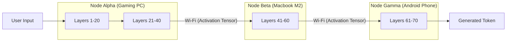

# Volume 36: Dynamic Compute Distribution - Multi-Node Load Balancing & Heterogeneous Compute Matrices

## I. The Shattered Monolith

The conventional approach to running Large Language Models (LLMs) relies on a monolithic architecture: a single massive GPU or a homogenous cluster of identical accelerators. This paradigm is rigid, expensive, and entirely unsuitable for the vision of Project Ember, which seeks to democratize intelligence across fragmented, everyday hardware.

Volume 36 of the Mythic Plan details the architecture of **Dynamic Compute Distribution**—the ability to shatter the inference process and distribute it across a Heterogeneous Compute Matrix (HCM). This involves seamlessly linking disparate devices—a high-end gaming PC, an aging laptop, and a smartphone—into a unified, ad-hoc supercomputer dedicated to the singular task of conversational synthesis.

## II. The Heterogeneous Compute Matrix (HCM)

The HCM treats every available computational device on a local network (or connected via a secure tunnel) as a "node." Unlike traditional clusters, these nodes are asymmetrical; they possess vastly different compute capabilities, memory bandwidths, and network latencies.

### 1. Node Profiling and Capability Discovery

When a node joins the Ember Matrix, it undergoes a rapid profiling phase. The system quantifies:
*   **FLOPS:** Raw floating-point operations per second (FP16 and INT8).
*   **VRAM/RAM Capacity:** Total available memory for weight storage.
*   **Memory Bandwidth:** The speed at which weights can be fed to the compute units (often the true bottleneck).
*   **Network Latency:** The round-trip time between the master node and the worker node.

This data is compiled into a dynamic "Compute Topology Map."

### 2. Tensor Parallelism vs. Pipeline Parallelism

To distribute a model, we employ two primary strategies:

*   **Tensor Parallelism (Intra-layer):** A single neural network layer is sliced vertically. Node A computes the left half of the matrix multiplication, Node B computes the right half. They then communicate via an All-Reduce operation to combine the results. *Requirement: Ultra-low latency connections (e.g., NVLink).*
*   **Pipeline Parallelism (Inter-layer):** The model is sliced horizontally. Node A holds Layers 1-10, Node B holds Layers 11-20. Node A processes a token, passes the activation state over the network to Node B, which continues the processing. *Requirement: High bandwidth, tolerant of moderate latency (e.g., Gigabit Ethernet/Wi-Fi).*

For a consumer-grade HCM spanning Wi-Fi networks, **Pipeline Parallelism is the only viable strategy.**

## III. Multi-Node Load Balancing

Distributing layers naively across devices of different speeds results in a "straggler problem." If Node Gamma (the smartphone) takes 500ms to process its layers, Node Alpha (the gaming PC) will sit idle, waiting. The entire pipeline moves at the speed of the slowest node.

### 1. Asymmetrical Layer Assignment

To achieve perfect load balancing, the master node assigns layers based on the measured Memory Bandwidth of each device (as LLM inference is memory-bandwidth bound, particularly at batch size 1).

If Node Alpha has 1000 GB/s bandwidth and Node Beta has 100 GB/s bandwidth, Node Alpha is assigned 10x more layers than Node Beta. The goal is for all nodes to finish their assigned computational chunk at the *exact same microsecond*.

### 2. Dynamic Rebalancing (The Fluid Matrix)

Network conditions fluctuate. A device might suddenly throttle due to heat. The Ember Matrix implements continuous telemetry.

If Node Beta begins to overheat and throttle its clock speeds, its inference time per layer will increase. The master node detects this latency spike in real-time. On the very next generation cycle, the master node commands a "Live Migration" of layers. Node Beta drops layers 50-60 from memory, and Node Alpha loads them from disk (or via network transfer if not already cached).

This ensures that the pipeline self-heals and maintains optimal throughput regardless of individual node degradation.

## IV. Advanced Matrix Topologies

### 1. The Ring-Attention Construct

When dealing with massive context windows (e.g., 1 million tokens), the KV Cache size becomes astronomical, exceeding the memory of any single node. 

We implement **Ring Attention**. The context is divided into chunks. Each node holds a specific chunk of the KV cache. As the query tensor passes through the network, it travels in a ring topology. Node A attends to its chunk, passes the intermediate attention scores to Node B, which attends to its chunk and updates the scores, and so on. This distributes both compute *and* memory linearly across the Matrix.

### 2. Speculative Distributed Decoding

We can combine the speculation techniques from Volume 35 with the HCM.

*   **The Draft Node:** The weakest device on the network (e.g., the smartphone) runs a tiny 1B parameter model locally. It generates a stream of 5 "draft" tokens.
*   **The Oracle Node:** The powerful desktop PC runs the massive 70B parameter target model. It receives the 5 draft tokens over the network and verifies them all in parallel.

This "Edge-Drafting" topology allows the mobile device to feel instantly responsive (as it generates tokens locally), while relying on the heavy backend only for periodic correction and verification, massively reducing network traffic and latency.

## V. Network Protocol Hardening for the HCM

Standard HTTP or REST protocols introduce unacceptable overhead for transferring raw tensor data (the activation states) between nodes.

The Ember Matrix relies on a custom binary protocol operating over UDP with application-layer reliability (similar to QUIC). Activation tensors are serialized directly from memory, compressed using fast algorithms like LZ4 or Zstd (if compute allows), and blasted across the network without serialization overhead (like JSON encoding).

## VI. Conclusion

Dynamic Compute Distribution transforms the environment itself into a supercomputer. By abstracting the model away from a single piece of hardware and distributing it fluidly across a Heterogeneous Compute Matrix, Project Ember achieves resilience, scalability, and efficiency. 

The user no longer runs a model *on* a device; the model exists as an ambient intelligence, dynamically pooling the computational resources of the user's entire technological ecosystem.
