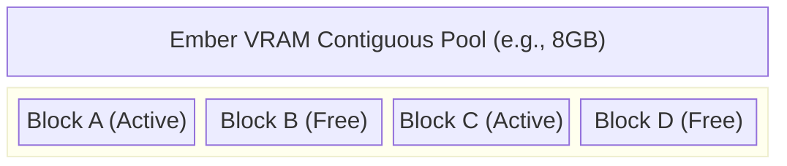

# Volume 37: Resource Efficiency Protocols - VRAM Memory Pooling & Zero-Copy Inference Strategies

## I. The Cult of Scarcity

In the theater of Large Language Models, Video RAM (VRAM) is the most precious commodity. It is the blood that sustains the neural network; without it, the entity crashes, out of memory, out of mind. Project Ember's thirty-seventh directive codifies the "Cult of Scarcity"—a paradigm where every byte of memory is accounted for, pooled, and recycled with fanatical efficiency.

We must move beyond the naive memory allocation strategies of standard inference engines and implement draconian Resource Efficiency Protocols (REPs). This document details the construction of VRAM Memory Pools, the elimination of redundant data copies through Zero-Copy inference, and the aggressive purging of computational exhaust.

## II. The Pathology of VRAM Fragmentation

When an LLM operates, especially during long conversational contexts, memory is allocated and deallocated constantly to store the KV (Key-Value) cache of previous tokens. 

Standard memory allocators (like `malloc` or `cudaMalloc`) suffer from fragmentation. As blocks of varying sizes are freed, "holes" appear in the VRAM. Eventually, the system might have 4GB of free VRAM, but because it is scattered in tiny, non-contiguous chunks, it cannot allocate a necessary 1GB continuous block, triggering an Out-Of-Memory (OOM) error.

### 1. The Ember VRAM Memory Pool

To annihilate fragmentation, Project Ember implements a custom **Memory Pool Allocator**. 

Upon initialization, SillyTavern (via its backend proxy) claims a massive, single, contiguous chunk of VRAM—essentially taking the GPU hostage. The Ember engine then manages this memory internally, completely bypassing the operating system's allocator.

The pool is divided into a strict hierarchy of slab sizes. When a tensor requires memory, the allocator provides a pointer to an pre-existing block. When the tensor is discarded, the block is merely marked as "available" in a bitmask. No system calls are made; fragmentation is mathematically impossible.

## III. Zero-Copy Inference: The Holy Grail of Bandwidth

In a standard system, data travels a convoluted path: from the Disk, to System RAM, over the PCIe bus to VRAM, into the GPU cores, back to VRAM, back over the PCIe bus to RAM, and finally to the CPU for output. Every "copy" consumes time, power, and bandwidth.

### 1. Direct Memory Access (DMA) and mmap

We deploy `mmap` (Memory-Mapped Files) to link the model weights on the NVMe SSD directly into the virtual address space. 

Furthermore, we utilize **GPUDirect Storage** (or equivalent APIs). This allows the GPU's DMA controllers to read the model weights directly from the NVMe SSD into VRAM, completely bypassing the CPU and System RAM. The CPU merely coordinates the transaction; it never touches the data.

### 2. The Unified Tensor Lifecycle

Once a tensor is loaded, it must never be copied again. If a layer requires an activation tensor to be reshaped or permuted, we do not create a new tensor. Instead, we alter the *stride* metadata of the tensor. 

The data remains physically stationary in VRAM, but the GPU reads it in a different pattern. This metadata-only manipulation is a true Zero-Copy operation, executing in O(1) time regardless of tensor size.

## IV. KV Cache Compression and Eviction

The KV Cache scales linearly with the context size. A 100k context window can consume more VRAM than the model weights themselves.

### 1. Token Attention Pruning (Heavy Hitters)

Not all tokens are equally important. The word "the" from fifty messages ago contributes almost nothing to the current generation, yet its KV vectors occupy valuable VRAM.

Project Ember implements **Attention Pruning**. We track the attention scores of every token. Tokens that consistently receive low attention (the "lightweights") are aggressively evicted from the VRAM cache. Only the "Heavy Hitters"—tokens crucial for semantic understanding (names, key facts, recent context)—are retained in VRAM. The pruned tokens are either discarded or compressed and banished to slow System RAM.

### 2. KV Cache Quantization

If weights can be quantized, so can the cache. Standard KV caches use FP16. We enforce **KV Cache Quantization** down to INT8 or even FP8. This instantly halves the VRAM requirement for the context window with negligible impact on perplexity, effectively doubling the maximum possible context length on the same hardware.

## V. Conclusion

Resource Efficiency is the quiet war fought in the nanoseconds and the kilobytes. By establishing a rigid VRAM Memory Pool, enforcing Zero-Copy data pathways, and ruthlessly pruning the KV cache, Project Ember achieves a density of computation that defies standard hardware limitations. We do not merely use the hardware; we dominate it, squeezing every drop of utility from the silicon.
