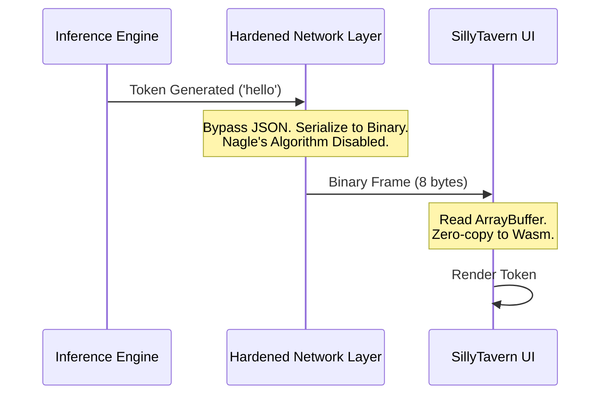

# Volume 38: Network Latency Annihilation - WebSocket Protocol Hardening & Predictive Prefetching

## I. The Millisecond War

The illusion of localized intelligence is shattered the moment the user perceives the network. When Project Ember operates in a distributed matrix or connects to a remote inference node, the speed of light and the inefficiency of the TCP/IP stack become the primary adversaries. A 50-millisecond ping may be acceptable for a web page, but it is fatal for real-time conversational synthesis.

Volume 38 details the strategies for **Network Latency Annihilation**. We will dissect the WebSocket protocol, strip away its fat, and implement predictive algorithms that allow the system to answer before the user has even finished asking.

## II. WebSocket Protocol Hardening

WebSockets provide full-duplex communication, but they are built atop TCP, which is inherently designed for reliability, not latency. 

### 1. Disabling Nagle's Algorithm (TCP_NODELAY)

By default, TCP implements Nagle's Algorithm, which buffers small packets together to reduce network congestion. When streaming tokens (which are often just a few bytes each), Nagle's Algorithm introduces an artificial delay, waiting to see if more data will arrive before sending the packet.

Project Ember mandates the absolute enforcement of `TCP_NODELAY` on all sockets. The moment a token is generated, it is fired across the network, regardless of packet size efficiency. We trade bandwidth for absolute minimum latency.

### 2. Binary Framing and Custom Serialization

JSON is the language of the web, but it is an abomination for performance. Parsing JSON strings costs CPU cycles and bloats the payload.

SillyTavern's communication layer must be rewritten to utilize pure binary WebSocket frames. We define a custom, ultra-lean binary protocol using FlatBuffers or Cap'n Proto.

*   **Standard JSON Payload:** `{"type": "token", "data": "hello", "id": 12345}` (45 bytes)
*   **Ember Binary Payload:** `[0x01] [0x30 0x39] [0x68 0x65 0x6C 0x6C 0x6F]` (8 bytes - Type Header, ID, UTF-8 String)

This 80% reduction in payload size drastically reduces transmission time and eliminates parsing overhead on the client.

## III. Predictive Prefetching and Speculative Execution

The ultimate way to hide latency is to execute operations before they are requested.

### 1. Keystroke-Level Speculation

While the user is typing their message in the SillyTavern input box, the engine should not be idle.

Project Ember implements **Keystroke-Level Speculation**. As the user types, a background thread sends the incomplete sentence to the backend. The LLM begins calculating the KV cache for the prompt *while it is still being typed*.

If the user types: `"What is the meaning of "`
The LLM has already processed those 5 tokens into its cache. When the user hits Enter after typing `"life?"`, the LLM only has to process the final token before beginning generation. This completely masks the "Time to First Token" (TTFT) behind the user's own typing speed.

### 2. Speculative UI Asset Loading

Based on the context of the conversation, the system can predict which UI assets will be needed. If the character's sentiment analysis indicates a shift to "angry," the frontend silently pre-fetches the "angry" character sprite into RAM before the generation has even finished, ensuring a zero-delay expression change when the text finally arrives.

## IV. The UDP/QUIC Horizon

For extreme scenarios—such as distributed compute matrices operating over volatile Wi-Fi networks (as detailed in Volume 36)—even hardened TCP WebSockets are insufficient due to "head-of-line blocking" (where a single lost packet halts the entire stream).

Project Ember's long-term objective is the implementation of **WebTransport (over QUIC/UDP)**. QUIC operates over UDP, providing multiplexed streams. If a packet containing Token #4 is lost, Token #5 and #6 can still be delivered and rendered immediately, while Token #4 is re-requested in the background. This guarantees uninterrupted flow even on severely degraded networks.

## V. Conclusion

Latency is friction, and friction destroys the illusion of intelligence. By hardening the network protocols, abandoning bloated web standards for raw binary frames, and anticipating the user's intent through speculative execution, Project Ember bridges the physical gap between the client and the core. The network ceases to be a bottleneck; it becomes an invisible extension of the local bus.
