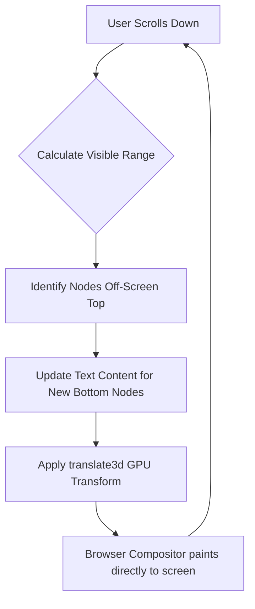

# Volume 39: Rendering Pipeline Hyper-Optimization - DOM Virtualization & WebGL Accelerated UI

## I. Escaping the Document Object Model

The Document Object Model (DOM) is a tree structure designed in the 1990s to display static text documents. It was never intended to act as a 120Hz canvas for a real-time, streaming neural network interface. When SillyTavern pushes thousands of tokens into complex HTML structures (nested divs, markdown tables, code blocks, and CSS-styled avatars), the browser's layout engine collapses under the geometric complexity.

Volume 39 of the Mythic Plan details the ultimate escape from this paradigm: the virtualization of the DOM and the radical transition to a WebGL-accelerated UI rendering pipeline.

## II. The Architecture of DOM Virtualization

As touched upon in Volume 33, DOM virtualization is essential. However, true "Hyper-Optimization" requires moving beyond simple infinite-scroll techniques to a deterministic, mathematically rigid layout engine built entirely in JavaScript.

### 1. The Shadow Layout Engine

The browser's native layout engine is a black box that reflows the entire page when a single element changes. We must bypass it. 

Project Ember implements a **Shadow Layout Engine**. When a message arrives, it is not placed into the DOM to measure its height. Instead, a background Web Worker utilizing the `OffscreenCanvas` API measures the precise pixel width and height of the text block based on the current font metrics.

The Shadow Engine calculates the absolute `X, Y` coordinates for every single message in the chat history. The actual DOM is reduced to a single, absolute-positioned container.

### 2. The Recycled Node Pool

When the user scrolls, the engine does not create or destroy HTML elements. It maintains a strict pool of (for example) 30 `
` elements. 

As a message scrolls out of the top of the viewport, its corresponding `
` is teleported to the bottom of the viewport via a GPU-accelerated CSS `transform: translate3d(x, y, z)`. Its text content is instantly swapped to the new incoming message. This results in zero garbage collection, zero DOM allocation, and zero reflows.

## III. WebGL Accelerated Text Rendering

To achieve "Absolute Zero Latency," even the Recycled Node Pool may be insufficient for high-density information display (e.g., massive coding outputs or complex RP environments). The ultimate solution is to abandon the DOM entirely for the main chat interface and render the text directly to the GPU using WebGL.

### 1. Signed Distance Fields (SDF)

Rendering crisp text in WebGL is notoriously difficult because standard textures become pixelated when scaled. We employ **Signed Distance Fields (SDF)**.

Instead of storing pixels of a font, an SDF texture stores the *distance* to the edge of the nearest character outline. In the WebGL fragment shader, this distance is mathematically evaluated to draw a perfectly sharp vector line at any zoom level or resolution. This is the exact technology used by modern AAA video game engines to render UI text.

### 2. The Glyph Batching Matrix

Every letter in the chat log is treated as a 3D quad (two triangles). 

When a token streams in, the engine maps it to its SDF texture coordinates and appends it to a massive `Float32Array` (a Vertex Buffer Object - VBO). The entire visible chat log—thousands of characters—is rendered by the GPU in a *single draw call*. 

This reduces the CPU's rendering overhead from hundreds of milliseconds (DOM layout) to literally less than 1 millisecond.

## IV. The CSS/WebGL Hybrid Architecture

WebGL is unparalleled for rendering massive amounts of text and particle effects, but it is terrible for accessibility, text selection, and standard web inputs (like text areas).

Project Ember utilizes a **Hybrid Architecture**:

1.  **The Canvas Core:** A `<canvas>` element sits at `z-index: 0`. It uses WebGL/SDF to render the avatar images, the background environments, and all the chat text at 120fps.
2.  **The Phantom DOM:** At `z-index: 1`, an invisible DOM layer exists. It contains transparent HTML text that perfectly overlaps the WebGL text. This allows the user to click, drag, highlight, and copy text exactly as they would on a normal webpage, and allows screen readers to function properly.
3.  **The Interactive Layer:** Standard HTML input fields and buttons (which require complex state management) sit at `z-index: 2`, seamlessly blending with the WebGL background.

## V. Conclusion

The Rendering Pipeline Hyper-Optimization is the final step in decoupling the interface from the underlying OS/Browser limitations. By calculating layouts in a deterministic Shadow Engine and painting text directly to the silicon via WebGL, SillyTavern transitions from a web application into a high-performance graphics engine. 

It becomes an interface capable of rendering the thoughts of a machine as fast as the machine can think them, bounded only by the refresh rate of the monitor itself.
