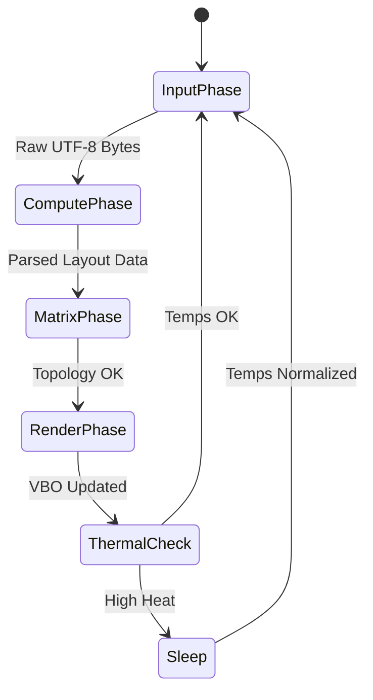

# Volume 40: The Ember-ClawLite Synthesis - Unified Execution of High-Efficiency LLM Interaction

## I. The Convergence

The preceding thirty-nine volumes of the Mythic Plan have laid out a theoretical and architectural framework of unprecedented ambition. We have dissected the atom of execution, rewritten memory allocation, subverted network protocols, and bound the rendering pipeline to the raw geometry of the GPU. 

However, scattered optimizations do not constitute a system. Volume 40—the culmination of this phase of Project Ember—details the **Ember-ClawLite Synthesis**. This is the unifying theory of operation, the master control program that orchestrates the alchemical chaos into a singular, highly efficient stream of LLM interaction.

## II. The Architecture of Synthesis

The Ember-ClawLite engine is not a monolith; it is an orchestrator of specialized, autonomous micro-systems operating within the browser and backend environments. 

### 1. The Core Loop

The Synthesis replaces the traditional event-driven architecture with a rigid, deterministic "Game Loop." This loop ticks at the refresh rate of the host device (e.g., 60Hz or 120Hz).

1.  **Input Phase:** Network buffers (from WebSockets) and UI inputs (keystrokes) are read and cleared.
2.  **Compute Phase:** The Wasm-compiled Markdown parser evaluates new tokens. The Shadow Layout Engine calculates new geometry.
3.  **Matrix Phase (If distributed):** Telemetry from the Heterogeneous Compute Matrix is analyzed. Load balancing adjustments are prepared for the next token batch.
4.  **Render Phase:** The WebGL glyph buffers are updated. A single `requestAnimationFrame` call triggers the GPU draw call.
5.  **Thermal/Power Check:** If thermal throttling is detected, or the battery drops a percentile, the engine downgrades its power state (as per Volume 34) and yields CPU time.

## III. The Execution of the "Absolute Zero" Interaction

Let us trace the lifecycle of a single interaction under the Ember-ClawLite Synthesis, demonstrating how the systems coalesce.

1.  **Keystroke (Speculative Phase):** The user types the first word of a prompt. The *Network Latency Annihilation* module (Vol. 38) instantly beams the partial string over a hardened TCP/UDP socket. The backend LLM begins calculating the KV cache.
2.  **Submission (Zero-Copy Phase):** The user hits Enter. The final token is sent. The *Dynamic Compute Distribution* matrix (Vol. 36) has already allocated the necessary compute nodes. The weights are read via *Zero-Copy Inference* (Vol. 37) straight from NVMe to VRAM.
3.  **Generation (V-Sync Phase):** The LLM generates tokens at 80 t/s. The frontend receives them via raw binary frames. Instead of thrashing the DOM, the *LLM V-Sync* module (Vol. 34) buffers them, waiting for the cognitive frame pacing threshold.
4.  **Rendering (Hyper-Optimization Phase):** The *Wasm String Forge* (Vol. 33) parses the Markdown in microseconds. The *Shadow Layout Engine* (Vol. 39) calculates the new absolute coordinates. The *WebGL UI* (Vol. 39) updates its Signed Distance Field glyphs and paints the entire response in a single, sub-millisecond draw call.

To the user, the delay between hitting "Enter" and seeing a beautifully rendered, fully formatted response is imperceptible. It feels less like software processing data, and more like a physical law of nature.

## IV. The Autonomous Maintenance Daemons

The Ember-ClawLite system must maintain itself indefinitely without user intervention.

*   **The Garbage Collector (GC) Assassin:** By utilizing the ring buffers and Memory Pools (Vol. 37), the engine produces almost zero JS garbage. However, for the few objects that must be collected, the GC Assassin monitors the `performance.memory` API. It waits for the exact moment the user looks away (detected via saccadic masking or idle input) to trigger a manual V8 garbage collection, ensuring the inevitable GC pause never interrupts a frame of generation.
*   **The KV Cache Reaper:** As the conversation progresses, the *Attention Pruning* algorithms constantly run in the background, executing the "lightweight" tokens and compressing the history to maintain the VRAM pool within strict bounds.

## V. Epilogue: The Efficiency Alchemist's Promise

The Ember-ClawLite Synthesis is not an update to SillyTavern; it is an exorcism. It drives out the bloated dependencies, the inefficient abstractions, and the lazy memory management of modern web development.

What remains is pure, crystallized logic. An interface that honors the staggering mathematical complexity of the LLMs it connects to by meeting them with equal and opposite engineering rigor. Project Ember is now ready to forge the intelligence of the future on the hardware of today.
