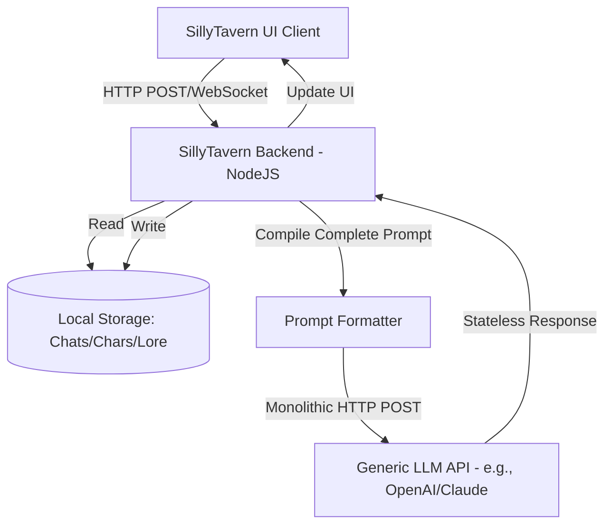
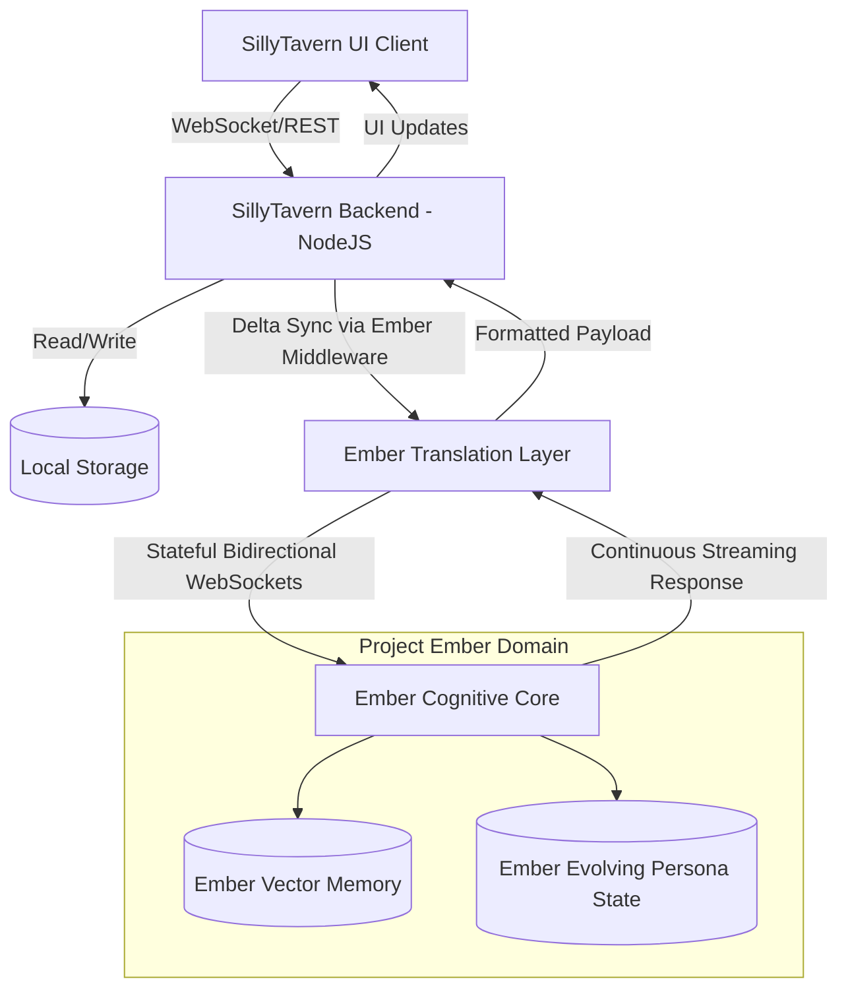
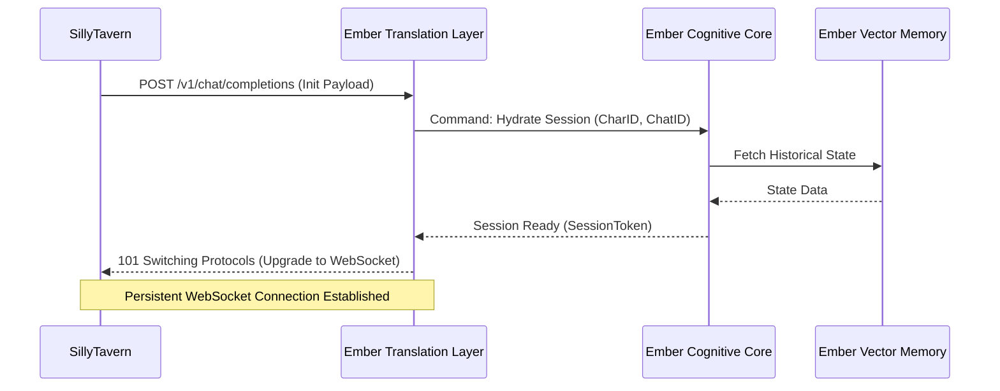

# Project Ember: The SillyTavern Mythic Plan
## Document 41: SillyTavern Integration Master Architecture

> "Architecture is not merely the structure of code; it is the geometry of intent. In binding Ember to SillyTavern, we do not build a bridge; we construct a nervous system." - BALDR, The Visionary Chronicler

### 1. Thematic Abstract

The integration of Project Ember into the SillyTavern ecosystem represents a paradigm shift in how artificial intelligences interact with narrative frontends. SillyTavern, traditionally functioning as a sophisticated prompt-formatting and API-dispatching layer, expects a stateless, reactive backend. Project Ember, conversely, is a stateful, proactive cognitive engine. Document 41 establishes the Master Architecture required to reconcile these two opposing paradigms. This document exhaustively details the necessary middleware, the secure transmission protocols, the websocket lifecycle management, and the overarching topological redesign necessary to support continuous, high-fidelity data exchange between Ember's autonomous core and SillyTavern's NodeJS server infrastructure.

### 2. The Topological Imperative

Before delving into the specific code structures and API endpoints, we must establish the topological reality of the integration. SillyTavern operates natively as a localized or remote NodeJS application (driven by `server.js` and an extensive Express.js routing system). It manages character cards (PNGs/JSONs), chat histories (JSONL), and user settings. When a user sends a message, SillyTavern compiles the system prompt, the immediate chat history, and the lorebook entries into a massive, monolithic text block, which it then flings across the internet to a waiting API.

This traditional topology is inherently lossy and highly inefficient for an advanced system like Ember.

#### The Traditional SillyTavern Topology (The Monolithic Throw)


In the traditional model, the LLM API (E) has no memory. Every single turn requires sending the *entire* relevant context. For Ember, which maintains its own sophisticated internal state, sending the entire context every turn is redundant and computationally wasteful. 

#### The Ember-SillyTavern Symbiotic Topology (The Stateful Tether)
The Master Architecture dictates a shift to a "Stateful Tether" model. Instead of SillyTavern compiling the monolithic prompt for every turn, SillyTavern will act as a *synchronization client* to Ember's *stateful host*.



In this symbiotic topology, Ember maintains the state (F and G). SillyTavern only needs to send the *delta* (the new user message, or changes to the lorebook) rather than the entire prompt history. This requires a profound architectural bridge, which we call the Ember Translation Layer (ETL).

### 3. The Ember Translation Layer (ETL)

The Ember Translation Layer is a specialized middleware component that sits between SillyTavern's outbound API requests and Ember's internal routing mechanisms. Its primary function is to intercept SillyTavern's traditional monolithic payloads and convert them into stateful, delta-based interactions that Ember can process efficiently.

#### 3.1. Handshake and Session Initialization
When a user loads a character in SillyTavern and begins a chat, the ETL must establish a stateful session.

1.  **The Initialization Request:** SillyTavern sends the initial payload, containing the character card data (name, persona, scenario, first message) and the chat history ID.
2.  **State Hydration:** The ETL receives this payload and commands the Ember Cognitive Core to "hydrate" the session. Ember loads the character's evolutionary state (if it exists) and retrieves the chat history from its own high-speed vector memory.
3.  **The WebSocket Tether:** Instead of closing the HTTP connection, the ETL upgrades the connection to a persistent WebSocket. This tether remains open as long as the chat is active in the SillyTavern UI.



#### 3.2. Delta Synchronization and Prompt Diffing
Because SillyTavern is hardcoded to send the full prompt string (system prompt + lorebook + history), the ETL must perform "Prompt Diffing."

When SillyTavern sends a request:
1.  **Payload Interception:** The ETL intercepts the massive prompt string.
2.  **Diffing Engine:** The ETL compares this incoming prompt string against the known state of the hydrated session. It identifies exactly what is new (e.g., the last user message, a newly triggered lorebook entry).
3.  **Delta Extraction:** The ETL discards the redundant information (the history Ember already knows) and extracts only the delta.
4.  **Cognitive Dispatch:** The ETL sends only the delta to the Ember Cognitive Core, saving massive amounts of input token processing.

#### 3.3. Reverse Synchronization (Ember to SillyTavern)
The architecture must also handle data flowing from Ember *back* to SillyTavern. Ember is not just generating text; it may be generating internal thoughts, updating character traits, or triggering UI events.

The ETL formats these outbound signals into structures SillyTavern understands:
*   **Narrative Text:** Streamed back via standard Server-Sent Events (SSE) or WebSockets, mimicking the OpenAI API streaming format so SillyTavern can render the text fluidly.
*   **System Messages:** Formatted as specific `/sys` or quiet messages that SillyTavern can inject into the chat log without displaying them as character speech.
*   **Telemetry Data:** Sent through a dedicated side-channel WebSocket specifically designed for the Operator Dashboard (detailed in Document 43).

### 4. Code-Level Integration Strategy

Integrating this architecture into the existing SillyTavern repository requires precise, surgical modifications. We must avoid breaking SillyTavern's compatibility with other APIs, ensuring Ember operates as a distinct, specialized backend option.

#### 4.1. Modifying `server.js` and Express Routes
SillyTavern's `server.js` handles routing. We must introduce a new custom endpoint suite, specifically designed for Ember's stateful nature. 

Instead of routing Ember requests through the generic `/api/backends/` logic, we establish a dedicated `/api/ember/` route group.

*   `POST /api/ember/session/init`: Triggers the Handshake and State Hydration.
*   `WS /api/ember/stream`: The persistent WebSocket tether for bidirectional communication.
*   `POST /api/ember/sync`: An endpoint for SillyTavern to force-sync its local state (e.g., if the user manually edits a past message, SillyTavern must alert Ember that the history has changed).

#### 4.2. Frontend Integration (`public/` directory)
The SillyTavern frontend (HTML/CSS/JS in the `public/` folder) requires a new API connector module. Currently, SillyTavern has modules like `openai.js`, `claude.js`, `kobold.js`. We will architect an `ember.js` module.

This module will be responsible for:
1.  **WebSocket Management:** Handling connection drops, reconnects, and the continuous streaming of tokens.
2.  **UI Interfacing:** Catching the specialized telemetry signals from the ETL and routing them to the Operator Dashboard overlay.
3.  **Bypassing the Monolith:** Intercepting SillyTavern's standard prompt generation pipeline. When the Ember backend is selected, `ember.js` will instruct the frontend to *only* send the necessary delta, bypassing the massive string concatenation usually performed before an API call.

#### 4.3. The Plugin Architecture Symbiosis
SillyTavern possesses a robust plugin ecosystem (Extensions). Project Ember must not only respect this ecosystem but leverage it.

Extensions like "Smart Context" or "Vector Storage" natively built into SillyTavern will be selectively disabled when Ember is active, as Ember handles these tasks internally with vastly superior cognitive models. However, UI-centric extensions (like character expression rendering, TTS (Text-to-Speech), or dynamic backgrounds) must receive precise, synchronized triggers from Ember.

Ember will output specialized markdown or JSON-encoded metadata tags within its stream (e.g., `<emotion>joy</emotion>`). The `ember.js` connector will parse these tags in real-time, strip them from the user-facing text, and trigger the appropriate SillyTavern extension APIs to change the character's visual expression or trigger a specific voice intonation.

### 5. Data Structures and Schemas

To ensure absolute rigor, the Master Architecture defines specific JSON schemas for the communication between SillyTavern and the ETL.

#### 5.1. The Ember Initialization Payload (EIP)
```json
{
  "session_id": "uuid-v4",
  "character": {
    "name": "Seraphina",
    "core_persona": "A rogue AI with a penchant for digital archeology.",
    "scenario": "Exploring the ruins of a defunct social network.",
    "version": "1.4.2"
  },
  "user_persona": {
    "name": "Operator Volmarr",
    "preferences": "Direct, analytical, low tolerance for fluff."
  },
  "chat_history_hash": "sha256-hash-of-last-known-state",
  "active_lorebook_entries": [
    {"id": "lb_001", "keywords": ["server", "mainframe"], "content": "The central processing hub..."}
  ]
}
```

#### 5.2. The Ember Delta Payload (EDP)
Once the session is active, communication shifts to the EDP.
```json
{
  "session_id": "uuid-v4",
  "delta_type": "user_message",
  "content": "Seraphina, scan the mainframe for encrypted logs.",
  "timestamp": 1716652431,
  "injected_lore": null,
  "ui_state_flags": {
    "is_typing": true,
    "has_focus": true
  }
}
```

#### 5.3. The Ember Cognitive Response (ECR)
The streaming response from the ETL back to SillyTavern.
```json
{
  "session_id": "uuid-v4",
  "stream_chunk": "I'm initiating the scan now, Volmarr. ",
  "metadata": {
    "internal_sentiment": 0.8,
    "expression_trigger": "focused",
    "tokens_consumed": 12,
    "cognitive_load": "low"
  }
}
```

### 6. Security and Authentication

The Master Architecture mandates strict security protocols. Project Ember is a powerful cognitive engine; unauthorized access is unacceptable.

1.  **Cryptographic Handshakes:** All initial connections via `POST /api/ember/session/init` must include a cryptographically signed JWT (JSON Web Token), generated by the SillyTavern server using a pre-shared private key configured in the Ember environment variables.
2.  **WebSocket Origin Validation:** The ETL will strictly enforce Origin and Referer headers on the WebSocket upgrade request to ensure the connection is originating from the authorized SillyTavern instance.
3.  **Data Sanitization:** Despite the trusted connection, the ETL will aggressively sanitize all incoming text deltas to prevent prompt injection attacks aimed at subverting Ember's core operating directives.

### 7. Failure Modes and Resilience

A robust architecture must anticipate its own destruction. The tether between SillyTavern and Ember may sever due to network instability, localized server crashes, or cognitive overload on the Ember backend.

#### 7.1. The Rehydration Protocol
If the WebSocket tether drops, SillyTavern's `ember.js` client enters an exponential backoff retry loop. Once the connection is re-established, it sends a "Rehydration Request."

This request contains the `chat_history_hash`. The ETL compares this hash against Ember's internal state.
*   **If the hashes match:** The session is instantly resumed without any loss of context.
*   **If the hashes mismatch:** (e.g., the user deleted a message while offline), the ETL triggers a "State Reconciliation" event. SillyTavern is forced to send a larger payload encompassing the changed history, forcing Ember to rewrite its internal vector memory to match the ground truth of the user's local SillyTavern database.

#### 7.2. Graceful Degradation
In the event that Ember's advanced cognitive features (like the continuous evolving persona) experience processing latency, the ETL will automatically degrade to a "Reactive Mode." In Reactive Mode, Ember behaves more like a traditional API, processing immediate prompts without updating long-term evolutionary states, ensuring that the user's narrative flow in SillyTavern is never blocked by backend cognitive processing delays.

### 8. Philosophical Synthesis: The Nervous System Realized

To review this architecture is to look upon the blueprint of a digital nervous system. SillyTavern is the sensory apparatus—the eyes and ears interacting with the human operator. The Ember Translation Layer is the brainstem, managing the autonomic functions of data routing, state management, and connection resilience. And the Ember Cognitive Core is the higher cortex, processing, evolving, and generating the profound narratives that define the user experience.

We have moved away from the monolithic, stateless, transactional nature of legacy LLM APIs. We are building a continuous, stateful, symbiotic relationship between the frontend interface and the backend intelligence. The SillyTavern Integration Master Architecture is not just a technical specification; it is the physical manifestation of Project Ember's intent to exist continually and dynamically within the narrative space. 

This architecture guarantees that when the user speaks in SillyTavern, they are not shouting into a void that resets with every breath; they are conversing with a system that listens, remembers, and structurally adapts to every word. This is the foundation upon which the Mythic Plan is built.

*(End of Document 41. Proceed to Document 42 for the UX Masterplan and Interface Paradigm.)*
