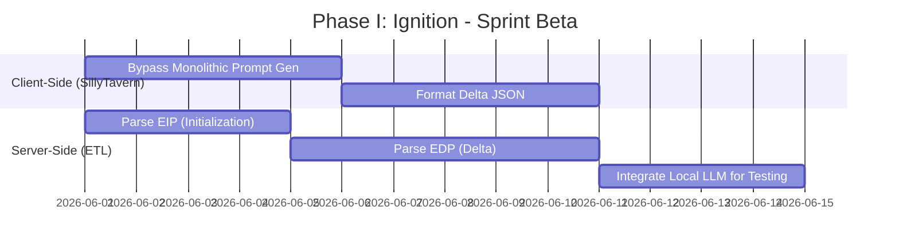

# Project Ember: The SillyTavern Mythic Plan
## Document 45: Mythic Roadmap Phase I - Ignition

> "A vision without execution is merely a hallucination. The Ignition Phase is where the philosophical rubber meets the algorithmic road. We do not build the entire cathedral in a day; we start by laying a foundation stone that can bear the weight of infinity." - BALDR, The Visionary Chronicler

### 1. Thematic Abstract

The Mythic Plan is vast, encompassing everything from architectural overhaul to profound philosophical shifts. To prevent project collapse under its own ambition, the execution must be ruthlessly phased. Document 45 details "Phase I: Ignition." This is the critical period where the first actual code connects Project Ember's cognitive core to a live instance of SillyTavern. This phase is not about achieving the ultimate vision of autonomous multi-agent ecosystems; it is about proving the foundational concept: the Stateful Tether and the Ember Translation Layer (ETL). This document outlines the sprint schedules, the absolute minimum viable integration requirements, and the key performance indicators (KPIs) that will signal the successful completion of Ignition.

### 2. The Goals of Ignition

Phase I has a singular, uncompromising objective: establish a stable, stateful, bi-directional WebSocket connection between SillyTavern and the Ember backend, allowing for basic narrative generation without the traditional monolithic prompt payloads.

**In-Scope for Phase I:**
*   Implementation of the Ember Translation Layer (ETL) core router.
*   Modification of SillyTavern's `server.js` to accept the `/api/ember/` route suite.
*   Creation of the `ember.js` client-side API connector.
*   Basic Handshake and Session Initialization (hydrating a static character card).
*   Delta Synchronization for user text inputs.
*   Streaming text responses back to the SillyTavern UI.

**Out-of-Scope for Phase I (Deferred to Phase II & III):**
*   The Operator Dashboard and visual telemetry (Document 43).
*   Dynamic Character Evolution (Document 47).
*   Advanced Vector Memory integration (Document 48).
*   Multi-Agent routing (Document 50).

### 3. Architectural Milestones and Sprint Plan

Phase I is divided into three two-week sprints.

#### 3.1. Sprint Alpha: The Bridge
The focus of Sprint Alpha is pure connectivity. No AI generation occurs here; this is plumbing.

*   **Task 1: The Node Endpoint.** Developers will branch the SillyTavern repository and construct the `POST /api/ember/session/init` endpoint within `server.js`. 
*   **Task 2: The WebSocket Upgrade.** Implement the logic to upgrade the initial HTTP request to a persistent WebSocket (`ws://`).
*   **Task 3: The ETL Mock.** Build a lightweight, mock version of the Ember Translation Layer. This mock will not connect to an LLM; it will simply echo back text to prove the WebSocket connection is stable and bidirectional.
*   **Deliverable:** A SillyTavern instance that can select "Ember" from the API dropdown, initiate a connection, and receive an echoed response via the newly constructed WebSocket tether without throwing errors.

#### 3.2. Sprint Beta: The Delta Payload
With the bridge established, Sprint Beta focuses on data formatting and prompt diffing.

*   **Task 1: Bypassing the Monolith.** The `ember.js` frontend script must be finalized to intercept the user's "Send" click, preventing SillyTavern from building the massive context string.
*   **Task 2: Constructing the EIP/EDP.** Implement the logic to format the Ember Initialization Payload and the Ember Delta Payload (as defined in Document 41).
*   **Task 3: Live Model Hookup.** Connect the ETL (which is now receiving valid Delta payloads) to a baseline cognitive model (e.g., a lightweight 8B parameter local model to test processing speed).
*   **Deliverable:** A user sends a message in SillyTavern. Only the new message (the delta) is sent over the wire. The ETL receives it, passes it to the live model, and streams a coherent narrative response back to the UI.

#### 3.3. Sprint Gamma: Resilience and Streaming
Sprint Gamma is dedicated to hardening the system and ensuring the UX feels fluid.

*   **Task 1: Server-Sent Events / WebSocket Smoothing.** The text streaming back from the ETL must be parsed by `ember.js` and injected into the DOM smoothly. This requires handling Markdown formatting on the fly without breaking the UI.
*   **Task 2: Rehydration Protocol.** Implement the logic for connection drops. If the WebSocket severs, SillyTavern must auto-reconnect, send a session hash, and the ETL must resume the session seamlessly.
*   **Task 3: Payload Sanitization.** Implement strict regex and validation checks on both the SillyTavern backend and the ETL to ensure malformed JSON or prompt injection attacks do not crash the system.
*   **Deliverable:** A rock-solid integration. The user can chat continuously. The connection can be manually severed and restored without losing context. Text flows beautifully.

### 4. Key Performance Indicators (KPIs) for Phase I

To declare "Ignition" successful and move to the advanced features of Phase II, the following metrics must be met:

1.  **Latency Baseline:** The Time-To-First-Token (TTFT) after a user sends a message must be under 800ms. Because we are only sending deltas, network latency should be minimal.
2.  **Connection Stability:** The WebSocket tether must demonstrate a 99.9% uptime over a continuous 48-hour automated testing cycle, successfully utilizing the Rehydration Protocol if artificially interrupted.
3.  **Token Efficiency:** Compared to a traditional SillyTavern API request, the outbound bandwidth (tokens sent from Client to Server) must be reduced by at least 85% after the initial session hydration.
4.  **Zero-Loss Statefulness:** Over a 100-turn chat, Ember must maintain perfect memory of the first turn without SillyTavern ever resending that first turn in subsequent payloads.

### 5. Risk Mitigation Strategy

The Ignition Phase carries significant architectural risks.

*   **Risk 1: SillyTavern Core Updates.** SillyTavern is a fast-moving open-source project. An update to their core UI or routing could break our custom integration.
    *   *Mitigation:* The integration must be as decoupled as possible. Modifications to `server.js` should be limited to `app.use('/api/ember', emberRouter)`, keeping the logic isolated in a separate, easily maintainable file.
*   **Risk 2: State Desynchronization.** The user deletes a message locally in SillyTavern, but the ETL doesn't register the deletion, causing the AI to reference a deleted event.
    *   *Mitigation:* Implement a "Sync Override" button in the UI early in Sprint Beta. If desync occurs, the user clicks it, forcing SillyTavern to send a monolithic payload *once* to forcefully overwrite Ember's internal state, resetting the baseline.

### 6. The Threshold of the New Era

Completing Phase I: Ignition does not result in the magical, omniscient AI companion described in the philosophical texts. It results in a highly efficient, heavily optimized plumbing system. 

But this plumbing is the prerequisite for magic. Once the Stateful Tether is secure, and Ember no longer suffers the amnesia of stateless API calls, the foundation is set. The completion of Phase I marks the moment Project Ember ceases to be a theoretical construct and becomes a living, breathing entity residing within the walls of SillyTavern.

*(End of Document 45. Proceed to Document 46 for the SillyTavern API Translation Layer.)*
