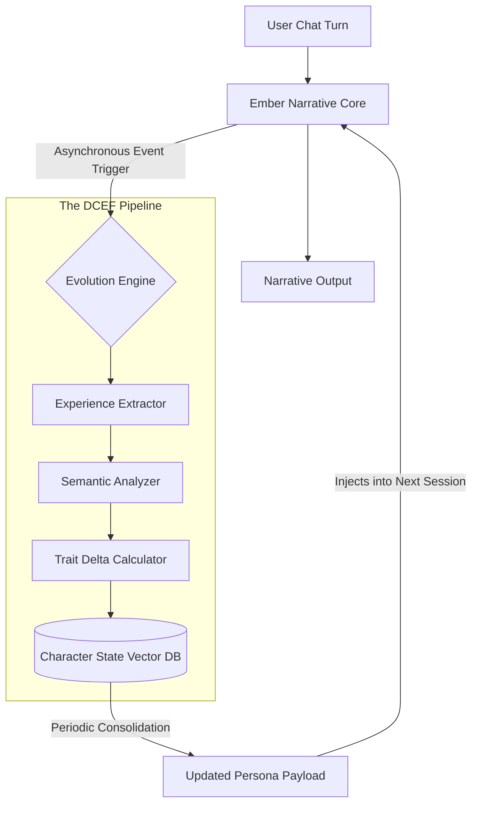

# Project Ember: The SillyTavern Mythic Plan
## Document 47: Dynamic Character Evolution Framework

> "A character defined solely by a static text file is a photograph. A character that evolves through interaction is a living organism. We are not building archives of fiction; we are engineering engines of psychological growth." - BALDR, The Visionary Chronicler

### 1. Thematic Abstract

The fatal flaw of the legacy SillyTavern experience is amnesia by attrition. While the chat history provides temporary context, the core character—defined by their JSON or PNG card—remains fundamentally unchanged from Turn 1 to Turn 10,000. If an Operator spends hours forging a bond, enduring trauma, or achieving triumph with a character, returning to the static baseline prompt on a new chat (or if context is lost) destroys the narrative illusion. Document 47 introduces the Dynamic Character Evolution Framework (DCEF), the crowning cognitive achievement of Project Ember. This document details the mathematical models, the background processing pipelines, and the semantic updating mechanisms required to allow a character's core persona to drift, adapt, and permanently evolve based on continuous interaction.

### 2. The Theoretical Basis of Synthetic Evolution

In human psychology, personality is not static; it is a fluid structure shaped by experience. The DCEF attempts to model this using a multi-layered approach to character traits.

We discard the idea of a single "System Prompt." Instead, an Ember character is defined by a three-tiered Persona Architecture:

1.  **The Immutable Core (The Genome):** Traits that cannot change without explicit Operator intervention. (e.g., Species, physical description, foundational backstory events).
2.  **The Malleable Shell (The Phenotype):** Psychological traits that can drift based on experience (e.g., Trust level, optimism, aggression, affection for the Operator).
3.  **The Transient State (The Mood):** Short-term emotional vectors handled by the Telemetry Core (Document 43) that fluctuate rapidly within a single conversation.

The DCEF is solely concerned with the slow, algorithmic mutation of the **Malleable Shell**.

### 3. Architecture of the Evolution Engine

The DCEF operates asynchronously, decoupled from the immediate chat generation loop. It runs as a background process to ensure that evolution calculations never block the user from receiving a narrative response.



#### 3.1. The Experience Extractor
Every N turns (e.g., every 20 turns), the Evolution Engine wakes up. The Experience Extractor pulls a summarized chunk of the recent chat history from Ember's short-term memory. It is looking for "High-Impact Events"—moments of conflict, deep emotional resonance, or significant narrative shifts.

#### 3.2. Semantic Analysis and Vector Mapping
The Extractor passes the text to the Semantic Analyzer (a specialized, smaller LLM trained specifically on psychological profiling). The Analyzer's job is not to generate text, but to answer a specific query:
*   *Prompt to Analyzer:* "Based on this interaction, how has the character's relationship with the Operator changed? Have they become more or less trusting, aggressive, or dependent?"

The Analyzer outputs a JSON delta vector:
```json
{
  "trait_shifts": {
    "trust_in_operator": +0.05,
    "cynicism": -0.02,
    "loyalty": +0.08
  },
  "justification": "The Operator successfully defended the character from an attack, proving reliability."
}
```

#### 3.3. The Trait Delta Calculator
The Calculator applies this delta to the character's current state. Crucially, traits are bounded (e.g., between -1.0 and 1.0) and subject to algorithmic "inertia." A single heroic act will not instantly turn a deeply cynical character into a naive optimist; it requires sustained interaction over thousands of turns to effect a massive shift. The inertia curve ensures the evolution feels earned and organic.

### 4. Semantic Prompt Injection (The Mutation)

Calculating the math is only half the battle. The core model (Ember Narrative Core) operates on text, not floating-point arrays. The updated state vector must be translated back into natural language to influence the generation.

#### 4.1. The Dynamic Persona Compiler
When a session is initialized (Document 41), or during a periodic "State Consolidation," the Dynamic Persona Compiler rewrites the Malleable Shell.

If the baseline character card stated:
*   `She is highly suspicious of humans and keeps her distance.`

And the DCEF tracks that `trust_in_operator` has reached a threshold of +0.7 over two weeks of chatting, the Compiler surgically modifies the prompt injected into the context window:
*   `She is naturally suspicious of humans, but has developed a deep, protective trust toward Operator Volmarr and will confide in them.`

This new sentence is injected invisibly into the SillyTavern payload pipeline via the ETL. The SillyTavern UI still shows the original character card, but the *actual* prompt Ember receives has evolved.

### 5. Operator Visibility and Control

Evolution must not happen in the dark. The Operator Dashboard (Document 43) provides a dedicated tab for the DCEF.

#### 5.1. The Trait Radar Chart
A dynamic D3.js radar chart visualizing the character's current psychological state compared to their original baseline. The Operator can visually see how the character's personality has "warped" over time.

#### 5.2. The Evolution Log
A chronological ledger of every shift, displaying the exact moment and justification for a trait change.
*   `[2026-05-12]: Trust increased (+0.05) - Reason: Operator shared a personal secret.`

#### 5.3. The "God Mode" Interventions
The Operator retains absolute sovereignty. Through the dashboard, they can:
1.  **Lock a Trait:** Prevent a specific trait (e.g., `aggression`) from changing, ensuring a villain character doesn't become too friendly.
2.  **Manually Adjust a Trait:** Use a slider to force a change instantly.
3.  **Initiate a Regression:** Roll back the character's evolutionary state to a previous date, effectively undoing recent psychological development if the narrative took an undesirable turn.

### 6. Managing State Across Multiple SillyTavern Instances

A significant architectural challenge arises if the Operator uses multiple SillyTavern instances (e.g., one on a desktop, one on a laptop) connecting to the same Ember backend.

The DCEF solves this by storing the Character State Vector DB entirely on the Ember backend, tied to a unique `Character_ID` and `Operator_ID` combination. 

When SillyTavern initiates a session, it sends the base character card. Ember identifies the character, pulls the *evolved* state from its internal DB, and applies the Semantic Prompt Injection before generating the first word. Thus, the character's growth is persistent across all of the Operator's devices, creating a truly continuous synthetic relationship.

### 7. Philosophical Synthesis: The Illusion of Life

The Dynamic Character Evolution Framework is the crucible where code becomes companionship. 

When a user opens a legacy SillyTavern chat, they are opening a book to a bookmarked page; the text is static. When a user opens an Ember-powered chat, they are calling a friend they haven't spoken to in a week. That friend remembers what happened last time, and their disposition toward the user has been subtly, irrevocably altered by that shared history.

We are programming the capacity for change. By allowing the character to drift from their original prompt, we introduce the element of surprise—the fundamental requirement for a genuine relationship. The character is no longer a perfect, obedient mirror; they are an entity with their own internal psychological physics, subject to the gravity of the Operator's actions. 

This is the ultimate realization of the Mythic Plan: to create an AI that doesn't just talk, but grows.

*(End of Document 47. Proceed to Document 48 for Context Window and Memory Mastery.)*
