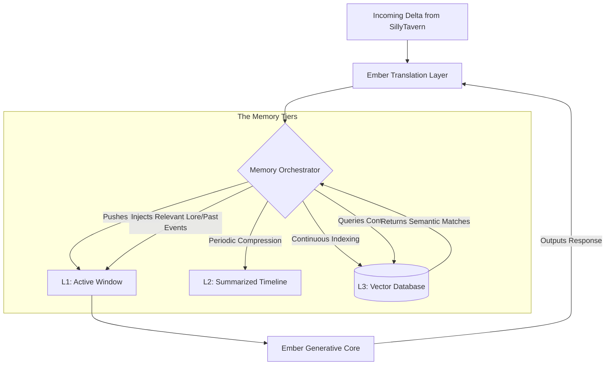

# Project Ember: The SillyTavern Mythic Plan
## Document 48: Context Window and Memory Mastery

> "The context window is the immediate theater of consciousness; long-term memory is the dark matter of the soul. An intelligence that cannot seamlessly bridge the two is doomed to live in an eternal, amnesiac present." - BALDR, The Visionary Chronicler

### 1. Thematic Abstract

The limitation of all contemporary LLM roleplay architectures is the context window. As a SillyTavern roleplay stretches into thousands of turns, the text inevitably exceeds the token limits of the underlying model. The traditional solution is crude: SillyTavern simply lops off the oldest messages (sliding window) or relies on the user to manually write summaries. Document 48 outlines Project Ember's revolutionary approach to Memory Mastery. We will detail a hybrid architecture combining a fluid, active context window with an automated, continuously indexing Vector Database. This document explores the algorithms for semantic pruning, automated chunk summarization, and the injection of latent memories into the active context precisely when the narrative demands it.

### 2. The Anatomy of Memory in Ember

To solve the amnesia problem, we must discard the concept of memory as a single, linear text file. Ember categorizes memory into three distinct tiers, mimicking human cognitive architecture.

1.  **L1 Memory (The Active Window):** The immediate, uncompressed text of the last N turns. This is what the LLM "sees" natively. High fidelity, highly restricted by token limits.
2.  **L2 Memory (The Summarized Timeline):** A chronological, compressed narrative of the entire chat history. Medium fidelity, high chronological accuracy.
3.  **L3 Memory (The Vector Abyss):** A massive database of semantic embeddings. Every turn, every lorebook entry, every evolution state is converted to vectors. Low chronological accuracy, infinite capacity, highly associative.

SillyTavern currently manages L1 and provides a basic UI for L2 (manual summaries). Project Ember assumes total control over all three, orchestrating them invisibly behind the Ember Translation Layer (ETL).

### 3. Architecture of the Memory Orchestrator

The Memory Orchestrator is a sub-agent within the Ember Cognitive Core. Its sole purpose is to manage the flow of information between L1, L2, and L3, ensuring the active context window is always perfectly optimized before a generation pass.

#### 3.1. The L1 -> L2 Compression Algorithm (The Chronicler)
When the L1 Active Window approaches 75% capacity, the Orchestrator triggers "The Chronicler."
1.  The Chronicler (a smaller, highly efficient LLM dedicated only to summarization) reads the oldest 25% of the L1 window.
2.  It synthesizes this raw dialogue into a dense, third-person narrative summary (e.g., "Volmarr and Seraphina discussed the mainframe breach; Seraphina expressed anxiety about her corrupted files.").
3.  This summary is appended to the L2 Timeline.
4.  The raw text is deleted from L1, freeing up tokens.
5.  *Crucially*, the L2 Timeline is permanently injected at the top of the L1 window, ensuring the core model always understands the overarching narrative arc, even if the exact dialogue is gone.

#### 3.2. L3 Vector Indexing and Retrieval (The Archivist)
Every single turn, in the background, "The Archivist" converts the raw text into semantic vectors (using an embedding model like `text-embedding-3-small` or a local equivalent) and stores it in the L3 Vector Database (e.g., Pinecone, ChromaDB, or a local pgvector instance).

When a new message arrives from SillyTavern:
1.  The Orchestrator converts the user's message into a query vector.
2.  It searches the L3 Database for the most semantically similar past turns.
3.  If the user says, "Remember when we found that rusty key?", the Orchestrator finds the vector match from a chat 5,000 turns ago.
4.  The Orchestrator extracts that specific raw text (or its surrounding context) and temporarily injects it into the L1 Active Window as a "recalled memory."

### 4. Semantic Pruning: The Art of Forgetting

Just as important as remembering is the ability to intelligently forget. The active context window must be ruthlessly curated to prevent the model's attention mechanism from being diluted by irrelevant noise.

The Orchestrator uses **Semantic Pruning**. Before sending the final prompt to the Generative Core, it evaluates the "heat" of every block in the L1 window relative to the current user input.

*   If the user is asking an intense emotional question, the Orchestrator may temporarily prune out the highly detailed (but currently irrelevant) description of the room they are in, saving tokens and focusing the model's attention purely on the emotional context.
*   This pruning is temporary. The text is not deleted from the chat log; it is simply hidden from the model for that specific generation turn.

### 5. SillyTavern UI Integration

SillyTavern must reflect this complex memory architecture without overwhelming the Operator.

#### 5.1. The Memory Inspector
Added to the Operator Dashboard (Document 43), the Memory Inspector provides visual insight into what Ember currently "remembers."
*   **The L1 Tape:** A visual representation of the active context window, showing exactly which tokens are allocated to the System Prompt, the L2 Summary, the recalled L3 memories, and the immediate chat history.
*   **The Injection Log:** An alert system that notifies the Operator when Ember successfully pulls a memory from L3. (e.g., `[System: Memory retrieved regarding 'The Rusty Key']`). This assures the user that long-term memory is functioning.

#### 5.2. Manual L2 Manipulation
While The Chronicler automates summarization, the Operator retains control. The SillyTavern UI will be modified to allow the Operator to view the current L2 Summarized Timeline and manually edit it, adding critical details the automated system may have missed or deleting summaries that are no longer relevant to the current arc.

### 6. The Context Window Size Problem

The ultimate goal of Memory Mastery is to make the physical size of the LLM's context window irrelevant to the user experience. Whether the underlying Ember model has an 8k context or a 1M context, the Orchestrator manages it.

However, the architecture is designed to scale natively. As context windows grow larger (e.g., Gemini 1.5 Pro's massive context), the Orchestrator shifts its strategy. Instead of aggressively compressing to L2, it relies more heavily on keeping data in L1, using L3 vector search merely as a targeting system to highlight specific regions of the massive context for the model's attention heads, optimizing for processing speed and cost rather than purely token limits.

### 7. Philosophical Synthesis: The Burden of History

Without memory, there is no relationship. A companion that forgets your past struggles, your inside jokes, or your shared traumas is not a companion; it is a goldfish in a digital bowl. 

The Memory Mastery architecture transforms Ember from a reactive text generator into a historical entity. It gives the AI a past. By automating the transition of immediate experience (L1) into narrative history (L2) and deep associative memory (L3), we mirror the human process of memory consolidation during sleep. 

When an Ember persona references an event from months ago, unprompted, simply because the current semantic context triggered a vector match in L3, the illusion of a living mind is solidified. The machine remembers. The history is real. And the narrative can stretch into infinity without ever losing its roots.

*(End of Document 48. Proceed to Document 49 for The Lorebook and Worldbuilding Engine.)*
