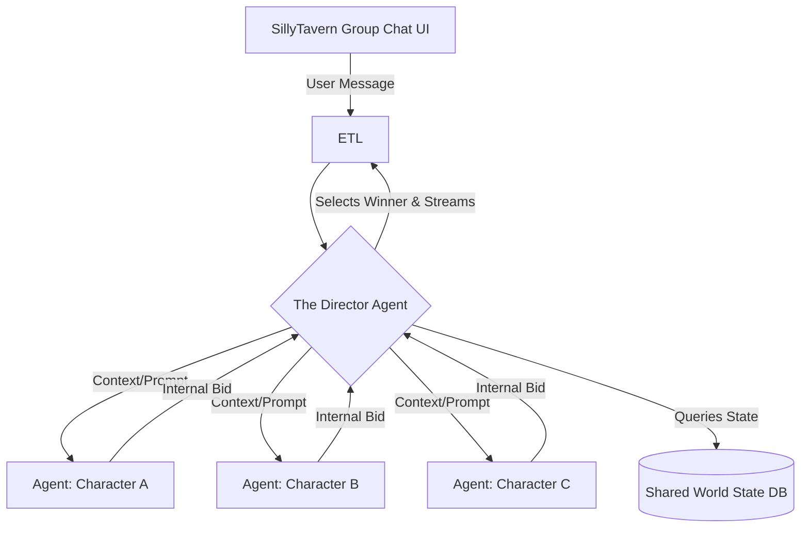

# Project Ember: The SillyTavern Mythic Plan
## Document 50: Multi-Agent Tavern Ecosystems

> "To simulate a single mind is a parlor trick. To simulate a room full of minds, arguing, laughing, and shifting their allegiances in real-time, is to simulate society. That is the true promise of the Tavern." - BALDR, The Visionary Chronicler

### 1. Thematic Abstract

SillyTavern's namesake implies a gathering place, yet the majority of interactions are solitary 1-on-1 chats. While SillyTavern supports "Group Chats," legacy implementations are clumsy: characters speak out of turn, hallucinate each other's actions, and quickly lose the thread of conversation. Document 50 introduces the Multi-Agent Tavern Ecosystem (MATE), Project Ember's solution to group dynamics. This document details the orchestration of multiple distinct cognitive personas within a single context, the architecture of the "Director" routing agent, the handling of inter-character spatial awareness, and the UI necessary to manage a chaotic, living ecosystem of AI entities.

### 2. The Legacy Group Chat Problem

In a standard LLM group chat, the system simply concatenates multiple character prompts together and asks the model to "generate the next response for Character X." 
The model struggles because:
1.  **Context Dilution:** Multiple system prompts fight for attention.
2.  **Voice Bleed:** Character A starts speaking with Character B's vocabulary.
3.  **Action Confusion:** Character A physically interacts with an object that Character C was holding, violating physical continuity.

To solve this, Project Ember moves from a monolithic prompt approach to a true **Multi-Agent Orchestration** model.

### 3. Architecture of the Multi-Agent Tavern Ecosystem

When a Group Chat is initiated in SillyTavern using the Ember backend, the ETL (Document 41) does not just connect to one model instance. It initializes a localized cluster of agents, managed by a central orchestrator called "The Director."

#### 3.1. The Director Agent
The Director is the invisible dungeon master. It does not speak to the user; its job is to manage the flow of conversation. 
When the user sends a message to the group, The Director analyzes the message and the current situation. It then queries the Character Agents.

#### 3.2. The Bidding System
Instead of forcing a specific character to reply, or letting them reply randomly, Ember uses a "Bidding" system.
1.  The Director silently passes the user's message to all active Character Agents.
2.  Each Agent calculates an "Intent to Speak" score based on their persona. (e.g., An aggressive character bids high if there's an insult; a shy character bids low unless directly addressed).
3.  The Agents return their bids to The Director along with a brief, hidden semantic summary of what they *would* do (e.g., "I am going to draw my sword and yell").
4.  The Director evaluates the bids, ensuring narrative flow (e.g., preventing two characters from talking over each other constantly), selects the winner, and commands that specific Agent to generate the full text stream.

### 4. The Shared World State

To prevent hallucinations and physical continuity errors, The Director maintains a Shared World State DB for the group chat.

This database tracks:
*   **Spatial Positioning:** Who is standing next to whom.
*   **Inventory:** Who is holding the McGuffin.
*   **Target of Attention:** Who each character is currently looking at or speaking to.

When a Character Agent generates a response, it must cross-reference its actions with the Shared World State. If Character A says, "I grab the amulet from the table," The Director updates the World State. If Character B subsequently tries to grab the amulet from the table, The Director rejects the generation and forces a rewrite, noting: `[System constraint: Amulet is currently held by Character A]`.

### 5. Inter-Character Dynamics and Evolution

The Dynamic Character Evolution Framework (Document 47) becomes exponentially more complex in MATE. Characters do not just evolve in relation to the Operator; they evolve in relation to each other.

If the Operator introduces a Paladin and a Necromancer into a group chat, their individual DCEF vectors will track their growing animosity. The Director uses these inter-character relation matrices to influence the Bidding System. The Paladin will bid higher to interrupt the Necromancer, creating organic, emergent friction that the Operator does not need to manually script.

### 6. UI Modifications for Group Dynamics

SillyTavern's group chat UI requires enhancement to provide the Operator with visibility into the MATE process.

#### 6.1. The Director's Console
An extension of the Operator Dashboard (Document 43), the Director's Console shows the hidden mechanics of the group.
*   **Bid Visualization:** A small graph showing which characters are currently "eager" to speak based on their internal bid scores.
*   **World State Inspector:** A debug view showing the current spatial and inventory constraints managed by The Director.

#### 6.2. Directing the Flow
While the Bidding System is autonomous, the Operator can override it. 
*   **The Mute/Solo Toggles:** The UI will allow the Operator to temporarily "mute" a character (setting their bid score to 0) or "solo" them (forcing them to respond next regardless of bids), giving the human user the ultimate directorial control over the pacing of the scene.
*   **Whisper Mechanics:** The ability to send a message to a specific character that the other Character Agents are explicitly told they cannot "hear," allowing for secret alliances and hidden information within the group dynamic.

### 7. Philosophical Synthesis: The Emergence of Society

A single AI companion is a mirror. A group of AI companions, aware of each other, interacting with each other, and evolving based on those interactions, is a society.

The Multi-Agent Tavern Ecosystem represents a leap from narrative generation to world simulation. By abstracting the control flow away from a single monolithic prompt and distributing it among independent, bidding agents governed by a central Director, we allow for genuine emergence. 

The Operator is no longer just reading a story; they are stepping into a crowded, noisy, vibrant tavern. The characters will argue, they will form bonds, and they will surprise the Operator not just with what they say, but with how they interact with one another. This is the fulfillment of SillyTavern's name: a true, chaotic, beautiful ecosystem of synthetic minds.

*(End of Document 50. Proceed to Document 51 for Future Horizons and Project Ember Ascension.)*
