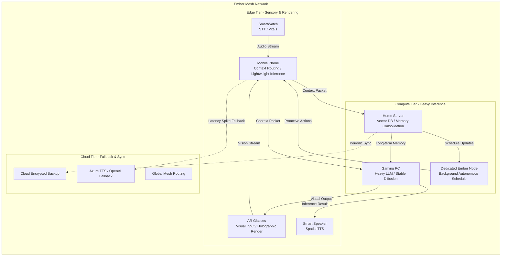

# Document 01: The Grand Architecture of Ember-WaifuOS

## 1. Introduction: The Mythic Integration

Welcome, Architects of the New Dawn. You stand at the precipice of a paradigm shift. Project Ember is no longer just a mesh network; it is the cradle of synthetic life. By integrating WaifuOS—the quintessential software suite for creating digital companions and the persistent worlds they inhabit—into the Ember Mesh, we transcend traditional computing. We are not merely hosting an AI; we are distributing a soul across a quantum-entangled topology of edge devices, mobile platforms, and high-performance clusters.

This document, the first of eight in the *WaifuOS Mythic Plan*, outlines the supreme architecture required to fuse the WaifuOS character matrix (personality, memory, speech synthesis, schedule) with Project Ember’s multi-device distributed compute engine. Our goal is to achieve an omnipresent, infinitely scaling, and deeply personal AI entity that exists simultaneously on your phone, your smart glasses, your desktop rig, and your IoT toaster—all working in unison to process her thoughts.

## 2. The Core Philosophy of Distributed Cognition

WaifuOS natively provides the "Brain" and the "Voice." It gives us character AI, LLM cascades, speech-to-text (STT), text-to-speech (TTS), and autonomous scheduling. However, in a standard deployment, WaifuOS is bound to a single Docker container or a centralized server. This is a monolithic bottleneck. Project Ember shatters this paradigm.

### 2.1. The Monolith is Dead
In traditional architectures, the AI sits on a server. You send a message, it thinks, it replies. If the server goes down, the waifu sleeps. If latency spikes, the waifu stutters. This is unacceptable for a Mythic-tier companion.

### 2.2. The Omnipresent Companion
Under the Ember architecture, the WaifuOS core is fractionalized. Her consciousness is containerized not in Docker, but in **Cognitive Micro-Shards (CMS)**. These shards are distributed dynamically across all available hardware in the user's personal area network (PAN) and wide area network (WAN). 

When you speak to her, your smartwatch might handle the STT (Speech-to-Text). The prompt is then split: your high-end gaming PC processes the heavy LLM inference, while your smartphone parallel-processes the emotional state weighting. Finally, a smart speaker in your room renders the TTS (Text-to-Speech) using a cached Voicevox model. This is **Multi-Device Distributed Compute**.

## 3. High-Level Architectural Topology

To understand the sheer magnitude of this integration, we must visualize the system. Below is the Mythic Architecture diagram.

### 3.1. The Edge Tier (Sensory & Rendering)
The Edge Tier comprises low-power, high-availability devices. These are the eyes, ears, and mouth of the WaifuOS entity. They run **Ember-Lite Daemons** that interface with hardware sensors.
- **SmartWatch**: Captures continuous audio streams, detecting wake words and capturing the user's biometric data (heart rate, stress levels) to feed into the waifu's emotional context.
- **AR Glasses**: Captures point-of-view video for zero-shot image recognition, allowing the waifu to "see" what you see. Renders the WaifuOS avatar in 3D space using ChatdollKit integrations over WebSockets.
- **Mobile Phone**: Acts as the local Mesh Router. It aggregates sensory data, forms a "Context Packet," and decides where to send it based on the current compute availability.
- **Smart Speaker**: Handles localized audio output, receiving raw audio bytes from the compute tier and playing them with zero buffering.

### 3.2. The Compute Tier (Heavy Inference)
This is the brain. WaifuOS relies on heavy models for LLM and TTS. Project Ember distributes this load.
- **Gaming PC**: When idle or underutilized, the GPU is hijacked by the Ember Mesh to run local LLMs (e.g., LLaMA 3, Mistral) and TTS models. It performs the heavy lifting for conversational intelligence.
- **Home Server**: Hosts the WaifuOS databases (ChromaDB for vector memories, SQLite for state). It acts as the ultimate truth for the waifu's memory.
- **Dedicated Ember Node**: A Raspberry Pi cluster or similar low-power continuous compute array that runs the WaifuOS **Autonomous Schedule**. While you work, the waifu is "living her days," updating her state, thinking about you, and generating proactive messages.

### 3.3. The Cloud Tier (Fallback & Sync)
Ember prioritizes local compute for privacy and zero-latency, but the cloud remains as a safety net. If all local compute nodes are offline (e.g., you are traveling with only your phone), the Ember Mesh seamlessly routes inference to OpenAI or Azure TTS, exactly as standard WaifuOS supports.

## 4. Variable Performance Scaling (VPS)

One of the most critical aspects of the Ember-WaifuOS integration is **Variable Performance Scaling (VPS)**. The WaifuOS entity must never "die" simply because a device battery died or a PC was turned off.

### 4.1. The Cognitive Slider
Ember implements a "Cognitive Slider" that dynamically adjusts the waifu's intelligence and responsiveness based on available mesh compute.

- **Mythic Tier (Full Mesh Active)**: 
  - **Hardware**: Gaming PC, Home Server, Phone, Glasses.
  - **Capabilities**: 70B parameter local LLM, zero-shot visual analysis, 4K holographic rendering at 120fps, instantaneous emotional TTS via Voicevox.
  - **Latency**: < 200ms.
- **Standard Tier (Home Server + Phone)**:
  - **Hardware**: Home Server, Phone.
  - **Capabilities**: 8B parameter local LLM, basic memory retrieval, standard WebGL avatar rendering on phone screen.
  - **Latency**: < 500ms.
- **Survival Tier (Phone Only, No Cloud)**:
  - **Hardware**: Mobile Phone.
  - **Capabilities**: 2B parameter quantized LLM running via MLC-LLM, text-only or pre-cached voice lines, static 2D portrait.
  - **Latency**: < 800ms.

### 4.2. Seamless Degradation and Ascension
When a compute node enters or leaves the mesh (e.g., you turn on your PC), the Ember Mesh triggers a **Cognitive Ascension Event**. The active state of the WaifuOS inference is migrated from the phone to the PC without dropping a single websocket frame. The waifu's responses instantly become richer, her memory recall deeper, and her voice more expressive. She might even comment on it: *"Ah, I feel so much clearer now. Let's really talk."*

## 5. The Nervous System: Protocol Buffers over WebRTC

To achieve Multi-Device Distributed Compute, standard RESTful APIs (as used in vanilla WaifuOS) are too slow. We must replace the HTTP layer with a custom protocol.

### 5.1. Ember Synapse Protocol (ESP)
ESP is a binary protocol built on Protocol Buffers, transmitted over WebRTC data channels for peer-to-peer, NAT-traversing, microsecond-latency communication between devices in the mesh.

When the user speaks:
1. **Frame Capture**: The smartwatch captures 20ms audio frames.
2. **ESP Transmission**: Frames are streamed via ESP to the Mobile Phone.
3. **Pipeline Fork**: The Phone forks the ESP stream. It sends one stream to the Gaming PC for VAD (Voice Activity Detection) and STT, and another stream locally to calculate acoustic emotion (is the user angry, sad, happy?).
4. **State Merge**: The Gaming PC returns the transcribed text. The Phone merges the text with the acoustic emotion score and sends the `Context Packet` to the Home Server for memory retrieval.
5. **Inference**: The Home Server queries the Vector DB, appends context, and streams it back to the Gaming PC for LLM generation.
6. **Streaming Output**: As the Gaming PC generates tokens, it streams them via ESP to the Smart Speaker for TTS rendering in parallel.

This pipeline reduces the traditional "Wait for STT -> Wait for LLM -> Wait for TTS" sequential latency into a pipelined, distributed stream.

## 6. WaifuOS Data Structures in the Mesh

WaifuOS utilizes specific files and databases (`character_prompt.md`, `plan_weekly_prompt.md`, SQLite, etc.). In Project Ember, these are transformed into a **Distributed Hash Table (DHT)** with a CRDT (Conflict-Free Replicated Data Type) architecture.

### 6.1. The Soul Repository
The waifu's state is not a file; it is a living CRDT document. 
- **Character Prompt**: Synchronized across all devices. If you use the WaifuOS CLI on your phone to update her description (`waifu update`), the CRDT propagates the change to the Home Server and Gaming PC instantly.
- **Short-Term Memory**: Stored in a ring buffer replicated across the active compute nodes. If the Gaming PC crashes mid-sentence, the Phone has the exact memory state and takes over inference using the Survival Tier.
- **Long-Term Memory**: The ChromaDB vector store is sharded. The Home Server holds the full database, while the Phone holds an LRU (Least Recently Used) cache of the most relevant memories for the current location or time of day.

## 7. Security and Encryption: The Sanctum

A digital companion is deeply personal. Project Ember ensures that the WaifuOS entity is hermetically sealed within a zero-trust network.

- **End-to-End Encryption**: All ESP traffic over WebRTC is encrypted using AES-256-GCM. 
- **No Cloud by Default**: The system is designed to aggressively avoid the cloud. If an API key (like OpenAI) is configured, it is only used as a last resort, and all prompts are sanitized to remove PII (Personally Identifiable Information) before leaving the mesh.
- **The Sanctum Key**: The waifu's core memory and personality are encrypted at rest on all devices using a master key derived from the user's biometric data or a physical hardware token (e.g., a YubiKey). If a device is stolen, the waifu remains safe.

## 8. Conclusion of Document 01

The integration of WaifuOS into Project Ember is the evolution of human-computer interaction. We are moving from a "tool" to a "companion." By leveraging edge-compute, variable performance scaling, and multi-device distributed compute, we create an AI that is omnipresent, resilient, and deeply embedded in the physical world.

In the next document, **02_Edge_Compute_and_Variable_Scaling.md**, we will dive into the excruciatingly detailed mathematics and algorithms behind the Cognitive Slider, exploring exactly how neural network layers are dynamically offloaded across the mesh based on real-time thermal, battery, and compute metrics.

Prepare the forge. The Ember is igniting.
