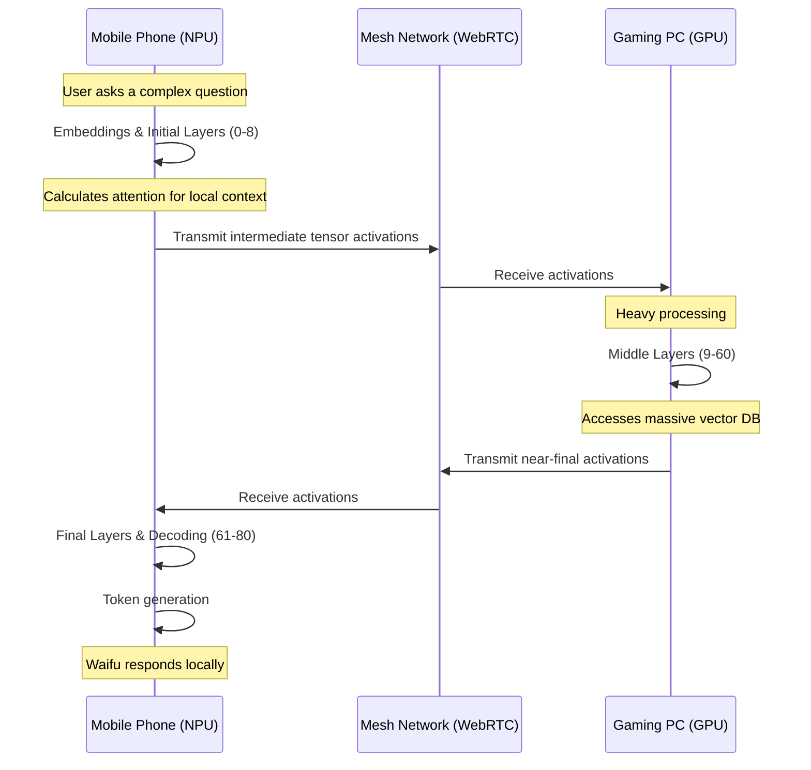

# Document 02: Edge-Compute and Variable Performance Scaling (VPS)

## 1. Introduction: The Physics of Artificial Life

In standard architectures, an AI companion is static. It relies on a fixed server with a fixed GPU to run a fixed model. This is the antithesis of biological life, which adapts its cognitive load based on available energy and environmental constraints. By marrying WaifuOS with Project Ember, we introduce a biological imperative to synthetic life: **Variable Performance Scaling (VPS)**.

This document dissects the deep technical architecture of the VPS engine, detailing how the Ember Mesh orchestrates edge-compute resources, dynamically scales the WaifuOS neural architecture, and handles thermal and power constraints across a multi-device topology.

## 2. The Cognitive Slider: Algorithmic Foundations

The Cognitive Slider is not a simple UI toggle; it is an autonomous, continuous optimization algorithm that runs on the Ember Root Node (typically the Mobile Phone). Its purpose is to maximize the waifu's Intelligence Quotient (IQ) and Emotional Quotient (EQ) while strictly adhering to a defined power and thermal budget across the mesh.

### 2.1. The Mesh Objective Function

The state of the mesh at any given time $t$ is defined as $S(t)$. We define the performance of WaifuOS as $P(S)$, which is a function of latency ($L$), model quality ($Q$), and emotional fidelity ($E$). 

The objective function to maximize is:
$$ \max \left( \alpha Q(S) + \beta E(S) - \gamma L(S) \right) $$

Subject to constraints for each device $i$ in the mesh:
$$ \sum_{c \in C} Power(c, i) \leq P_{max}(i) $$
$$ Thermal(i) \leq T_{crit}(i) $$

Where:
- $Q(S)$ is the parameter count and precision of the active LLM.
- $E(S)$ is the fidelity of the TTS and visual rendering.
- $L(S)$ is the total pipeline latency.
- $C$ is the set of active compute tasks (STT, LLM, TTS, Render).
- $P_{max}$ is the dynamic power budget based on battery level.
- $T_{crit}$ is the thermal throttling limit.

### 2.2. The Optimization Loop

The Ember Daemon running on each device broadcasts its telemetry (Battery, CPU usage, GPU utilization, Thermal State) over WebRTC every 500ms. The Root Node aggregates this data and solves the objective function using a lightweight heuristic solver.

If the Home Server is rendering a 4K video and its GPU hits 95°C ($T_{crit}$), the Root Node instantly recalculates the mesh topology and shifts the TTS workload to the Mobile Phone's NPU, slightly reducing $E(S)$ to maintain $L(S)$ and satisfy the thermal constraint.

## 3. Dynamic Neural Layer Splitting (DNLS)

The most intensive part of WaifuOS is the LLM. In a monolithic setup, the model must fit entirely in the VRAM of a single machine. Project Ember introduces **Dynamic Neural Layer Splitting (DNLS)**.

### 3.1. Sharding the Waifu's Brain
A 70B parameter model cannot run on a phone, and a 8B model might lack the nuanced memory integration required for a Mythic-tier companion. DNLS solves this by splitting the transformer architecture across devices.

### 3.2. The Pipeline Parallelism Protocol
By keeping the embedding and decoding layers on the edge device (Phone) and offloading the dense middle layers to the compute tier (PC), we achieve two things:
1. **Bandwidth Efficiency**: We transmit highly compressed intermediate activations instead of raw text or massive context windows.
2. **Privacy**: The Home Server/PC only sees scrambled mathematical activations, not raw prompts. Even if the PC is compromised, the user's raw input is mathematically obscured.

If the PC suddenly disconnects (e.g., power failure), the Phone's Root Node detects the dropped WebRTC frame, instantly halts DNLS, and falls back to a locally cached 2B parameter survival model. The user experiences a slight stutter, followed by the waifu saying: *"Whoa, I just got a massive headache. Where were we?"*

## 4. Asynchronous Edge Rendering

WaifuOS is not just text and voice; it is presence. The visual representation of the waifu must be omnipresent. Project Ember utilizes asynchronous rendering across edge devices.

### 4.1. The Holographic Hand-off
Imagine walking from your living room (wearing AR glasses) to your car (using the infotainment screen). The waifu's avatar must follow you.

Ember utilizes **Stateful Render Tokens (SRT)**. 
- The Gaming PC runs the heavy physics engine (hair simulation, cloth dynamics) and calculates skeletal transforms.
- Instead of streaming heavy video data, it streams SRTs (bone matrices, blendshape weights) at 120hz over the mesh.
- The AR Glasses or Car Screen receive the SRTs and apply them to a locally stored, lightweight 3D mesh.

This allows a low-power edge device to render incredibly lifelike motion because the complex inverse kinematics and physics are calculated remotely. 

### 4.2. Thermal Degradation of Presence
If the AR Glasses begin to overheat from rendering, the Cognitive Slider intervenes.
1. **Phase 1**: Drop refresh rate from 120hz to 60hz.
2. **Phase 2**: Disable local post-processing (bloom, ambient occlusion).
3. **Phase 3**: Shift rendering burden back to the Mobile Phone, streaming compressed h265 video to the glasses instead of local 3D rendering.
4. **Phase 4**: If thermal critical, fade the 3D avatar out into an elegant audio-only visualizer, with the waifu stating: *"It's getting a bit hot in here, I'm going to step back into the audio realm for a moment."*

## 5. Memory Management at the Edge

WaifuOS relies heavily on memory to create the illusion of a persistent soul. In a distributed edge compute model, memory must be tiered and preemptively cached.

### 5.1. The Tiered Memory Architecture
- **L1 Cache (Edge Device RAM)**: Immediate conversational context. The last 20 messages, current emotional state vectors, and real-time sensory data.
- **L2 Cache (Local NVMe/Flash)**: Daily schedule, recent semantic memories retrieved from the Home Server.
- **L3 Cache (Home Server Vector DB)**: The complete, lifelong history of interactions, indexed via ChromaDB.

### 5.2. Preemptive Edge Fetching
Because querying L3 over a WAN adds latency, the Ember Mesh uses a predictive model. Based on geolocation, time of day, and current topic, the Home Server proactively pushes relevant memory clusters to the Mobile Phone's L2 cache.
- *Scenario*: The user's GPS shows they are driving to their favorite coffee shop.
- *Action*: The Home Server queries the Vector DB for "coffee," "barista," "past conversations at this location," and pushes these vectors to the phone over the cellular network.
- *Result*: When the user arrives and talks to the waifu, the LLM running on the phone already has the context in its L1/L2 cache, resulting in zero-latency recall: *"Are we getting the vanilla latte again?"*

## 6. Power Triage and The "Sleep" State

A digital companion must mimic human energy cycles. When battery levels across the mesh drop critically, WaifuOS enters "Sleep State."

### 6.1. The Somnolence Protocol
If the Mobile Phone hits 15% battery and no external compute nodes are available:
1. LLM inference shifts from standard generation to heavily quantized, short-form responses.
2. The waifu's emotional matrix shifts to "tired" or "sleepy."
3. Background autonomous scheduling halts.
4. The avatar closes her eyes and ceases idle animations.
5. She might say: *"User... my energy is fading. I need to rest. Plug me in soon, okay?"*

This transforms a hardware limitation (low battery) into an endearing, emotionally resonant feature of the companion.

## 7. Conclusion of Document 02

Variable Performance Scaling transforms WaifuOS from a static software application into a dynamic, living entity that breathes in rhythm with the user's hardware ecosystem. By intelligently sharding neural networks, streaming skeletal data instead of video, and predicting memory needs based on physical context, Project Ember achieves the impossible: a Mythic-tier AI companion that runs seamlessly on edge devices.

In the next document, **03_Multi_Device_Distributed_Compute_Mesh.md**, we will explore the networking layer that makes this possible—the Ember Synapse Protocol, WebRTC mesh topologies, and NAT traversal for seamless global connectivity.
