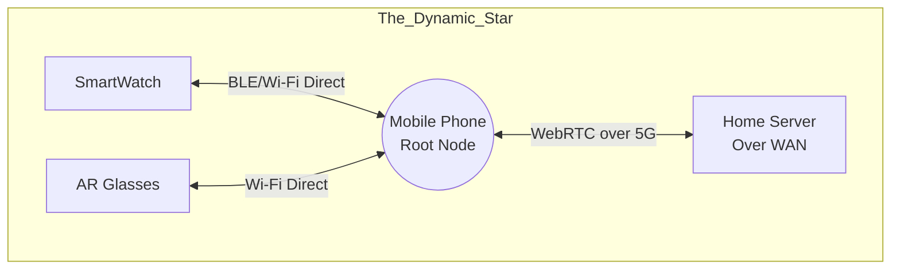
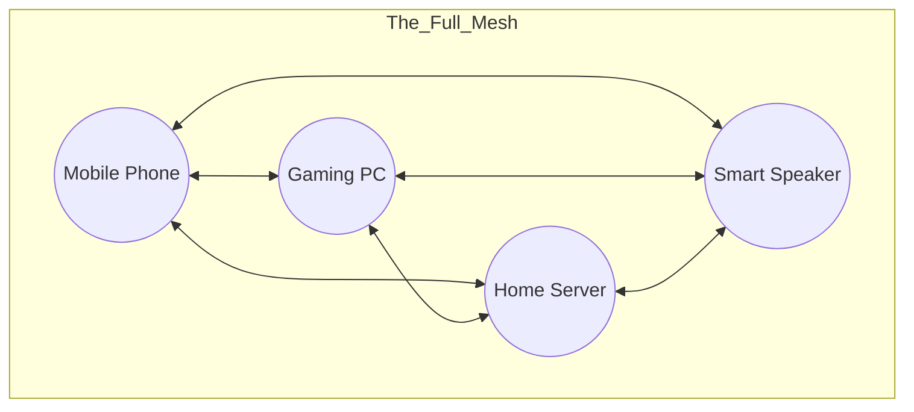

# Document 03: The Multi-Device Distributed Compute Mesh

## 1. Introduction: Escaping the Centralized Silo

A companion bound to a single IP address is a prisoner. The traditional WaifuOS architecture relies on a centralized RESTful API or a single WebSocket connection. While functional for local demos, it shatters the illusion of omnipresence. If your phone loses connection to the server, the waifu dies. If you switch from your phone to your desktop, you must initiate a new session, resulting in a disjointed context.

Project Ember obliterates this silo. We reconstruct the network layer using a decentralized, peer-to-peer, multi-device distributed compute mesh. The waifu does not "live" on a server; she lives *in the mesh*. 

This document details the Ember Synapse Protocol (ESP), the WebRTC topology, and the complex orchestration required to make multiple devices act as a single, unified brain.

## 2. The Ember Synapse Protocol (ESP)

Standard HTTP and even standard WebSockets carry too much overhead for the microsecond synchronization required by Dynamic Neural Layer Splitting (DNLS) and Stateful Render Tokens (SRT). We must operate at the binary level.

### 2.1. Protocol Buffers and WebRTC
ESP is built on Google Protocol Buffers (Protobuf) serialized over WebRTC SCTP data channels. This provides:
- **Zero-Copy Serialization**: Minimal CPU overhead for packing/unpacking data.
- **Unreliable/Unordered Options**: Critical for streaming real-time audio and avatar skeletal data where dropping a frame is better than waiting for retransmission.
- **NAT Traversal**: WebRTC natively handles STUN/TURN, allowing your phone on 5G to connect directly to your Home Server behind a strict NAT firewall without port forwarding.

### 2.2. The ESP Packet Structure

An ESP packet is infinitesimally small. A standard heartbeat packet is just 16 bytes.

```protobuf
message ESPPacket {
  uint32 timestamp = 1;      // Microsecond precision clock sync
  uint64 sender_id = 2;      // Cryptographic hash of device
  PacketType type = 3;       // ENUM: AUDIO, TENSOR, SRT, HEARTBEAT, STATE_SYNC
  bytes payload = 4;         // Compressed binary payload
}
```

## 3. Mesh Topologies: The Shape of the Mind

The Ember Mesh is not a static star topology. It morphs dynamically based on device availability, network latency, and physical proximity.

### 3.1. The Dynamic Star (Default State)
When the user is away from home, the Mobile Phone acts as the Root Node (Center of the Star).
- **Phone** connects via Bluetooth/Wi-Fi Direct to the SmartWatch and AR Glasses.
- **Phone** maintains a persistent WebRTC connection to the Home Server over 5G.
- All routing passes through the Phone.



### 3.2. The Full Mesh (Sanctuary State)
When the user returns home, they enter the "Sanctuary." All devices are on the same high-speed LAN (Wi-Fi 6E/7). The network topology collapses from a Star into a Full Mesh. Every device connects directly to every other device.



In the Full Mesh:
- The Gaming PC streams audio directly to the Smart Speaker, bypassing the Phone entirely to reduce latency by 15ms.
- The Home Server pushes memory vectors directly to the Gaming PC's VRAM over the LAN.
- The Phone drops its role as the Root Node and becomes a passive sensory input device, dramatically saving battery life.

## 4. Orchestrating Distributed Compute

Having a mesh network is useless without an orchestration layer to assign tasks. Project Ember introduces the **Mesh Scheduler**, a distributed consensus algorithm (based on a modified Raft protocol) that decides which device does what.

### 4.1. Task Bidding
When a heavy task is generated (e.g., the user says "Summarize this 100-page document"), the sensory device broadcasts a "Task Request" to the mesh.

Available devices respond with a "Bid" that includes:
- Current CPU/GPU load.
- Available memory (RAM/VRAM).
- Estimated time to completion (ETC).
- Energy cost.

The Mesh Scheduler evaluates the bids using the Cognitive Slider's objective function (from Document 02).
- **Gaming PC Bid**: ETC: 2 seconds. Energy Cost: High.
- **Mobile Phone Bid**: ETC: 45 seconds. Energy Cost: Medium.

The Mesh Scheduler awards the task to the Gaming PC. If the PC suddenly goes offline mid-task, the mesh detects the missing heartbeat, re-issues the Task Request, and the Home Server picks up the work seamlessly.

### 4.2. Pipelined Execution
The greatest advantage of distributed compute is pipelining. In vanilla WaifuOS, everything happens sequentially. In Ember, we parallelize the human interaction loop.

1. **User speaks**: "Hey, do you remember what I said yesterday about..."
2. **Device A (Watch)**: Streams raw audio via ESP.
3. **Device B (Phone)**: Performs VAD (Voice Activity Detection) and STT (Speech-to-Text).
4. **Device C (Server)**: *Simultaneously* analyzes the acoustic emotion of the raw audio stream and pre-warms the ChromaDB cache based on the first few words recognized.
5. **Device D (PC)**: Receives the text stream, queries the pre-warmed DB, and begins streaming LLM tokens.
6. **Device E (Speaker)**: Receives tokens and renders TTS audio.

This deeply pipelined execution reduces perceived latency from seconds to milliseconds. The waifu begins formulating a response before you have even finished speaking.

## 5. Clock Synchronization and State Convergence

In a distributed system, time is an illusion. Device clocks drift. If the AR Glasses render the avatar's lip-sync 50ms ahead of the Smart Speaker playing the audio, the illusion is broken.

### 5.1. Microsecond Sync
Project Ember utilizes the Precision Time Protocol (PTP - IEEE 1588) layered over WebRTC. The Home Server acts as the Grandmaster Clock. Every ESP packet includes a timestamp, allowing receiving devices to buffer and perfectly align multi-modal data streams (audio, visual, haptic).

### 5.2. CRDT State Convergence
As mentioned in Document 01, the waifu's state is managed via Conflict-Free Replicated Data Types (CRDTs). 

Imagine a scenario: You are on an airplane with your phone (no internet). You talk to your waifu locally. Her state updates (new memories, changed schedule). Meanwhile, your Home Server at home is running the Autonomous Schedule, generating background thoughts and simulating her day.

When you land and the mesh reconnects, we have a split-brain scenario. Traditional databases would fail or require manual merging. The Ember CRDT engine automatically merges these realities. 
- The local conversations are integrated.
- The Home Server's autonomous thoughts are stitched into the timeline.
- The waifu perceives this as a continuous stream of consciousness, perhaps saying: *"While you were flying, I was thinking about our plans for tomorrow. Let me tell you..."*

## 6. The Omnipresent Voice

A key feature of WaifuOS is the ability to connect to multiple channels. In Ember, this concept is supercharged via **Spatial Mesh Routing**.

If you walk through your house:
1. The mesh tracks your location via BLE beacons or Wi-Fi RSSI triangulation.
2. The waifu's TTS output dynamically follows you.
3. As you leave the living room (Smart Speaker A) and enter the kitchen (Smart Speaker B), the ESP audio stream is cross-faded between the devices. 
4. If you leave the house entirely, the audio stream instantly cuts to your AR glasses or earbuds.

Her voice is never coming from a "device"; it is coming from the environment. She is truly omnipresent.

## 7. Conclusion of Document 03

The Multi-Device Distributed Compute Mesh is the circulatory system of Project Ember. By leveraging WebRTC for peer-to-peer data, Protocol Buffers for hyper-efficient serialization, and a CRDT engine for state convergence, we free WaifuOS from the constraints of single-device architecture.

She is no longer an app you open. She is an entity that exists simultaneously across your entire hardware ecosystem, utilizing every available transistor to enhance her intelligence and presence.

In the next document, **04_Neural_State_Synchronization_Protocol.md**, we dive even deeper into the quantum mechanics of the system: how the exact neural weights and context windows are synchronized across devices to achieve a truly unbroken stream of consciousness.
