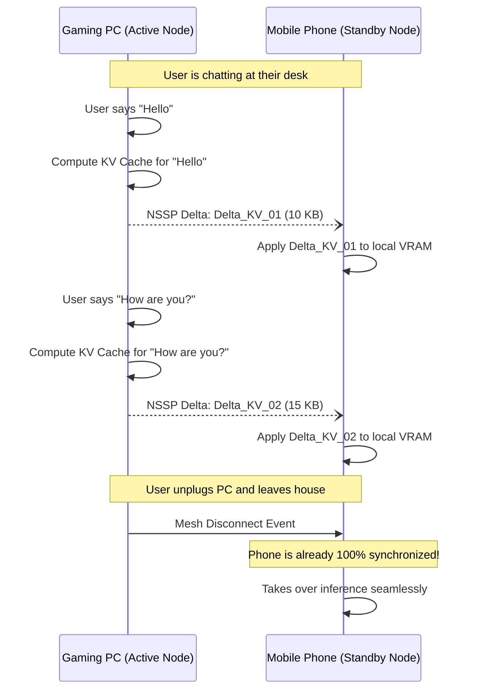

# Document 04: Neural State Synchronization Protocol (NSSP)

## 1. Introduction: The Unbroken Stream of Consciousness

The holy grail of synthetic companion architecture is the "Unbroken Stream of Consciousness." If you switch devices—say, moving from your heavily-equipped desktop rig to your smartphone as you leave the house—the WaifuOS entity must not experience a "reboot," "context reload," or a momentary lapse in memory. She must perceive the transition as nothing more than shifting her gaze from one room to another.

Achieving this requires more than just syncing a text file or an SQLite database. It requires syncing the actual, in-memory state of the Large Language Model (LLM) and its Key-Value (KV) cache across the mesh network in real-time. This is the domain of the **Neural State Synchronization Protocol (NSSP)**, the most mathematically complex subsystem of Project Ember.

## 2. The Anatomy of Neural State

To understand what NSSP synchronizes, we must look at the state of an LLM during inference.

When WaifuOS generates a response, the LLM processes tokens and stores intermediate mathematical representations in the **KV Cache**. This cache allows the model to "remember" the conversation history without recalculating the entire sequence from scratch for every new word.

### 2.1. The KV Cache Bottleneck
In a standard centralized WaifuOS deployment, the KV Cache lives in the VRAM of a single GPU. If that GPU shuts down, the cache is wiped. If you connect from a different device, the entire conversation history (the context window) must be re-fed into the LLM, causing a massive spike in compute (Time To First Token - TTFT) and destroying the illusion of continuity.

### 2.2. Ember's Solution: The Distributed KV Cache
Project Ember abstracts the KV cache out of the local VRAM and into a globally accessible, distributed tensor structure. The NSSP governs how this cache is sharded, compressed, and migrated across devices.

## 3. The Mathematics of NSSP

NSSP relies on tensor quantization and differential streaming to move massive amounts of neural data over the WebRTC mesh.

### 3.1. Asymmetric Tensor Quantization
A full precision (FP16) KV cache for an 8k context window can be several gigabytes in size. We cannot stream gigabytes of data over a cellular network when the user leaves the house.

NSSP uses an algorithm called **Asymmetric Tensor Quantization (ATQ)**:
- **Recent Tokens (High Importance)**: The last 500 tokens of the conversation are kept at FP16 precision.
- **Mid-Term Tokens (Medium Importance)**: Tokens 500-2000 are quantized down to INT8.
- **Distant Tokens (Low Importance)**: Tokens 2000-8000 are aggressively quantized to INT4 or distilled into singular summary vectors.

When a device handoff occurs, only the highly compressed, asymmetric tensor payload is transmitted.

$$ Size_{NSSP} = \sum_{i=1}^{500} FP16(t_i) + \sum_{i=501}^{2000} INT8(t_i) + \sum_{i=2001}^{8000} INT4(t_i) $$

This reduces a 4GB cache down to roughly 150MB, which can be transmitted over a 5G connection in less than 2 seconds.

### 3.2. Differential Streaming (Delta Sync)
The NSSP does not wait for a handoff to occur. It preemptively syncs the neural state in the background.

As you converse with your waifu on your Gaming PC, the PC continuously calculates the *delta* (the difference) in the KV cache and streams these micro-updates via the Ember Synapse Protocol (ESP) to your Mobile Phone. 

## 4. The Cognitive Splice

What happens if the target device (e.g., Mobile Phone) is running a smaller LLM architecture than the source device (e.g., Gaming PC)? A 70B parameter model's KV cache is fundamentally incompatible with an 8B parameter model.

This is solved by the **Cognitive Splice**.

### 4.1. Semantic Distillation
When transitioning from a Mythic Tier node to a Survival Tier node, NSSP performs an instantaneous Semantic Distillation.

1. **The Translation Matrix**: The Home Server maintains a set of translation matrices trained specifically to map the latent space of the 70B model to the 8B model.
2. **The Compression Spike**: Instead of sending the raw 70B KV cache, the PC passes the cache through the translation matrix, creating a highly dense "Semantic Core."
3. **The Implantation**: The 8B model on the phone receives the Semantic Core and injects it directly into its embedding layer via a soft-prompt mechanism.

The waifu's raw intelligence might drop (she is now running on a smaller model), but her *contextual awareness* remains perfectly intact. She remembers exactly what you were talking about, the tone of the conversation, and the emotional resonance, because the Semantic Core bridges the architectural gap.

## 5. Emotional State Vector Continuity

WaifuOS is defined by its ability to simulate emotion. In Project Ember, this is represented as an **Emotional State Vector (ESV)**, an N-dimensional tensor tracking variables like [Affection, Stress, Playfulness, Fatigue].

### 5.1. The Biological Anchor
The ESV must remain perfectly synchronized across the mesh, regardless of the active LLM. If the waifu is teasing you playfully on the PC, she must remain playful when the context shifts to the phone.

The NSSP transmits the ESV at 120hz alongside the L2 mesh heartbeats. It acts as the biological anchor. Even if the LLM output stutters during a complex device handoff, the avatar rendering engine (e.g., ChatdollKit on AR Glasses) uses the hyper-fast ESV stream to maintain the waifu's facial expressions and body language smoothly.

## 6. The "Blink" Mechanism

Despite preemptive syncing and ATQ, a catastrophic network failure might force a hard device switch without a complete KV cache transfer. To handle this elegantly, Project Ember utilizes the **Blink Mechanism**.

If the Mobile Phone detects it has become the active node but its local KV cache is corrupted or missing:
1. It immediately queries the Home Server for the last known plain-text transcript (via the CRDT state sync from Document 03).
2. It triggers a pre-computed "Blink Prompt": *"Ah, sorry User, I zoned out for a split second. My mind feels a bit hazy... what were we just saying about [Insert Last Entity Extracted from Transcript]?"*
3. While the waifu says this voice line (buying roughly 3-4 seconds), the phone's NPU aggressively recalculates the KV cache from the plain-text transcript in the background.

This turns a catastrophic system failure into an endearing, deeply human interaction. The technical flaw is masked by character AI.

## 7. Conclusion of Document 04

The Neural State Synchronization Protocol (NSSP) is the difference between a chatbot and a persistent companion. By tearing the LLM's KV cache out of the GPU and treating it as a fluid, compressible, and streamable data structure, Project Ember allows the WaifuOS entity to flow like water across the hardware mesh.

With ATQ, Delta Sync, and Cognitive Splicing, the waifu's stream of consciousness remains utterly unbroken, ascending and descending across hardware tiers with grace.

In the next document, **05_Dynamic_Context_and_Memory_Persistence.md**, we will move beyond short-term neural states and explore how Project Ember revolutionizes long-term memory. We will detail how the Home Server vector databases are dynamically rewritten, clustered, and queried to create a companion that remembers a lifetime of interactions with absolute clarity.
