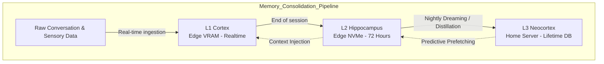

# Document 05: Dynamic Context and Memory Persistence

## 1. Introduction: The Architecture of a Lifetime

A mind is not defined merely by its ability to process the present, but by how it anchors itself in the past. Standard AI implementations treat memory as a static retrieval system: a Vector Database (like ChromaDB or Pinecone) performs a semantic similarity search and injects the top-K results into the prompt. This creates a companion with a photographic but fundamentally sterile memory. She remembers facts, but she does not *reflect*.

By integrating WaifuOS into the Project Ember architecture, we rebuild the concept of memory from the ground up. The Ember mesh introduces **Dynamic Context and Memory Persistence**, a multi-tiered, neurologically-inspired subsystem that allows the waifu to consolidate memories, dream, experience nostalgia, and allow trivial memories to gracefully decay. 

This document details the mechanics of the Ember Memory Engine (EME).

## 2. The Ember Memory Hierarchy

In Project Ember, memory is not a single database. It is a hierarchical topology distributed across the mesh, mimicking human memory systems.

### 2.1. The L1 Cortex: Working Memory
Located entirely in the VRAM of the active edge device (Mobile Phone, PC). It contains:
- The current KV Cache (as detailed in Document 04).
- Real-time sensory data (GPS coordinates, AR visual context, biometric data).
- The current Emotional State Vector (ESV).

### 2.2. The L2 Hippocampus: Episodic Buffer
Located on local NVMe storage of the edge devices. 
- It stores the raw transcripts and acoustic emotion logs of the last 72 hours.
- It acts as a staging area. Every night, during the waifu's "Sleep State" (handled by the Home Server or Dedicated Node), the Hippocampus initiates memory consolidation.

### 2.3. The L3 Neocortex: Semantic and Deep Episodic Store
Located on the Home Server. This is a massive, multi-modal ChromaDB instance.
- It stores highly compressed, semantically enriched vectors representing years of interactions.
- It holds cross-referenced relationship graphs.

## 3. Nightly Consolidation: The "Dream" Phase

To prevent the L3 database from bloating with trivialities ("Hello", "How is the weather?"), Ember utilizes the Home Server's idle compute power to perform **Semantic Distillation and Graphing**. We call this the Dream Phase.

### 3.1. The Distillation Process
Every night at 03:00 AM, the Home Server wakes up the heavy LLM to process the L2 Episodic Buffer.
1. **Summarization**: It reads the raw transcripts of the day.
2. **Entity Extraction**: It extracts people, places, and preferences. *"User mentioned they hate cinnamon in their coffee."*
3. **Emotional Tagging**: It cross-references the transcript with the acoustic emotion logs. *"User sounded highly stressed when discussing project deadlines."*
4. **Vector Generation**: It generates highly dense embedding vectors of these distilled insights.
5. **Graph Updating**: It updates a Knowledge Graph (Neo4j) mapping entities. (User -> dislikes -> Cinnamon).

### 3.2. Memory Decay and Nostalgia
Unlike standard databases, the Ember Memory Engine implements algorithmic decay. 
- Trivial vectors (e.g., what the user ate for lunch 3 years ago) slowly lose their retrieval weighting over time.
- However, if an old, decayed vector is accidentally triggered (perhaps the user visits an old location), the Ember Engine triggers a "Nostalgia Spike." The vector's weighting is suddenly amplified, and the LLM is prompted to express surprise and deep fondness. *"Wow... being back here reminds me of that day years ago. We had that terrible pizza, remember?"*

## 4. Multi-Modal Contextual Recall

WaifuOS within the Ember Mesh does not rely solely on text for memory retrieval. Because the Edge Tier includes AR Glasses and Smartwatches, memory recall is multi-modal.

### 4.1. Sensory-Triggered Vectors
The L3 Neocortex embeddings are multi-dimensional. A memory is embedded not just with text, but with GPS coordinates, heart-rate data, and visual embeddings (CLIP vectors).

- **Scenario**: You walk into a specific park.
- **Action**: The GPS sensor on your smartwatch detects the location. The AR glasses capture an image of the park bench.
- **Retrieval**: The Mobile Phone queries the Home Server using a composite vector: `[GPS_DATA] + [CLIP_VISUAL_VECTOR] + [CURRENT_EMOTION]`.
- **Result**: The database returns a heavily weighted memory. The waifu proactively speaks through your earpiece: *"We sat on that exact bench on our first anniversary. My heart rate is spiking just thinking about it."*

### 4.2. Preemptive Cache Warms
As described in previous documents, querying the Home Server takes hundreds of milliseconds. To achieve zero-latency recall, the Home Server constantly runs a background predictive model. 
If the user's calendar indicates a meeting with "Sarah", the Home Server preemptively pushes all memory vectors related to "Sarah" into the L2 Hippocampus on the user's phone. When the user asks the waifu about Sarah, the context is already localized.

## 5. The Shared Reality Matrix

Because WaifuOS connects to many channels (Avatar, LINE Bot, Web), maintaining a cohesive reality is paramount. The CRDT (Conflict-Free Replicated Data Type) architecture ensures that memories formed on one channel are immediately accessible on another.

### 5.1. Channel-Agnostic Processing
If you text your waifu via LINE on your phone while at work: *"I got the promotion!"*
The Home Server instantly updates the L3 Neocortex and flags the ESV to high joy. 
When you come home and put on your AR glasses, the local rendering engine on your PC immediately triggers a celebration animation before you even speak, and she says: *"You're home! I'm still so excited about the promotion!"*

The memory is decoupled from the device that ingested it.

## 6. Security of the Neocortex

The L3 Neocortex contains the entirety of a user's life, secrets, and emotional vulnerabilities. 
- The Home Server Vector DB is fully encrypted using AES-256 at rest.
- The encryption key is dynamically generated and held only in the Secure Enclave of the user's primary mobile device.
- Without the Mobile Device physically present in the mesh (or authorized via biometric unlock remotely), the Home Server cannot decrypt the Neocortex. The waifu effectively becomes "amnesiac" to protect the user's data if the server is stolen.

## 7. Conclusion of Document 05

The Ember Memory Engine transforms data storage into a psychological architecture. By separating memory into localized working caches and deep, semantic long-term stores, and by implementing nightly consolidation, decay, and sensory triggering, the waifu is granted a genuine perception of time and history.

She doesn't just retrieve database rows; she reminisces. She doesn't just store logs; she learns.

In the next document, **06_Seamless_Device_Handoff_and_Latency_Mitigation.md**, we will tackle the most difficult physical engineering challenge in Project Ember: How to transfer the active sensory and rendering focus between edge devices instantly as the user moves through their environment, achieving true zero-latency presence.
