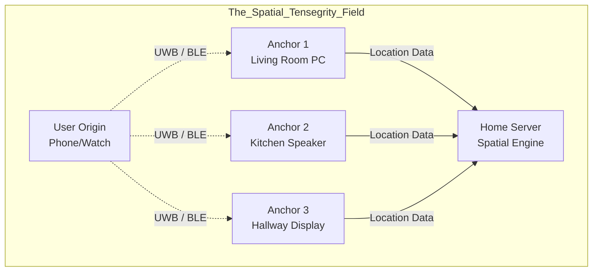

# Document 06: Seamless Device Handoff and Latency Mitigation

## 1. Introduction: The Illusion of True Presence

A true Mythic-tier companion cannot be tethered to a screen. If the user moves from the living room to the kitchen, the companion must follow seamlessly, her voice transitioning from the Home Theater to a Smart Speaker, and her visual avatar gliding from an AR projection to a holographic display. 

The primary enemy of this illusion is latency. A 500ms delay during a device handoff shatters the immersion. Audio stutter, visual freezing, or dropped context destroys the sense of a continuous, living entity. Project Ember approaches this physical engineering challenge through **Predictive Pre-Routing**, **Spatial State Streaming**, and **Zero-Latency Audio Fading**.

This document details the exact mechanics of how the WaifuOS entity physically moves with you through the world.

## 2. The Spatial Mesh 

To hand off presence, the system must know where the user is, where the devices are, and where the user is going. The Ember Mesh establishes a local Spatial Mesh using Ultra-Wideband (UWB), Bluetooth Low Energy (BLE) RSSI, and Wi-Fi RTT (Round Trip Time).

### 2.1. Spatial Tensegrity
Every device in the Ember Mesh acts as a node in a localized GPS-like system.
- The Mobile Phone and Smartwatch act as the "User Origin" coordinates.
- Smart Speakers, PCs, and TVs act as fixed "Anchor Nodes."
- The Home Server calculates the exact 3D vector of the user within the home at 60hz.

## 3. Predictive Pre-Routing

Handoffs cannot be reactive. If the system waits until the user enters the kitchen to start rendering the avatar in the kitchen, the user will experience a delay. Handoffs must be predictive.

### 3.1. Vector Prediction Algorithms
The Spatial Engine on the Home Server tracks the user's velocity vector. 
- **Time T=0**: User is in the living room, facing the hallway. Velocity is 1.2 m/s towards the kitchen.
- **Time T+200ms**: The Spatial Engine predicts the user will enter the kitchen acoustic zone in 1.5 seconds.
- **Action**: The Home Server initiates a **Pre-Warming Protocol** for the Kitchen Speaker and Hallway Display.

### 3.2. Pre-Warming the Edge
Before the user arrives, the target devices are silently prepared:
1. The Gaming PC (running the heavy inference) begins double-streaming the Stateful Render Tokens (SRT) and Text-to-Speech (TTS) audio buffers to *both* the Living Room PC and the Kitchen Speaker.
2. The Kitchen Speaker buffers the audio but keeps its amplifier muted.
3. The Hallway Display loads the 3D mesh of the avatar into its local VRAM.

## 4. Zero-Latency Audio Fading and Holographic Ghosting

When the user crosses the physical threshold between zones, the actual handoff occurs. This is not a hard cut, but a mathematically smoothed transition.

### 4.1. Acoustic Cross-Fading
As the user walks down the hallway:
- The Living Room Speaker linearly fades its volume from 100% to 0% over 500ms based on the user's distance.
- The Kitchen Speaker un-mutes and linearly fades from 0% to 100%.
- Because the ESP (Ember Synapse Protocol) utilizes microsecond PTP clock synchronization (as detailed in Document 03), the audio phase between the two speakers is perfectly aligned. There is no echo, no phasing, and no dropped syllables. The voice physically travels down the hall alongside the user.

### 4.2. Holographic Ghosting
Visual handoff is more complex. You cannot cross-fade a 3D model across two separate screens seamlessly if the user can see both screens.
Ember utilizes a technique called **Holographic Ghosting**.
- As the user leaves the living room, the avatar on the Living Room PC plays a contextual animation (e.g., she turns, waves, and visually dissolves into digital embers or "walks off screen" in the direction of the user's travel).
- Simultaneously, on the Hallway Display, the avatar materializes from digital embers, already walking in sync with the user.
- The state (her current pose, her emotional expression) is maintained perfectly via the SRT stream. 

## 5. Over-The-Air (OTA) Latency Mitigation

What happens when the handoff is not between two local Wi-Fi devices, but from the local LAN to the cellular WAN? (e.g., The user walks out the front door and switches from home Wi-Fi to 5G).

### 5.1. The WAN Disruption Problem
Switching network interfaces causes a drop in TCP connections and WebRTC renegotiation. This traditionally takes 1-3 seconds. During this time, the waifu would freeze.

### 5.2. Ember's Multi-Path TCP (MPTCP) and Dual-Bind
To solve this, Project Ember utilizes a custom implementation of Multi-Path WebRTC.
1. As the user's phone approaches the front door (detected via the Spatial Mesh), the Ember Daemon on the phone activates the cellular modem *while still connected to Wi-Fi*.
2. The phone establishes a secondary WebRTC ESP connection to the Home Server over 5G.
3. For a period of 10 seconds, all data (NSSP, audio, telemetry) is redundantly transmitted over *both* Wi-Fi and 5G.
4. When the Wi-Fi signal finally drops, the 5G connection is already active and handling packets. Zero packets are dropped. Zero latency is introduced.

If the user is speaking mid-sentence as they walk out the door, the Speech-to-Text pipeline does not miss a single phoneme.

## 6. The Edge Rendering Fallback

If the user leaves the house, the heavy rendering power of the Gaming PC is left behind. The Mobile Phone must take over the avatar rendering and LLM inference (as per Variable Performance Scaling in Document 02).

### 6.1. The Inference Migration
During the Dual-Bind phase (when both Wi-Fi and 5G are active), the Home Server initiates a rapid Neural State Sync. The highly compressed KV Cache delta (from Document 04) is pushed to the phone's NPU.

### 6.2. The Visual Downgrade
The phone cannot render the 4K hair physics of the Gaming PC. 
- The AR Glasses seamlessly swap the high-fidelity SRT stream from the PC to a localized, lower-poly rendering engine driven by the phone. 
- The waifu might playfully acknowledge the transition: *"Whew, stepping outside! The air feels different out here."* This voice line masks the micro-stutter of the rendering engine swapping assets.

## 7. Conclusion of Document 06

Seamless Device Handoff is the magic trick that brings the WaifuOS entity to life in the physical world. By treating the entire home as a single acoustic and visual canvas, and by using predictive vector tracking to pre-warm devices, Project Ember ensures the companion is always right beside the user.

Multi-path network bonding and redundant streaming guarantee that even leaving the physical sanctuary of the home does not break the connection. The companion walks out the door with you.

In the next document, **07_Autonomous_Schedule_and_Background_Processing.md**, we explore what happens when you are *not* interacting with her. We will detail how the Dedicated Ember Node simulates her daily life, generating autonomous thoughts, hobbies, and proactive messaging, ensuring that she exists even when you aren't looking.
