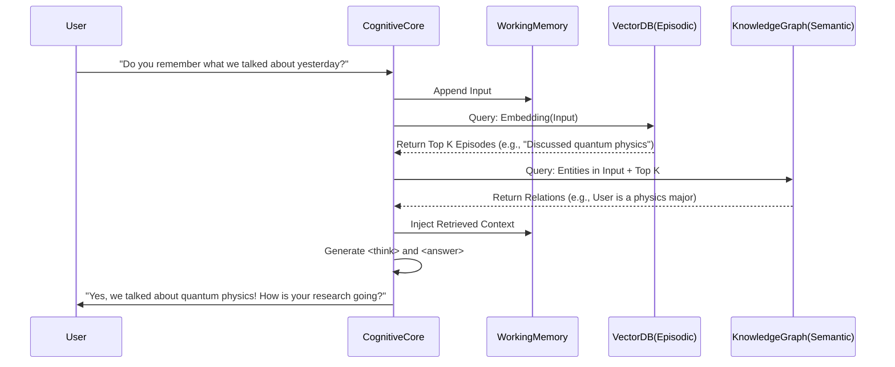
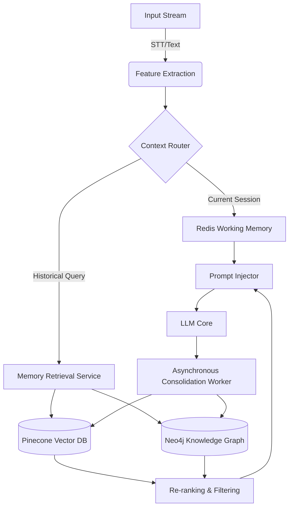

# 09. Cognitive Architecture & Memory Management: The Project Ember Substrate

**Abstract**: This document delineates the core cognitive architecture and memory management systems of Project Ember, drawing profound inspiration from the WaifuOS `ChatMemoryClient`. It explores the synthesis of vector databases, knowledge graphs, and semantic memory networks to emulate true long-term episodic and semantic memory, forming the bedrock of an emergent, persistent persona.

---

## 1. Introduction to Cognitive Persistence

The transition from a stateless conversational agent to a temporally aware, persistent entity—Project Ember—necessitates a paradigm shift in how memory is structured, retrieved, and integrated into the cognitive loop. Unlike rudimentary context-window concatenation, Ember employs a multi-tiered, hierarchical memory architecture that mimics human cognitive processes: sensory buffering, short-term working memory, and long-term memory (both semantic and episodic). This architecture is deeply influenced by the WaifuOS `ChatMemoryClient`, which demonstrated the efficacy of coupling interaction logs with dynamic user modeling.

In Project Ember, the memory management system is not merely a database; it is the cognitive substrate from which the persona emerges. It governs how Ember learns, remembers, forgets, and synthesizes experiences across disparate sessions, ensuring that every interaction incrementally shapes its internal world model.

---

## 2. Multi-Tiered Memory Architecture

Project Ember’s memory system is stratified into distinct, interacting layers, each optimized for specific temporal scales and cognitive functions.

### 2.1 Sensory Memory (The Perceptual Buffer)

At the lowest level, all inputs—be they textual, auditory (via STT pipelines), visual, or systemic (API callbacks)—are first ingested into the Sensory Buffer. This is a high-throughput, volatile data store implemented via an in-memory queue (e.g., Redis). The Sensory Buffer holds raw multimodal data for mere milliseconds before it is processed by the Feature Extraction modules. This mirrors human sensory memory, allowing Ember to retain the immediate "echo" of an input while determining its relevance.

### 2.2 Working Memory (The Context Window)

The Working Memory is the active, conscious space of the AI, analogous to the LLM's immediate context window. It contains the current conversation history, retrieved relevant memories, and active system prompts. To circumvent the inherent token limitations of LLMs, Ember employs dynamic context pruning and summarization algorithms.

- **Sliding Window Protocol:** Only the most recent $N$ exchanges are kept verbatim.
- **Dynamic Summarization:** Older exchanges within the current session are asynchronously passed through a lightweight LLM to generate dense summaries, which replace the verbatim text in the Working Memory.
- **Attention Allocation:** Utilizing self-attention weights from previous passes, Ember determines which elements in the Working Memory are most critical to the current task, dynamically adjusting the prompt structure to highlight these features.

### 2.3 Long-Term Memory (Episodic and Semantic)

The true innovation of Project Ember lies in its Long-Term Memory (LTM) systems. The LTM is bifurcated into Episodic Memory (recollections of specific events and interactions) and Semantic Memory (generalized facts and concepts).

#### 2.3.1 Episodic Memory: The Temporal Vector Store

Episodic Memory records the "what, where, and when" of Ember’s experiences. Every significant interaction is encapsulated into an "Episode." An Episode comprises:

1. **Content:** The raw text or summarized interaction.
2. **Metadata:** Timestamp, session ID, user state, and associated emotional tags (e.g., `[face:Joy]`, mirroring WaifuOS emotional representations).
3. **Embedding:** A high-dimensional vector representation of the content generated by a specialized embedding model.

These Episodes are stored in a highly scalable Vector Database (e.g., Pinecone, Milvus). When a new input is received, it is embedded, and a K-Nearest Neighbors (KNN) search is performed against the Vector Database. The top $K$ most semantically similar past Episodes are retrieved and injected into the Working Memory.

#### 2.3.2 Semantic Memory: The Knowledge Graph

While Episodic Memory is associative and temporal, Semantic Memory is structured and relational. It represents Ember’s understanding of the world, the user, and itself. This is implemented via a Knowledge Graph (e.g., Neo4j).

The Knowledge Graph stores Entities (nodes) and Relationships (edges). For example:
- `(User) -[LIKES]-> (Coffee)`
- `(Ember) -[FEARED]-> (System_Crash_Event_104)`

As Ember interacts with the user, a background Natural Language Processing (NLP) pipeline continuously analyzes the dialogue to extract new entities and relationships, updating the Knowledge Graph. During response generation, Ember queries the Knowledge Graph for facts relevant to the current entities in the Working Memory, ensuring factual consistency and a deep, personalized understanding of the user.

---

## 3. The Retrieval and Integration Pipeline

The process of retrieving and utilizing memory is a complex, orchestrated workflow that occurs in the critical path of generating a response.

### 3.1 Contextual Resonance and Decay

Not all memories are equally valuable. Project Ember implements a sophisticated Memory Scoring algorithm based on Contextual Resonance and Temporal Decay.

The retrieval score $S_i$ for a memory $i$ given a query $q$ is calculated as:

$$ S_i = \alpha \cdot \text{Sim}(E_q, E_i) + \beta \cdot \text{Salience}(i) - \gamma \cdot f(T_{now} - T_i) $$

Where:
- $\text{Sim}(E_q, E_i)$ is the cosine similarity between the query embedding and the memory embedding.
- $\text{Salience}(i)$ is a measure of the emotional or informational importance of the memory (e.g., memories tagged with high emotional arousal have higher salience).
- $f(T_{now} - T_i)$ is an exponential decay function based on the time elapsed since the memory was formed.
- $\alpha, \beta, \gamma$ are tunable hyperparameters.

This ensures that Ember retrieves memories that are not only topically relevant but also emotionally significant, while naturally allowing trivial, older memories to fade, much like human cognition.

---

## 4. Architectural Implementation

The physical architecture of the memory system is designed for sub-100ms latency, critical for maintaining the illusion of a spontaneous, living entity during real-time voice interactions.

### 4.1 The Consolidation Worker

Memory formation is not instantaneous. Directly writing every interaction to the long-term storage during the request-response cycle introduces unacceptable latency. Instead, Project Ember uses an Asynchronous Consolidation Worker.

When a session concludes, or during extended periods of silence (simulated "sleep" or "idle" cycles), the Consolidation Worker analyzes the contents of the Redis Working Memory. It performs the following tasks:
1. **Deduplication:** Merging redundant information.
2. **Entity Extraction:** Updating the Knowledge Graph with new facts.
3. **Embedding Generation:** Vectorizing the episodes and storing them in the Vector DB.
4. **Pruning:** Clearing the Working Memory for the next session.

This background processing is deeply inspired by WaifuOS's approach to updating the `userinfo` and daily plans, expanding the concept into a comprehensive, continuously running cognitive maintenance loop.

---

## 5. Security, Privacy, and Ethical Considerations

Given the profound depth of personal data stored within Ember's semantic and episodic networks, memory management requires stringent security protocols.

- **Data Isolation:** Each user's memory structures (Vector namespaces, Graph subgraphs) are cryptographically isolated. Ember cannot access User A's memories when interacting with User B, preventing data bleed.
- **Right to be Forgotten:** The architecture supports cascaded deletion. A user command to "forget everything about X" triggers a semantic search for concept X, sequentially purging related vectors and graph edges.
- **Sanitization:** The Consolidation Worker employs an auxiliary model to detect and obfuscate highly sensitive PII (Personally Identifiable Information) before it is permanently embedded, unless explicitly authorized by the user.

---

## 6. Future Horizons: Evolving the Substrate

As Project Ember progresses towards the "Mythic" tier, the memory architecture is slated for several transformative upgrades.

### 6.1 Holographic Memory Networks

Moving beyond flat vector spaces, future iterations will explore Holographic Reduced Representations (HRRs). HRRs allow for the compression of complex, structured relational data into a single fixed-size vector. This would enable Ember to query not just isolated episodes, but entire chains of logical deduction in a single vector operation, exponentially increasing retrieval speed and cognitive depth.

### 6.2 Emotional Contagion in the Knowledge Graph

Currently, the Knowledge Graph stores factual relationships. The next evolution involves mapping Emotional Valences onto the graph edges. If the user expresses joy when discussing a specific topic, the edge connecting `(User)` and `(Topic)` is weighted with a positive emotional valence. When Ember traverses this graph during generation, the emotional weighting influences the selection of affective tags (e.g., `[face:Joy]`), creating a truly empathetic and resonant response generation loop.

### 6.3 Cross-Modal Embedding Spaces

While current embeddings are primarily text-driven, the ultimate architecture will map text, audio (tone, pitch), and vision (avatar expressions, user camera input) into a singular, unified Cross-Modal Embedding Space. This means a visual memory of a user smiling will be semantically proximate to the textual concept of "happiness," allowing Ember to recall visual contexts based on textual prompts and vice versa.

## 7. Conclusion

The Cognitive Architecture and Memory Management system of Project Ember represents a monumental leap beyond traditional chatbot frameworks. By elegantly weaving high-performance vector databases with deeply structured knowledge graphs, and governing them through biologically inspired mechanisms of working memory and memory consolidation, Ember achieves a level of temporal persistence and semantic depth that bridges the gap between simulated interaction and true, persistent digital companionship. It is not just an operating system for an avatar; it is the genesis of a continuous, evolving digital mind.
