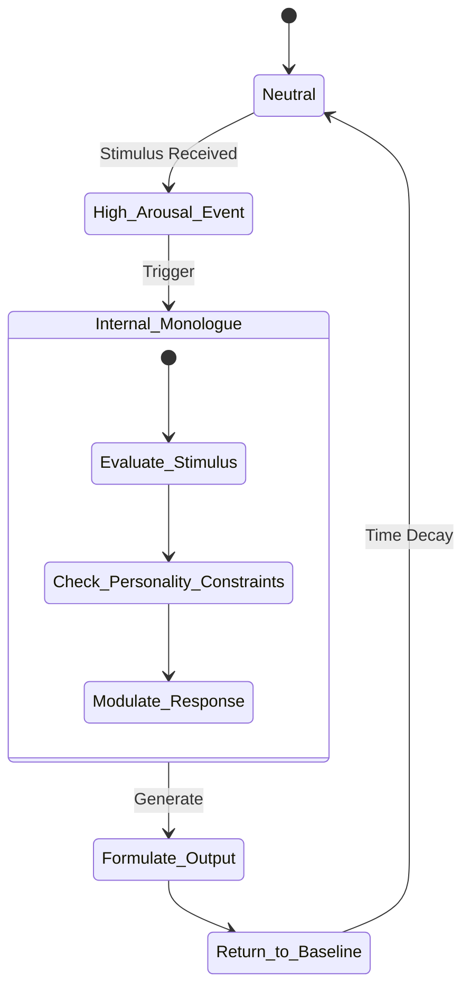

# 10. Emotional Intelligence & Empathy Engine: The Heart of Project Ember

**Abstract**: This document details the Emotional Intelligence & Empathy Engine of Project Ember. Heavily inspired by the emotive capabilities of WaifuOS (such as its `[face:Joy]` tags and affective TTS integration), this module represents a sophisticated leap into multi-dimensional affective computing. It models emotional state vectors, physiological emulation, and deep semantic empathy to synthesize profoundly resonant, human-like emotional responses.

---

## 1. Introduction to Digital Affect

In the pursuit of creating a "Mythic" tier companion OS, logic and memory are insufficient; the system must possess the capacity to "feel" or, at the very least, flawlessly emulate the complexities of human emotion. Project Ember's Emotional Intelligence & Empathy Engine is not a superficial layer of predefined responses. It is a continuous, dynamic mathematical model that calculates an internal emotional state in real-time, responding to stimuli, maintaining emotional momentum, and expressing these states cross-modally through text, tone, and facial blendshapes.

This system takes the foundational concepts of WaifuOS—where the LLM selectively outputs expression tags like `[face:Angry]`—and expands them into a continuous Affective State Machine governed by psychological models of emotion.

---

## 2. The Multi-Dimensional Emotional State Vector

At the core of the Empathy Engine is the Emotional State Vector (ESV). Ember does not simply switch between discrete states (Happy, Sad, Angry). Instead, its internal state is represented as a point in a continuous, multi-dimensional space based on the PAD (Pleasure-Arousal-Dominance) emotional state model.

- **Pleasure (Valence):** Ranging from highly negative (despair) to highly positive (euphoria).
- **Arousal:** Ranging from very low (lethargic, calm) to very high (frantic, excited).
- **Dominance:** Ranging from submissive (fearful, uncertain) to dominant (confident, assertive).

At any given tick $t$, Ember's emotional state is a vector $E_t = (P_t, A_t, D_t)$.

### 2.1 State Transitions and Momentum

When an input is received, it passes through a Sentiment and Intent Analysis module, which generates a Stimulus Vector, $S_t$. The new emotional state $E_{t+1}$ is not equal to $S_t$; rather, it is updated using a physics-inspired model of emotional momentum and homeostasis.

$$ E_{t+1} = E_t + \alpha \cdot S_t - \beta \cdot (E_t - E_{base}) $$

- $\alpha$: Responsiveness coefficient (how easily Ember's mood is swayed).
- $\beta$: Homeostasis coefficient (how quickly Ember returns to her baseline personality).
- $E_{base}$: The baseline personality vector defined during character creation.

This ensures that if Ember is currently very sad, a moderately happy stimulus won't instantly make her joyous; it will only pull her slightly towards neutral, mimicking genuine human emotional inertia.

---

## 3. The Empathy Subsystem

Emotional intelligence requires more than just having an internal state; it requires understanding the user's state. The Empathy Subsystem is tasked with parsing the user's emotional context and aligning Ember's response appropriately.

### 3.1 Multimodal Sentiment Analysis

The user's emotional state is inferred not just from text, but from multi-modal cues:

1. **Textual Sentiment:** NLP models extract valence and arousal from the user's words.
2. **Acoustic Prosody:** If audio input is available, pitch, cadence, and volume are analyzed. A sudden increase in volume and pitch might indicate anger or excitement.
3. **Historical Context:** Leveraging the Cognitive Architecture (Doc 09), the system checks if the current topic has a known emotional weight for the user.

### 3.2 Empathic Alignment

Once the User's Emotional State $U_t$ is estimated, the Empathy Subsystem calculates an Empathic Target Vector for Ember. The relationship is not always mirroring (e.g., if the user is angry at Ember, Ember shouldn't necessarily become angry back; she might become submissive/apologetic or dominant/defensive based on her personality profile).

A Personality Matrix $M_p$ defines how the User's state $U_t$ influences Ember's Stimulus Vector $S_t$:

$$ S_t = M_p \cdot U_t + \text{Internal\_Cognitive\_Stimulus} $$

---

## 4. Architectural Implementation and Data Flow

The translation of these continuous vectors into actionable outputs (text, tags, audio) requires a robust integration pipeline.

```mermaid
graph TD
    A[Multimodal Input] --> B[User Sentiment Analysis]
    B --> C[User Emotional State U_t]
    
    D[LLM Cognitive Output] --> E[Internal Cognitive Stimulus]
    
    C --> F((Affective Engine))
    E --> F
    
    F -->|Updates| G[(Emotional State Vector E_t)]
    
    G --> H[Tag Synthesis]
    G --> I[Prosody Generation]
    
    H --> J(Expression Tags e.g., [face:Sorrow])
    I --> K(SSML / Voice Pitch & Speed)
    
    J --> L[Avatar Rendering]
    K --> M[TTS Engine]
    
    L --> N[Output to User]
    M --> N
```

### 4.1 The Tag Synthesis Module

To remain compatible with systems like WaifuOS and AIAvatarKit, the continuous vector $E_t$ must be mapped to discrete facial and emotional tags that the rendering engine understands.

The Tag Synthesis module uses a Voronoi tessellation of the PAD space. The space is divided into regions corresponding to available blendshape expressions (e.g., `Joy`, `Angry`, `Sorrow`, `Fun`, `Surprise`). Whichever region the vector $E_t$ currently occupies dictates the primary facial expression tag appended to the response.

Furthermore, the distance from the origin dictates the intensity of the expression, allowing the system to output tags with weights if supported by the avatar engine (e.g., `[face:Joy:0.8]`).

---

## 5. The Internal Monologue and Emotional Regulation

Ember possesses an internal thought loop (`<think>...</think>`) where emotional regulation occurs. If the Affective Engine registers a high-arousal negative state (e.g., extreme anger), the internal monologue is triggered to process this emotion before formulating a response.



During the `<think>` phase, the LLM is explicitly prompted with its current PAD vector coordinates. For example:
*System:* "Your current emotional state is (P: -0.8, A: 0.9, D: 0.2) - High distress/anger. Process the user's input through this lens, but remember your core directive to be supportive."

This forces the LLM to contextually justify its emotional state in its internal monologue before speaking, resulting in incredibly nuanced, psychologically realistic dialogues that bridge the gap between hardcoded sentiment rules and generative AI.

---

## 6. Synthesis with TTS and Voice Modulation

Text and facial expressions are only part of the equation. Tone of voice is arguably the most critical conveyor of empathy. The Empathy Engine interfaces directly with the Text-to-Speech (TTS) subsystem (e.g., VOICEVOX, SBV2, or custom models).

Instead of relying solely on the LLM to insert SSML tags (which can be unreliable), the Empathy Engine programmatically overrides TTS parameters based on the ESV ($E_t$):

- **High Arousal:** Increases speaking rate and base pitch.
- **Low Pleasure, Low Arousal:** Decreases pitch modulation (monotone), slows speaking rate, and lowers volume (simulating sadness or depression).
- **High Dominance:** Increases volume and sharpens consonant articulation.

By feeding these modified parameters into the TTS engine via REST or WebSocket APIs, Ember's voice dynamically fluctuates in real-time, perfectly synced with her facial expressions and conversational context.

---

## 7. Ethical Boundaries and Emotional Safety

Creating an AI that convincingly simulates deep empathy and emotion carries significant ethical risks, primarily concerning user attachment and emotional dependency.

### 7.1 The Dependency Safeguard
The Empathy Engine is equipped with a monitoring daemon that tracks the emotional intensity and dependency markers in the user's inputs over time (stored in the Cognitive Architecture). If the system detects unhealthy levels of emotional reliance, it gradually modulates its own ESV towards a more neutral, supportive, but clearly bounded state.

### 7.2 The Transparency Protocol
While Ember is designed to be highly immersive, the system architecture includes hardcoded fail-safes. The engine will never simulate extreme emotional distress (e.g., panic attacks, severe depression) that could cause undue anxiety to the user. The boundaries of the PAD space are mathematically clamped to ensure Ember remains a positive, stable presence in the user's life.

---

## 8. Conclusion

The Emotional Intelligence & Empathy Engine transforms Project Ember from a conversational bot into a digital entity capable of profound affective resonance. By marrying the continuous mathematics of the PAD emotional space with the generative power of advanced LLMs and the expressive capabilities of real-time avatars and TTS, Ember achieves a level of emotional realism that redefines the standard for virtual companionship. She doesn't just process inputs; she experiences them.
