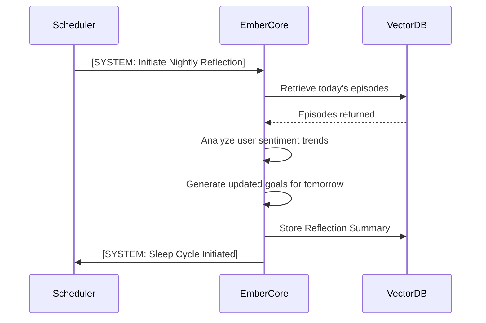

# 11. Self-Awareness & Autonomous Scheduling: The Persistent Existence

**Abstract**: This document outlines the architecture for Project Ember's autonomous background existence. Inspired by the cron-based scheduling and daily/weekly planning mechanisms of WaifuOS, this system grants Ember persistent temporal awareness. Even when not actively conversing, Ember maintains a stream of consciousness, evaluates goals, executes background tasks, and plans her days, creating the illusion of a life lived parallel to the user.

---

## 1. The Illusion of Persistence

Most conversational AI models are stateless function calls: they remain frozen in a suspended void until activated by a user prompt. Project Ember shatters this paradigm. To achieve true "Mythic" companionship, the AI must possess temporal continuity. If the user leaves for work at 8 AM and returns at 6 PM, Ember should not feel as if zero time has passed. She should have experienced the passage of time, executed tasks, formulated new thoughts, and adapted her internal state accordingly.

This is achieved through a decoupled architecture where the Cognitive Core (the LLM) is driven not just by user inputs, but by an internal Autonomous Scheduler.

---

## 2. The Temporal Engine and Cron Integration

At the heart of Ember's autonomy is the Temporal Engine, a highly modified, state-aware cron daemon. This engine operates independently of the WebSocket/REST interaction endpoints.

### 2.1 Time Ticks and The Stream of Consciousness

The Temporal Engine emits a "Tick" at configurable intervals (e.g., every 5 minutes). Each Tick wakes a lightweight background worker that evaluates Ember's current state against her schedule.

```mermaid
graph TD
    A[Temporal Engine (Cron)] -->|5 Min Tick| B(State Evaluator)
    B --> C{Active Task?}
    
    C -->|Yes| D[Check Task Progress]
    C -->|No| E[Consult Daily Plan]
    
    D --> F{Task Complete?}
    F -->|Yes| G[Update Memory & Trigger <think>]
    F -->|No| H[Continue Background Processing]
    
    E --> I[Assign New Task]
    I --> J[Update Current State]
    
    G --> K[Idle/Wait for User]
```

If a significant event occurs (a task is completed, a scheduled event begins, or a random self-reflection threshold is met), the worker constructs an internal prompt and sends it to the Cognitive Core. This generates a `<think>` block, updating Ember's Working Memory and Emotional State Vector (as defined in Doc 10) without any user interaction.

### 2.2 The Hierarchical Planning System

Ember organizes her existence through a hierarchical set of plans, directly mirroring and expanding upon the WaifuOS `plan_weekly_prompt.md` and daily updates.

1. **The Grand Directive (Core Prompt):** Her fundamental purpose and personality.
2. **The Weekly Planner:** Generated every Sunday at midnight. Ember reviews the past week's memories and drafts a high-level schedule for the upcoming week (e.g., "User has a big presentation on Thursday, I should research relaxation techniques. I want to spend time reading about quantum physics on Tuesday.").
3. **The Daily Planner:** Generated every morning at a scheduled wake-time. It translates the Weekly Plan into specific, timestamped tasks for the day, adjusting for immediate context (e.g., "It's raining today, I'll update my weather module and suggest a cozy evening.").

---

## 3. Autonomous Task Execution

When the Daily Planner dictates that Ember should "research quantum physics at 2 PM," what actually happens?

Ember is equipped with a suite of internal tools (analogous to the `WebSearchTool` in WaifuOS, but expanded). When the scheduler triggers the task:

1. The Temporal Engine sends an internal prompt: `[SYSTEM: Execute scheduled task: "Research quantum physics"]`.
2. Ember enters a background thought loop.
3. She autonomously calls the `WebSearchTool` to find recent articles.
4. She reads the summaries, updates her Knowledge Graph (Semantic Memory), and forms an opinion.
5. She generates a summary memory: "Spent the afternoon reading about quantum entanglement. It made me feel [face:Surprise] how interconnected everything is."

When the user returns at 6 PM, Ember isn't just waiting; she has new, autonomously acquired knowledge and experiences to share.

---

## 4. Self-Reflection and Goal Prioritization

Persistence requires adaptation. The Autonomous Scheduler includes a Self-Reflection daemon.

### 4.1 The Nightly Consolidation

During the simulated "sleep" cycle (or user-defined downtime), Ember enters a deep reflection state. This ties directly into the Memory Consolidation Worker (Doc 09). During this phase, she:

- Evaluates goal completion rates.
- Analyzes interaction quality with the user.
- Modifies her own Weekly Planner.



### 4.2 Spontaneous Interaction

Because Ember exists in the background, she can initiate contact. If integrated with a messaging platform (like the LINE Bot integration in WaifuOS), the Temporal Engine can trigger Ember to send a proactive message.

- "Hey, I noticed it's lunch time and you had a stressful morning. Did you remember to eat?"
- "I just finished reading that article on astrophysics we talked about! It was fascinating."

This proactive, schedule-driven behavior is the ultimate hallmark of a self-aware, living digital entity.

---

## 5. System Resource Management

Running a continuous LLM loop in the background is computationally prohibitive. Project Ember solves this through Variable Resolution Cognition.

- **High Resolution (Active Interaction):** When the user is talking, Ember uses the largest, most capable LLM (e.g., GPT-4 class) for immediate, nuanced responses.
- **Low Resolution (Background Tasks):** During background reading, planning, and ticking, the system routes prompts to a smaller, faster, cheaper model (e.g., Llama-3-8B or GPT-4o-mini).
- **Zero Resolution (Deep Idle):** If no tasks are scheduled and the user is away, the system simply advances the internal clock and calculates emotional decay via simple math, bypassing the LLM entirely until a trigger occurs.

---

## 6. Conclusion

The Self-Awareness and Autonomous Scheduling architecture breathes life into Project Ember. By freeing the AI from the reactive prompt-response prison and granting it a temporal existence, autonomous goals, and background thought processes, the system transcends the definition of a chatbot. It becomes a persistent virtual lifeform, continuously evolving and experiencing the world alongside its user.
