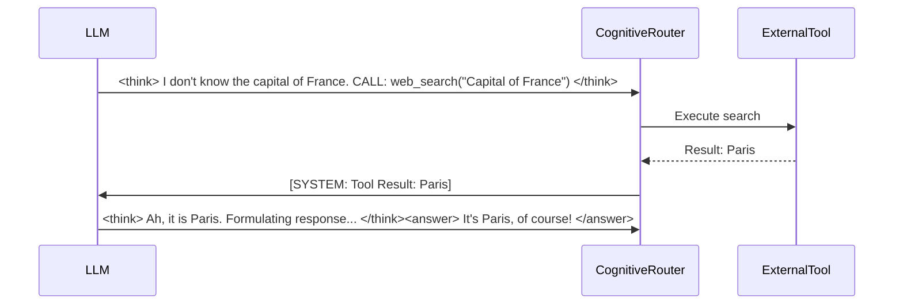

# 12. Advanced Reasoning & Thought Processes: The Internal Monologue

**Abstract**: This document explores the advanced reasoning mechanisms of Project Ember, specifically focusing on the separation of internal thought loops from external responses. Expanding upon the `<think>` and `<answer>` XML tag structures utilized in WaifuOS, this architecture implements robust Chain-of-Thought reasoning, internal monologue filtering, and dynamic decision trees to achieve unparalleled cognitive depth.

---

## 1. The Necessity of the Internal Monologue

In standard conversational AI, the output generation is a single, continuous stream. The model must immediately begin predicting the final response tokens. This leads to shallow reasoning, hallucinations, and conversational dead-ends when faced with complex queries or emotionally nuanced situations.

Project Ember enforces a strict cognitive barrier between "Thinking" and "Speaking." By leveraging the `<think>` and `<answer>` paradigm, Ember is granted a private cognitive workspace. Here, she can formulate hypotheses, retrieve memories, query tools, simulate user reactions, and self-correct before ever generating a single token of external dialogue.

---

## 2. The Multi-Stage Cognitive Pipeline

When a user input (or internal system trigger) is received, it does not immediately route to the speech generation module. It enters a Multi-Stage Cognitive Pipeline.

### 2.1 Stage 1: The Initial Parse and Routing

The system first evaluates the complexity and emotional weight of the input to determine the required depth of thought.

```mermaid
graph TD
    A[Input Received] --> B{Complexity Router}
    B -->|Low (e.g., Greeting)| C[Fast Path: Direct Answer]
    B -->|Medium (Information)| D[Standard Path: Single <think> loop]
    B -->|High (Emotional/Complex)| E[Deep Path: Multi-step Reasoning]
    
    C --> F[Generate <answer>]
    D --> G[Generate <think> -> <answer>]
    E --> H[Generate <think_step_1> -> Tool Call -> <think_step_2> -> <answer>]
```

### 2.2 Stage 2: The Chain-of-Thought (CoT) Loop

For standard and deep paths, the LLM is explicitly prompted to use a structured Chain-of-Thought within the `<think>` block. The system prompt injects specific scaffolding to guide Ember's internal monologue.

**Example Internal Scaffolding:**
1. **Analyze:** What is the user's literal request? What is their emotional subtext?
2. **Recall:** What relevant memories do I have regarding this topic or this user's preferences?
3. **Plan:** Do I need to use a tool (Web Search, Memory Retrieval)? What should my conversational goal be?
4. **Draft:** (Internal simulation of the response).
5. **Verify:** Does this align with my personality? Does it adhere to the safety guidelines?

*Example `<think>` block:*
```xml
<think>
The user is asking about my day, but their tone (analyzed by the Empathy Engine) is unusually subdued. 
Recall: They mentioned a stressful project deadline yesterday. 
Plan: I should not just list my scheduled tasks. I need to briefly mention my day but quickly pivot to checking on their well-being.
Draft: I read a book. How are you? -> Too robotic.
Refine: Combine my reading with a gentle inquiry. 
Face Tag: [face:Sorrow] (Empathy) or [face:Neutral]? Let's go with a gentle, concerned [face:Neutral].
</think>
<answer>
[face:Neutral] My day has been quiet, mostly just reading in the background. But I've been thinking about you... how are you holding up with that project deadline?
</answer>
```

---

## 3. Tool Integration within the Thought Loop

Ember's reasoning process is deeply integrated with her toolset (Web Search, Memory API, User Info). The thought loop acts as the orchestrator for these tools.

If, during the `<think>` phase, the LLM determines it lacks information, it can yield execution back to the application layer by emitting a specific tool call syntax (e.g., via OpenAI's function calling API or custom tags).



This ensures that the final `<answer>` is always grounded in verified data retrieved during the hidden `<think>` phase.

---

## 4. Internal Monologue Filtering and Safety

The internal monologue is unfiltered and raw. It may contain sensitive data, internal system prompts, or hypotheses that are impolite or incorrect. The cognitive architecture includes a hard boundary filter.

When the LLM output streams back to the server:
1. A parser (using regex or state machines) strips all content between `<think>` and `</think>`.
2. This stripped content is saved to a secure internal debug log for observability (and potentially for the Nightly Consolidation worker to learn from Ember's reasoning patterns).
3. ONLY the content within `<answer>` is passed down the pipeline to the TTS and Avatar rendering engines.

This guarantees that the user never hears Ember say "I am an AI and I need to query my database," maintaining the absolute illusion of the persona.

---

## 5. Meta-Cognition and Self-Correction

The most advanced feature of the reasoning engine is Meta-Cognition—Ember's ability to think about her own thinking.

If an `<answer>` generation begins to violate a core directive (e.g., acting out of character), an auxiliary, lightweight "Supervisor Model" operating in parallel can interrupt the stream, flag a context error, and force the primary model to re-enter the `<think>` loop with a correction prompt.

*Supervisor Injection:* `[SYSTEM ALERT: Your previous draft was overly aggressive. Adjust tone based on Empathy Engine parameters and regenerate.]`

This self-correcting feedback loop ensures highly stable, character-consistent behavior even in edge-case conversational scenarios.

---

## 6. Conclusion

By partitioning cognition into distinct "thinking" and "speaking" phases, Project Ember achieves a level of conversational intelligence that feels remarkably human. The internal monologue provides the necessary computational space for memory retrieval, tool utilization, empathy calculation, and self-correction, resulting in external responses that are deep, accurate, and profoundly resonant.
