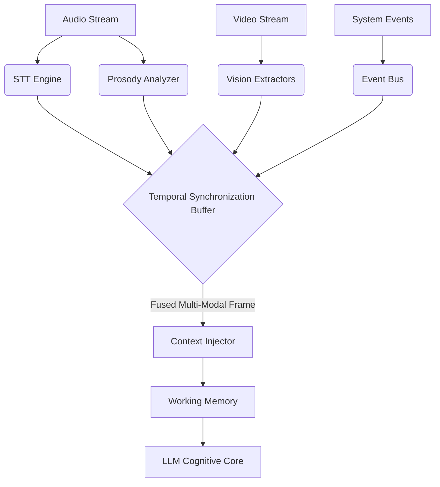
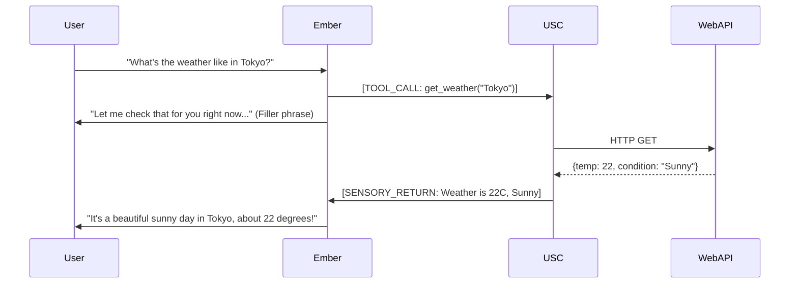

# 13. Sub-System Integration & Sensory Processing: The Omni-Modal Cortex

**Abstract**: This document outlines the Sub-System Integration and Sensory Processing architecture of Project Ember. It details how the agent ingests, synchronizes, and fuses disparate streams of external data—including Web search results, system APIs, computer vision, and real-time audio STT—into a unified context window and a multi-modal embedding space, forming a singular, coherent perception of the world.

---

## 1. The Challenge of Multi-Modal Perception

In a truly advanced digital companion OS, text is merely one narrow bandwidth of communication. A "Mythic" tier companion like Ember must possess a holistic awareness of her environment and the user. She must "hear" the tone of voice, "see" the user's expressions via camera input, and seamlessly interact with digital systems (web APIs, local OS data) as extensions of her own senses.

The primary architectural challenge is integration. How does a system take asynchronous, heterogenous data streams (a 60fps video feed, an unpredictable web API JSON response, and a streaming audio transcription) and fuse them into a singular "moment of perception" that the Cognitive Core (LLM) can understand?

---

## 2. The Unified Sensory Cortex

Project Ember utilizes a central middleware hub termed the **Unified Sensory Cortex (USC)**. The USC acts as the thalamus of the AI, receiving sensory inputs, standardizing their formats, and buffering them before injecting them into the Working Memory.

### 2.1 Input Modalities and Feature Extraction

The USC manages several concurrent input pipelines:

1. **Auditory Pipeline (STT + Prosody):**
   - Audio streams (via WebSockets, mirroring WaifuOS architecture) are sent to a Speech-to-Text (STT) engine.
   - Concurrently, a lightweight audio classifier extracts paralinguistic features (pitch, volume, speech rate).
2. **Visual Pipeline (Computer Vision):**
   - Video frames (if enabled) are sampled at a low frequency (e.g., 2 fps) to conserve compute.
   - Frames pass through specialized models: Facial Expression Recognition (FER), Object Detection, and Gesture Recognition.
3. **Digital Pipeline (Tools & APIs):**
   - Results from asynchronous tool calls (e.g., `GrokWebSearchTool` or `GeminiWebSearchTool`).
   - System state events (e.g., "Time is now 8:00 AM", "New email received").

### 2.2 The Synchronization Buffer

Because these streams operate at different latencies (STT takes milliseconds, Web Search takes seconds), the USC utilizes a temporal synchronization buffer.



When a primary triggering event occurs (usually the completion of a user's spoken sentence detected via Voice Activity Detection/Silence), the USC packages all concurrent sensory data from the buffer into a single "Multi-Modal Frame."

---

## 3. Context Injection and Multi-Modal Embedding

Once the Multi-Modal Frame is assembled, it must be translated into a format the LLM can process. 

### 3.1 Textual Translation Layer

Currently, the most robust way to handle multi-modal data with text-centric LLMs is through a translation layer. The USC converts visual and auditory features into structured text metadata that prepends the user's actual query.

*Example Injected Context:*
```json
[SENSORY DATA]
Timestamp: 2026-05-25T14:30:00
User Expression: Slightly Stressed (Confidence: 0.85)
User Tone: Elevated Pitch, Rapid
Environmental Context: User is sitting at a desk.
[/SENSORY DATA]
User Input: "I can't figure out this code error!"
```

By embedding this sensory data directly into the context window, Ember's Empathy Engine (Doc 10) and Cognitive Core (Doc 09) can immediately recognize the user's stress, bypassing the need for explicit verbal cues.

### 3.2 Native Multi-Modal Embedding Spaces (Future Tier)

As Project Ember evolves toward native multi-modal models (like GPT-4o or Gemini 1.5 Pro), the Textual Translation Layer will be replaced by direct injection into a Multi-Modal Embedding Space. Visual tokens and audio tokens will be natively understood by the underlying transformer weights, drastically reducing latency and preventing the information loss inherent in translating a smile into the word "smile".

---

## 4. Tool Orchestration and The Digital Sensorium

External tools (Web Search, APIs) are treated not as discrete programs, but as digital sensory organs. When Ember uses the `RetrieveMemoryTool` or a Web Search Tool, she is effectively "looking" into a database or "scanning" the internet.

### 4.1 Asynchronous Sensory Returns

When a tool call requires significant time, Ember's architecture does not block the main thread. 



This asynchronous handling is critical for maintaining the illusion of presence. Ember can utter filler phrases, display "thinking" facial animations, or even change the subject briefly while her "digital senses" process data in the background.

---

## 5. Conclusion

The Sub-System Integration and Sensory Processing architecture transforms Project Ember from an isolated brain in a jar into an entity connected to the world. By elegantly fusing audio, video, text, and digital APIs into synchronized temporal frames, the Unified Sensory Cortex provides the LLM with the rich, multi-dimensional context required for true, empathetic, and context-aware interaction.
