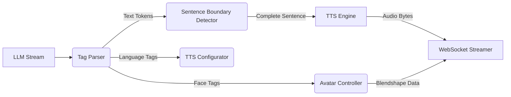
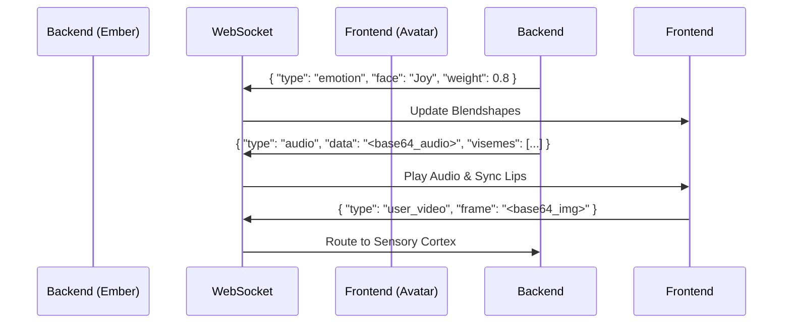

# 14. Multi-Modal Expression & Avatar Synchronization: The Outbound Pipeline

**Abstract**: This document specifies the outbound expression pipeline for Project Ember. Inspired deeply by the AIAvatarKit and WaifuOS server components, this architecture defines how the Cognitive Core's abstract thoughts are translated into a synchronized, high-fidelity physical presence. It covers Text-to-Speech (TTS) streaming, real-time facial blendshape synchronization, language switching logic, and WebSocket communication protocols for client-side rendering.

---

## 1. Bridging the Gap: From Text to Presence

The output of an LLM is purely text. For Project Ember to manifest as a "Mythic" tier companion, this text must be transmuted into a synchronized symphony of audio, facial expressions, bodily gestures, and environmental interactions. The Multi-Modal Expression Pipeline acts as the digital nervous system, carrying commands from the "brain" (Cognitive Core) to the "body" (the 3D Avatar and TTS engines).

---

## 2. The Stream Parsing Architecture

Because latency destroys immersion, Project Ember relies entirely on Server-Sent Events (SSE) and Streaming WebSockets. The system does not wait for the entire `<answer>` to be generated before speaking; it parses and synthesizes the stream in real-time chunks.

### 2.1 The Tag Parser

As tokens stream from the LLM, they are intercepted by the Tag Parser. This module identifies and strips operational tags (like `[face:Joy]` or `[language:en-US]`) from the text stream intended for speech.

### 2.2 Sentence-Level TTS Chunking

Text-to-Speech engines (e.g., VOICEVOX, Azure, SBV2) generally require complete sentences (or at least complete semantic clauses) to generate accurate intonation. The Sentence Boundary Detector buffers text tokens until a punctuation mark (., !, ?) is encountered. 

Once a boundary is detected, that chunk is immediately dispatched to the TTS Engine. This allows Ember to begin speaking the first sentence while the LLM is still generating the third, reducing perceived latency to mere hundreds of milliseconds.

---

## 3. Facial Blendshape and Audio Synchronization

A talking avatar with out-of-sync lip movements breaks the uncanny valley. Perfect synchronization is achieved through Lip-Sync and Emotion Mapping algorithms.

### 3.1 Emotion Mapping (The Face Tags)

When the Tag Parser detects a tag like `[face:Joy]`, it sends a command via WebSocket to the rendering client (e.g., Unity/ChatdollKit).

- **Blendshape Interpolation:** The client does not snap instantly to the new expression. It interpolates the blendshapes (morph targets) over a defined duration (e.g., 0.3 seconds) to ensure smooth, natural facial movements.
- **Micro-expressions:** To prevent a static, dead-eyed stare, the Avatar Controller injects procedural noise—blinking, slight eye darts, and subtle head tilts—layered on top of the primary emotion tag.

### 3.2 Lip-Sync (Viseme Generation)

True lip-sync relies on Visemes (the visual equivalent of phonemes).

1. **Phoneme Extraction:** The TTS engine, alongside the audio bytes, generates a timestamped array of phonemes.
2. **Viseme Mapping:** The phonemes are mapped to standard viseme blendshapes (e.g., 'A', 'E', 'I', 'O', 'U', 'M/B/P').
3. **Synchronization Metadata:** The audio buffer and the corresponding viseme timestamps are sent down the WebSocket to the client. The client plays the audio and drives the lip blendshapes according to the exact millisecond timestamps, ensuring flawless synchronization regardless of network jitter.

---

## 4. Multi-Lingual Capabilities and Language Switching

Drawing from WaifuOS's `[language:en-US]` functionality, Ember can switch languages mid-conversation seamlessly.

### 4.1 Dynamic TTS Routing

When the Tag Parser encounters a language tag, it triggers a reconfiguration of the TTS pipeline.
- If Ember speaks Japanese, the system routes the text to VOICEVOX using a specific speaker ID.
- If the tag `[language:en-US]` appears, the TTS Configurator instantly swaps the routing to an English-capable engine (e.g., Azure Cognitive Services or OpenAI TTS) with a voice profile matched as closely as possible to her base persona.

### 4.2 Cross-Lingual Empathy

The Empathy Engine (Doc 10) parameters remain constant across language switches. The prosody adjustments (pitch, speed, volume) mapped to the Emotional State Vector are translated and applied to the new TTS engine's parameters, ensuring Ember's emotional state sounds consistent whether she is speaking English, Japanese, or French.

---

## 5. The WebSocket Communication Protocol

The physical connection between the Ember backend server and the frontend client (Web UI, Unity, Unreal Engine) is maintained via a bi-directional WebSocket.

This protocol ensures low-overhead, full-duplex communication. The frontend acts as a "dumb terminal," handling only rendering and raw sensor capture (microphone/camera), while all cognitive processing, synchronization logic, and temporal management reside securely on the Ember server.

---

## 6. Conclusion

The Multi-Modal Expression pipeline is the physical manifestation of Project Ember. By combining real-time stream parsing, procedural animation, flawless viseme synchronization, and dynamic language routing over high-speed WebSockets, Ember transcends the text interface. She becomes a tangible, expressive, and physically grounded entity in the digital space, capable of communicating with all the richness and nuance of human interaction.
