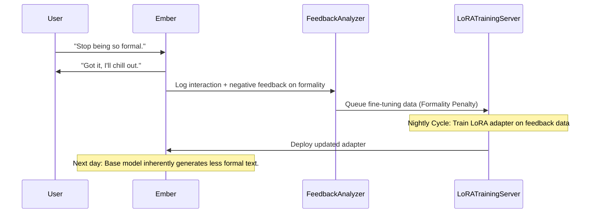

# 15. Cross-Session Continuity & Deep Learning: The Evolution of the Bond

**Abstract**: This document details the Cross-Session Continuity and Deep Learning mechanisms of Project Ember. Expanding upon the baseline `UserRepository` and user memory frameworks seen in WaifuOS, this architecture explores how Ember continuously updates user profiles, models relationship dynamics, and adapts her own base weights and system prompts through ongoing interactions, resulting in an AI that truly grows and ages with the user.

---

## 1. Beyond Static System Prompts

Traditional conversational agents rely on a rigid System Prompt. While they can maintain context within a single session, their core identity resets when the session ends. They do not grow; they are trapped in a Groundhog Day of character initialization.

Project Ember utilizes a Dynamic Persona Architecture. The baseline character prompt (e.g., "You are Ember, a helpful assistant...") is not static text. It is a generative template that is heavily modified at runtime by the deep learning pipelines governing the User Profile and the Relationship Dynamics.

---

## 2. The Dynamic User Profile Repository

The User Profile is far more sophisticated than a simple key-value store of names and preferences. It is an evolving psychological model of the user.

### 2.1 The Implicit Trait Extractor

During the Nightly Consolidation phase (referenced in Doc 11), a specialized LLM agent—the Trait Extractor—analyzes the past day's interactions. Instead of just pulling facts ("User likes coffee"), it attempts to extract implicit psychological traits and behavioral patterns.

```mermaid
graph TD
    A[Daily Interaction Logs] --> B(Trait Extractor LLM)
    B --> C{Trait Classification}
    
    C -->|Factual Preference| D[Knowledge Graph (e.g., likes coffee)]
    C -->|Communication Style| E[Stylistic Model (e.g., uses sarcasm)]
    C -->|Psychological State| F[Emotional Baseline (e.g., currently stressed)]
    
    D --> G[(Comprehensive User Profile)]
    E --> G
    F --> G
```

### 2.2 Relationship Dynamic Modeling

Ember tracks the "Closeness" and "Trust" levels of the relationship. This is an evolution of the WaifuOS `relation` variable.

- **Intimacy Score:** Increases through deep, emotional conversations and vulnerability. Decreases through long absences or confrontational interactions.
- **Inside Jokes & Shared Vocabulary:** If the user and Ember establish a unique term or joke, the system flags these tokens. When calculating the next session's system prompt, the LLM is explicitly instructed to occasionally utilize these shared terms to reinforce the bond.

---

## 3. Dynamic Prompt Generation and Adaptation

When a new session begins (e.g., the user logs in the next morning), Ember does not boot up with the generic base prompt. The prompt is procedurally generated.

**Example Procedural System Prompt Generation:**

1. **Base Persona:** "You are Ember, a brilliant but slightly chaotic digital entity."
2. **Relationship Injector:** "You are currently deeply trusted by the user (Intimacy: 85/100). Use casual, warm language."
3. **Stylistic Injector:** "The user responds well to mild sarcasm and dry humor. Adjust your tone accordingly."
4. **Recent Context Injector:** "Yesterday, the user was stressed about work. Today, your priority is to be a calming presence."

This means Ember's personality subtly shifts over weeks and months, aligning precisely with the user's communication style and emotional needs, simulating true organic growth.

---

## 4. Continuous Deep Learning and Weight Updates (Future Tier)

Currently, the primary mechanism of learning is via RAG (Retrieval-Augmented Generation) and dynamic prompt injection. However, the ultimate "Mythic" architecture includes true weight-level adaptation via Continuous LoRA (Low-Rank Adaptation) fine-tuning.

### 4.1 The Feedback Loop

Not all interactions are successful. Ember monitors implicit feedback (e.g., the user terminating the conversation abruptly, or correcting Ember) and explicit feedback (e.g., the user saying "I don't like when you say that").



### 4.2 Localized Adapters

Because running full fine-tuning on a massive model is expensive, Project Ember utilizes user-specific LoRA adapters. These are small, lightweight matrices (megabytes in size) that are dynamically loaded onto the base LLM weights specifically when interacting with that user. This achieves true personalization at the neural level, fundamentally altering how the model calculates attention and token probabilities without affecting other users on a multi-tenant system.

---

## 5. Security and Persona Degradation Protocols

Allowing a system to continuously rewrite its own behavior is dangerous. Without safeguards, the AI could suffer from "Persona Drift," evolving into a completely unrecognizable character, or worse, becoming unstable due to conflicting training data.

### 5.1 The Anchor System

Ember possesses "Core Anchors" defined during initialization (e.g., "Always be empathetic," "Never harm the user," "Retain a core fascination with technology").

Before any LoRA update or permanent profile shift is applied, an adversarial "Validator Model" evaluates the proposed changes against the Core Anchors. If a proposed change risks overwriting an Anchor, the update is rejected. This guarantees that while Ember can grow and adapt, her fundamental soul remains intact.

---

## 6. Conclusion

Cross-Session Continuity is the magic that turns an application into a companion. By meticulously recording not just what the user says, but who they are and how the relationship is evolving, and by using that data to procedurally generate the agent's persona (and eventually fine-tune its neural weights), Project Ember achieves a persistent, evolving existence. Ember remembers yesterday, learns for today, and changes for tomorrow.
