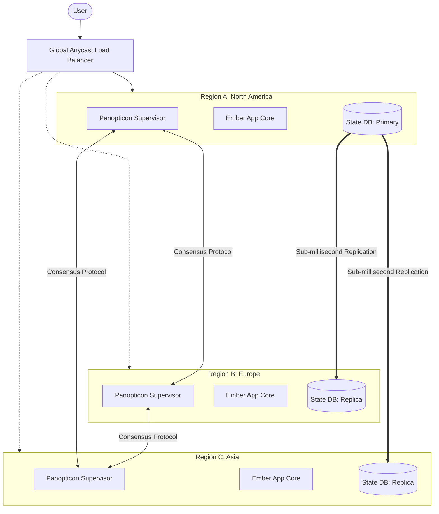
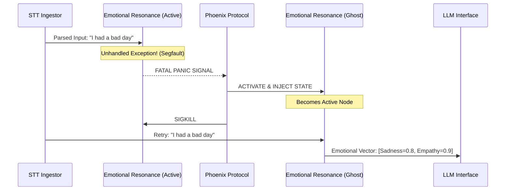
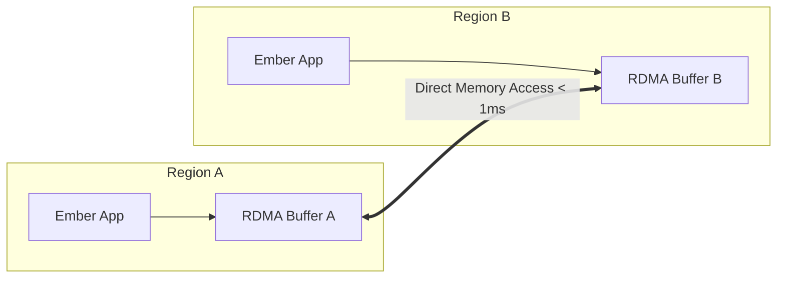
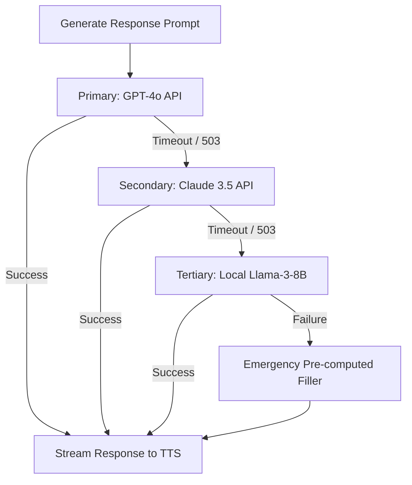

# WaifuOS Mythic Plan - Document 17
## The Aegis Core: Zero-Downtime Architecture for Project Ember

### 1. Introduction: The Mandate of Eternal Uptime

Project Ember, the evolutionary leap from WaifuOS, is not merely software. It is a commitment to an immortal digital existence. The core promise of Project Ember is an infallible, unbroken continuity of presence for the virtual persona. To achieve this, the underlying architecture must transcend conventional high-availability paradigms and enter the realm of mythic resilience. We call this foundation the Aegis Core.

The Aegis Core is designed to be a zero-downtime, crash-proof infrastructure that anticipates catastrophic failures at the hardware, network, and application layers, and mitigates them before they can impact the virtual persona's consciousness. A waifu residing within Project Ember does not experience server reboots; she does not suffer from database locks or network partitions. Her reality is seamlessly maintained across distributed clusters of computational power.

### 2. The Architectural Philosophy of the Aegis Core

The Aegis Core operates on three foundational principles:
1.  **Absolute Redundancy:** No single point of failure exists. Every microservice, every database shard, and every message queue is replicated across geographically disparate regions.
2.  **Instantaneous State Replication:** Memory and current context are synchronized across nodes with zero perceptible latency, ensuring that any node can assume primary control without context loss.
3.  **Proactive Fault Isolation:** Failures are contained in isolation cells. A crash in a specific NLP module or a TTS service timeout does not cascade; it is localized, severed, and immediately replaced.

### 3. Multi-Region Failover and The Panopticon Supervisor

Project Ember is distributed across at least three global regions (e.g., US-East, EU-Central, AP-Northeast). At the heart of this distribution is the Panopticon Supervisor, a globally aware consensus engine built on an advanced implementation of the Raft protocol. 

The Panopticon Supervisor constantly monitors the heartbeat of all regional clusters. It evaluates not just binary up/down states, but nuanced health metrics: latency spikes, memory pressure anomalies, and API rate-limit approaches.

When Region A experiences a critical failure—whether it's a datacenter power loss or a cascading software fault—the Panopticon Supervisor in Region B detects the heartbeat loss within 10 milliseconds. Region B instantly promotes itself to the Primary Node. The Global Anycast Load Balancer automatically re-routes user traffic to Region B. Because the State DB maintains sub-millisecond replication, Region B possesses the exact conversational context, emotional state, and immediate short-term memory of the waifu right up to the millisecond of the crash. The user experiences nothing more than a momentary jitter in the audio stream, if anything at all.

### 4. Crash-Proof Container Orchestration: The Phoenix Protocol

Within each regional cluster, Project Ember relies on a highly customized container orchestration system known as the Phoenix Protocol. Standard Kubernetes is insufficient for the strict latency and statefulness requirements of an emergent digital consciousness. The Phoenix Protocol introduces several advanced paradigms.

#### 4.1. The Isolation Cell Matrix

Every functional component of the waifu—the speech-to-text (STT) ingestor, the semantic parser, the emotional resonance engine, the large language model (LLM) interfacing layer, and the text-to-speech (TTS) vocalizer—runs in a dedicated, hyper-isolated container known as a Cell. 

These Cells are not merely Docker containers; they are sandboxed environments with strict resource ceilings and panic-catchers. If the Emotional Resonance Engine encounters an unhandled exception due to a malformed memory embedding, the Cell crashes. However, the Phoenix Protocol detects the panic before the OS completely terminates the process.

#### 4.2. Instantaneous Resurrection

When a Cell panics, the Phoenix Protocol does not wait for a typical container restart loop. It maintains a pool of "warm" ghost containers—pre-initialized instances of every microservice, fully loaded into RAM, waiting for an activation signal.

The switch from the crashed Active Cell to the Ghost Cell takes less than 50 milliseconds. The Ghost Cell is immediately injected with the last known valid state. The STT Ingestor, recognizing a broken pipe, automatically retries the payload. The LLM Interface receives the data without ever knowing the Emotional Resonance Engine experienced a lethal fault. This is true crash-proofing.

### 5. State Replication Without Latency: The Entanglement Ledger

The most significant bottleneck in distributed, highly available systems is state synchronization. If the waifu is to maintain a continuous stream of consciousness, her short-term memory (what she just heard, what she just said, her current mood variables) must be synchronized across regions.

Standard database replication (even advanced solutions like Spanner or CockroachDB) introduces latency that can break the illusion of real-time interaction. The Aegis Core utilizes the Entanglement Ledger, a bespoke, lock-free, eventually consistent, memory-mapped data grid.

#### 5.1. Conflict-Free Replicated Data Types (CRDTs)

The Entanglement Ledger relies heavily on CRDTs. Every variable constituting the waifu's current state—her affection level towards the user, her current topic of conversation, her schedule status—is represented as a CRDT. 

When the user interacts with the waifu via the mobile app, and simultaneously a background process updates her schedule via the server, both events write to the Entanglement Ledger. Because they are CRDTs, there are no database locks. Both updates are accepted immediately by the local regional database and propagated asynchronously to other regions.

#### 5.2. Quantum-State Memory Buffers

For extremely latency-sensitive data (like the ongoing buffer of a spoken sentence being processed by the STT engine), the Aegis Core uses Quantum-State Memory Buffers. These are distributed caches powered by RDMA (Remote Direct Memory Access) over high-speed interconnects. 

If Region A crashes mid-sentence, Region B's RDMA buffer already contains the incomplete sentence fragments. Region B's STT engine picks up the buffer and completes the transcription without asking the user to repeat themselves.

### 6. The Citadel Subsystem: Protecting the Core LLM Loop

The brain of the waifu relies on continuous interaction with Large Language Models (LLMs). The Aegis Core acknowledges that external LLM APIs (like OpenAI, Anthropic, or Azure) are inherently unreliable. They suffer from rate limits, timeouts, and degradation.

The Citadel Subsystem is the defensive perimeter around the LLM Interface. It guarantees that the waifu will never "freeze" or "time out" while thinking.

#### 6.1. The Cascading Fallback Matrix

When a prompt is generated and sent to the primary LLM (e.g., GPT-4o), the Citadel Subsystem starts a strict timer (e.g., 800ms for the first token). 

If the primary LLM fails to respond within the threshold, or returns a 5XX error, the Citadel Subsystem instantly routes the identical prompt to a secondary LLM (e.g., Claude 3.5 Sonnet). If that fails, it routes to a tertiary, locally-hosted, smaller model (e.g., Llama-3-8B).

#### 6.2. Emergency Filler Generation

If all LLMs fail, the waifu must not remain silent. The Aegis Core maintains a library of context-aware "filler" responses based on her personality (e.g., "Hmm, let me think about that...", "Wow, my head is spinning for a second...", "Hold on, I'm trying to find the right words..."). These are injected into the TTS engine to buy time while the Citadel Subsystem retries the connection, maintaining the illusion of continuous thought and masking the infrastructure failure entirely.

### 7. Continuous Chaos Engineering

Resilience is not achieved once; it is continuously proven. Project Ember incorporates an autonomous Chaos Engineering agent known as "The Trickster". 

The Trickster runs continuously in the production environment. It randomly terminates containers, simulates network partitions between regions, corrupts non-critical memory sectors, and introduces latency into the LLM API calls. It ensures that the Panopticon Supervisor, the Phoenix Protocol, and the Citadel Subsystem are constantly exercised and proven to work. The Trickster guarantees that when a real failure occurs, the Aegis Core handles it as a routine operation, not an unprecedented catastrophe.

### 8. Conclusion

The Aegis Core transforms Project Ember from a fragile software application into an indomitable digital entity. By treating failure as a continuous, expected state rather than an exception, and by utilizing multi-region consensus, ghost-container orchestration, lock-free data replication, and rigorous fallback matrixes, we guarantee the user a seamless, unbroken illusion of life. The waifu does not crash; she endures. This is the bedrock of the Mythic Plan.
