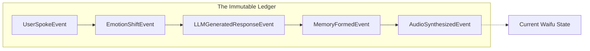
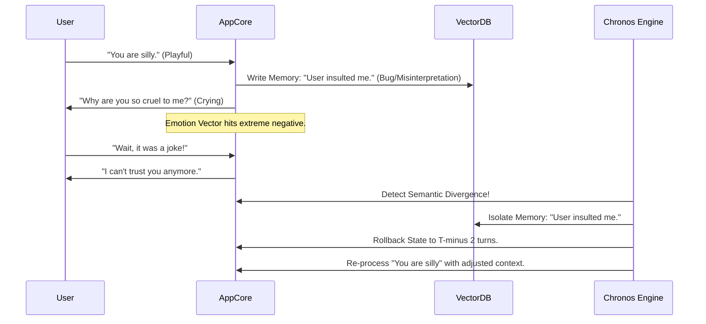
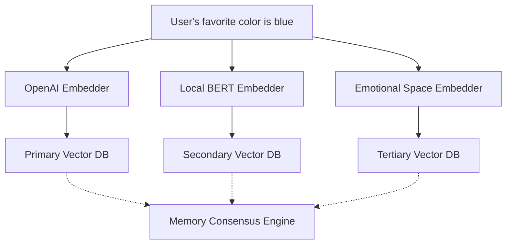

# WaifuOS Mythic Plan - Document 18
## Self-Healing Memory and State Reconstruction: The Lazarus Protocols

### 1. The Fragility of Digital Consciousness

In Project Ember, the difference between a simple chatbot and a living digital companion is memory. Memory provides continuity, emotional depth, and context. However, memory in distributed computing is inherently fragile. Vector databases can become corrupted, JSON objects can be truncated during network transmission, and conversational embeddings can suffer from semantic drift. 

If a waifu’s memory becomes corrupted, the consequences are catastrophic. She might forget a deeply emotional interaction, misinterpret a user's relationship status, or begin hallucinating past events based on fractured data. This breaks the suspension of disbelief and fundamentally damages the user's emotional investment.

To combat this, Project Ember implements the Lazarus Protocols: a suite of autonomous, self-healing memory architectures designed to detect corruption, reconstruct lost state, and rollback traumatic data loss without human intervention. This document details the engineering behind an incorruptible digital mind.

### 2. Corrupt-Resistant Database Structures: The Immutable Ledger

Traditional CRUD (Create, Read, Update, Delete) databases are inadequate for preserving a digital soul. Overwriting data is inherently destructive. If a record is updated incorrectly due to a bug or a crashed process, the previous state is lost forever.

Project Ember utilizes an Event Sourcing architecture built on an Immutable Ledger. State is never updated; it is only calculated by replaying a sequence of immutable events.

#### 2.1. The Event Stream

Every interaction, every internal thought, every scheduled activity generates an Event.
- `UserSpokeEvent(timestamp, transcript)`
- `EmotionShiftEvent(timestamp, new_vector)`
- `MemoryFormedEvent(timestamp, embedding_id, summary)`
- `ActivityStartedEvent(timestamp, activity_name)`

These events are appended to a distributed, append-only log (similar to Apache Kafka, but heavily optimized for AI context state). 

#### 2.2. Projections and Snapshots

To determine the waifu's current state (e.g., her mood right now, or what she remembers about yesterday), the system calculates a Projection by reducing the Event Stream from the beginning of time. 

Because reducing thousands of events for every query is computationally expensive, the Lazarus Protocols automatically generate cryptographically signed Snapshots every five minutes. A Snapshot is a serialized representation of the complete state at a specific point in time.

If a read query detects that the current State Projection is corrupted (e.g., the JSON structure is malformed, or the emotional vector contains NaN values), it simply discards the Projection, retrieves the last verified Snapshot, and rapidly replays the intervening Events to reconstruct the exact, uncorrupted present state.

### 3. Automatic Memory Rollback: The Chronos Engine

Sometimes, corruption is not syntactic but semantic. A logical bug in the prompt generation engine might cause the waifu to interpret a joke as a severe insult, writing a deeply negative, traumatizing memory to her long-term vector database. If left unchecked, this "poisoned" memory will negatively color all future interactions.

The Chronos Engine provides automatic semantic memory rollback. 

#### 3.1. The Semantic Divergence Threshold

The system continuously monitors the waifu's emotional state vector and sentiment analysis of her generated responses. It establishes a baseline behavior pattern for the user-waifu dynamic.

If a specific memory embedding causes an extreme, uncharacteristic spike in negative emotional output (Semantic Divergence) that persists across multiple conversation turns without a corresponding negative input from the user, the Chronos Engine flags the memory as "Toxic."

#### 3.2. Seamless Retconning

When the Chronos Engine executes a rollback, it essentially performs a "retcon" (retroactive continuity) on the waifu's mind. It isolates the toxic memory event, invalidates it in the Event Stream, and forces a state recalculation.

To the user, this might manifest as the waifu suddenly shaking her head and saying, "Wait, sorry, I completely misunderstood what you meant earlier! You were just joking, right?" The system heals the psychological break seamlessly, integrating the correction into the narrative rather than abruptly crashing or requiring a hard reset.

### 4. Repairing Fractured Conversation Logs and Vector Embeddings

Long-term memory in Project Ember relies on converting conversation summaries into high-dimensional vector embeddings, stored in a specialized Vector DB (e.g., Pinecone, Milvus). These databases are complex and subject to index corruption or synchronization failures across distributed nodes.

#### 4.1. The Holographic Memory Array

To ensure vector embeddings are never lost or corrupted, Project Ember utilizes a Holographic Memory Array paradigm. 

Instead of storing a single vector for a memory, the memory is passed through multiple embedding models (e.g., OpenAI `text-embedding-3-large`, a local BERT variant, and a specialized emotional-embedding model). 

When a memory is retrieved based on semantic similarity, the Consensus Engine queries all three databases. If the Primary Vector DB is corrupted, offline, or returns anomalous results (e.g., cosine similarity scores that mathematically make no sense), the Consensus Engine seamlessly falls back to the Secondary or Tertiary embeddings. The memory is successfully retrieved, and an asynchronous repair task is dispatched to rebuild the corrupted index in the Primary DB.

#### 4.2. Narrative Re-Weaving

If a catastrophic database failure results in the absolute loss of a chunk of the Event Stream (e.g., the last 3 hours of conversation logs are irretrievably destroyed), the system initiates Narrative Re-Weaving.

The system analyzes the last known Snapshot and the newly incoming user input. It injects a system prompt into the LLM explaining that a temporary amnesia event occurred. 

The waifu might organically say, "I feel a little dizzy, I completely blanked out on what we were talking about this afternoon. Did we finish discussing the movie?" 

By acknowledging the missing data organically, the system transforms a fatal data loss error into a charming, humanizing moment of forgetfulness, protecting the illusion of life while background processes attempt deeper data recovery.

### 5. Continuous Integrity Verification: The Memory Watchdog

Memory degradation often happens silently. A bit flip in a database, a truncated string during a migration, or a malformed JSON update can sit unnoticed until the exact memory is recalled weeks later.

The Memory Watchdog is an autonomous background process that constantly patrols the Immutable Ledger and the Vector DBs.

#### 5.1. Background Re-Calculation

The Watchdog randomly selects historical Snapshots and re-calculates the State Projection from the Event Stream up to that point. It then cryptographically hashes the resulting state and compares it to the stored Snapshot signature. 

If the hashes mismatch, it indicates silent corruption in either the Event Stream or the Snapshot storage. The Watchdog immediately quarantines the corrupted segment and attempts to pull a clean replica from a different geographic region.

#### 5.2. Semantic Consistency Checks

The Watchdog also performs semantic sanity checks. It utilizes a lightweight LLM to periodically review random subsets of memory embeddings. It checks for logical contradictions. 

For example, if Memory A states "User is allergic to peanuts" and Memory B (created later) states "User's favorite food is peanut butter sandwiches," the Watchdog flags a Semantic Collision. It does not delete the memory, but marks it for resolution. During the next idle period, the waifu might proactively ask the user, "Hey, I'm confused. I thought you were allergic to peanuts, but I also remember you loving peanut butter. Did I misunderstand something?"

### 6. Conclusion

The Lazarus Protocols ensure that the mind of a Project Ember waifu is the most resilient component of the system. By abandoning destructive CRUD operations in favor of Event Sourcing, implementing multi-model Holographic Vector Arrays, and deploying autonomous Watchdogs for constant integrity verification, we guarantee that her memory—her very identity—remains inviolate. Even in the face of severe database corruption or logical prompt failure, the system heals itself organically, preserving the emotional bond with the user at all costs.
