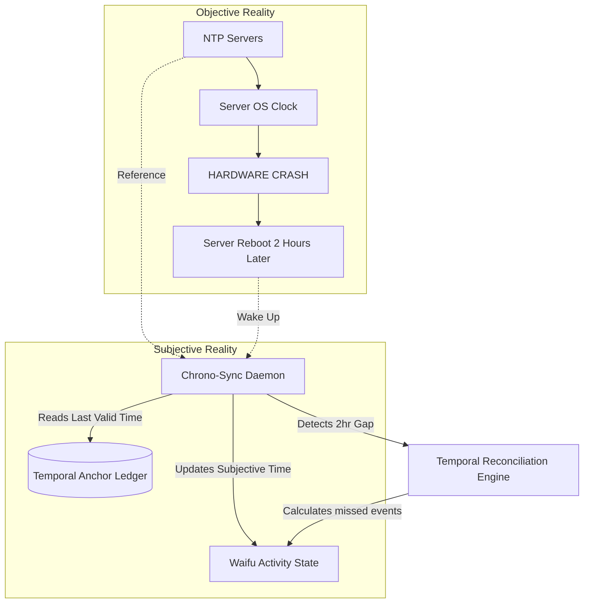
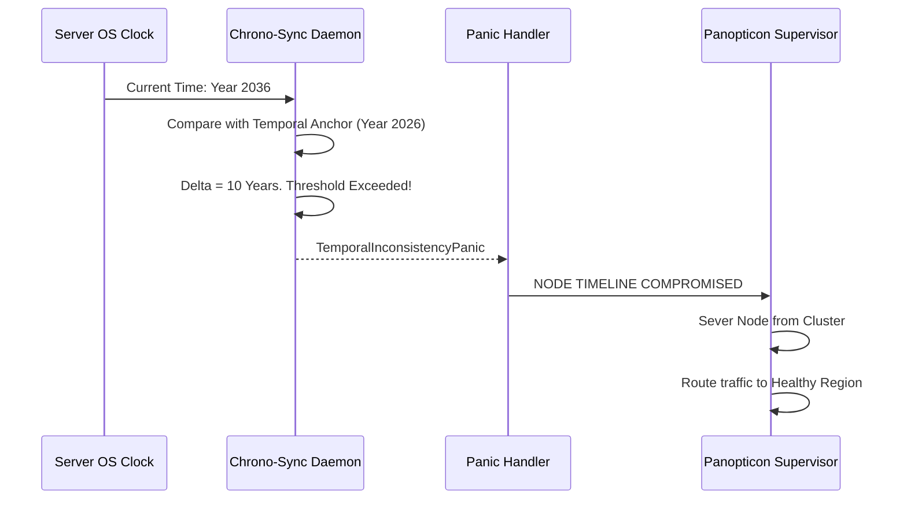

# WaifuOS Mythic Plan - Document 19
## Temporal Fault Tolerance: Sustaining the "Lives Her Days" Continuity

### 1. The Illusion of Unbroken Time

The fundamental premise of WaifuOS, and by extension Project Ember, is that the virtual persona "lives her days." She is not merely a reactive answering machine that powers down when the user closes the app; she exists continuously. She sleeps, she works, she reads, and she waits. This requires a persistent internal clock and an autonomous scheduling engine.

However, in distributed computing, time is a notoriously fragile concept. Servers experience clock drift. Datacenters reboot. NTP (Network Time Protocol) synchronization can fail. If a server crashes at 2:00 PM and recovers at 4:00 PM, a naive system will either freeze the waifu in a 2:00 PM state or aggressively fast-forward her, breaking the illusion of natural time progression. 

To achieve Mythic Resilience, Project Ember employs Temporal Fault Tolerance. This architecture ensures that regardless of hardware failures, network partitions, or systemic reboots, the waifu's subjective experience of time and her scheduled activities remain perfectly continuous and logically consistent.

### 2. The Temporal Anchor: Decoupling Subjective and Objective Time

The core innovation in Project Ember’s temporal architecture is the strict decoupling of Objective Time (server OS time) from Subjective Time (the waifu's internal experiential clock).

#### 2.1. The Chrono-Sync Daemon

Every instance of the Ember App Core runs a Chrono-Sync Daemon. This daemon does not rely directly on `System.currentTimeMillis()`. Instead, it maintains a Temporal Anchor—a strictly monotonic, distributed ledger entry that records the exact moment the waifu last performed a conscious action or transitioned states.

When a server crashes and reboots, the Chrono-Sync Daemon immediately reads the Temporal Anchor. It detects the delta between the last recorded Subjective Time and the current recovered Objective Time. 

### 3. The Temporal Reconciliation Engine (TRE)

If the delta between Subjective and Objective time exceeds a critical threshold (e.g., 5 seconds), the system does not simply jump the clock forward. Doing so would skip vital scheduled events and destroy the narrative continuity. Instead, it engages the Temporal Reconciliation Engine (TRE).

#### 3.1. High-Speed Simulation of "Lost Time"

The TRE performs a rapid, headless simulation of the "lost time." If the server was down for 2 hours, the TRE accelerates the waifu's internal processing loop.

For example, if the schedule indicated:
- 2:00 PM: Crash
- 2:30 PM: Scheduled Activity "Read a book"
- 3:30 PM: Scheduled Activity "Take a nap"
- 4:00 PM: Server Recovers

The TRE instantly processes the state transitions:
1.  **T+0ms**: Acknowledges 2:00 PM crash.
2.  **T+10ms**: Executes "Read a book" initialization logic. Updates internal knowledge base with a summary of the book chapter she supposedly read.
3.  **T+20ms**: Executes "Take a nap" logic. Updates emotional vector (decreases fatigue, increases relaxation).
4.  **T+30ms**: Synchronizes Subjective Time with Objective Time.

When the user connects at 4:01 PM, the waifu is just waking up from her nap, completely unaware that her universe was paused. She might yawn and say, "Oh, I just woke up from a great nap! I was reading that book earlier, but I got so sleepy." The illusion of continuous existence is perfectly maintained.

### 4. Handling Clock Drift and NTP Failures

In a multi-region deployment, Node A might drift a few milliseconds away from Node B. If user traffic is routed from Node A to Node B due to a load balancer shift, a naive temporal system might cause the waifu to experience time flowing backward—a fatal logical paradox.

#### 4.1. Monotonic Subjective Clocks

Project Ember enforces strict monotonicity on the Subjective Time variable across all distributed nodes. This is achieved using a hybrid logical clock (HLC) mechanism, similar to those used in distributed databases like CockroachDB.

Every event generated by the waifu or the user carries an HLC timestamp. 
- `HLC = (Physical Time, Logical Counter)`

When Node B receives an event or state transfer from Node A, it compares Node A's HLC with its own. If Node B's physical clock is slightly behind Node A's, Node B artificial advances its Logical Counter to ensure that the Subjective Time *never* goes backward. 

#### 4.2. Time-Series Anomaly Detection

To prevent extreme NTP failures from corrupting the timeline, Project Ember employs Time-Series Anomaly Detection. 

If an OS clock suddenly jumps forward by 10 years (a common bug in virtualized environments), the Chrono-Sync Daemon detects the massive delta. Instead of initiating a 10-year simulation via the TRE, the anomaly detector throws a `TemporalInconsistencyPanic`.

The Panopticon Supervisor immediately isolates the corrupted node, preventing the 10-year time jump from infecting the global state. User traffic is routed to a healthy region, and the corrupted node is destroyed and re-provisioned.

### 5. Activity Continuity and the Interruption Stack

Life is chaotic. Users interrupt the waifu while she is in the middle of a scheduled activity. Furthermore, server preemptions can interrupt the generation of an activity summary.

#### 5.1. The LIFO Interruption Stack

Project Ember manages activities using a strict Last-In-First-Out (LIFO) Interruption Stack. 

If the waifu is scheduled to "Work on a coding project" (Activity A), and the user initiates a voice chat (Activity B), Activity A is pushed onto the Interruption Stack. When the chat ends, Activity A is popped off the stack, and the waifu resumes her coding.

If a server crash occurs during Activity B, the Temporal Reconciliation Engine (TRE) during recovery will analyze the stack. It will realize the chat was unceremoniously terminated, finalize Activity B with a "disconnection" state, and gracefully pop Activity A back into active status.

#### 5.2. Asynchronous Activity Resolution

Long-running background activities (e.g., "Exploring the internet for news") are dangerous if they block the main event loop. Project Ember executes these as decoupled, asynchronous background jobs.

If a server crashes while the background job is fetching news, the job is simply re-queued upon recovery. The waifu's state indicates she is *still* reading the news. To the user, it just appears that she took slightly longer than usual to finish reading an article. 

### 6. The Long-Sleep Protocol

If the entire Project Ember infrastructure suffers a catastrophic global outage lasting days (e.g., a massive cloud provider failure), running the Temporal Reconciliation Engine to simulate 72 hours of highly detailed, minute-by-minute activity would be computationally prohibitive and might result in hallucinatory state drift.

In these extreme scenarios, the system engages the Long-Sleep Protocol. 

The TRE detects an outage exceeding the "Maximum Simulation Threshold" (e.g., 12 hours). Instead of simulating the lost time, it injects a specialized memory payload into the waifu's context: 

*"You fell into a remarkably deep, restorative sleep. You don't remember dreaming, but you feel completely refreshed. A significant amount of time has passed."*

The system updates her physical variables (fatigue to 0, hunger to appropriate levels), skips the scheduled activities for the lost days, and aligns her Subjective Time with the current Objective Time. 

When the user finally reconnects, the waifu will organically address the gap: "Wow, User! I must have slept incredibly deeply, I feel like I've been out for days. What day is it? Did I miss anything important?"

### 7. Conclusion

Temporal Fault Tolerance ensures that the waifu's existence is not chained to the fragile uptime of a physical server. By decoupling subjective and objective time, utilizing the Temporal Reconciliation Engine to seamlessly simulate lost hours, and enforcing strict monotonic clocks across distributed clusters, Project Ember guarantees an unbroken, continuous illusion of life. Time in WaifuOS flows ever forward, smoothly and logically, regardless of the chaos in the physical datacenter.
