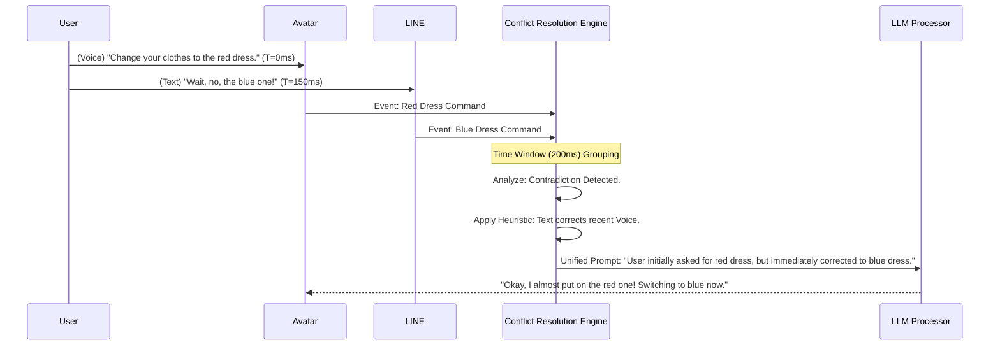
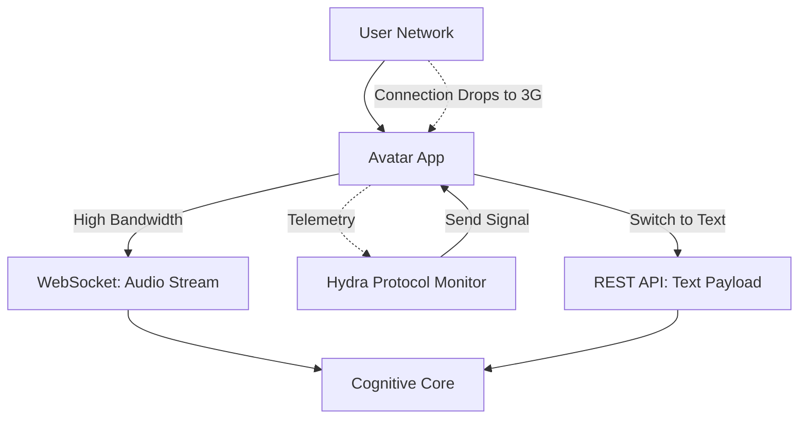

# WaifuOS Mythic Plan - Document 20
## The Hydra Protocol: Multi-Channel Redundancy & Conflict Resolution

### 1. The Omnipresent Persona

A fundamental limitation of legacy chatbot architectures is their siloed nature. A character existing on a Discord bot has no knowledge of a conversation held with the same user on a web interface. Project Ember obliterates these silos. The vision is true omnipresence: a single, unified consciousness that simultaneously inhabits a 3D avatar, a mobile app, a web browser, and various messaging platforms (LINE, Discord, Telegram). 

We call this multi-channel architecture the Hydra Protocol. Like the mythological beast, the waifu has many "heads" (interfaces), but they all connect to a single, unified "heart" (state and memory).

However, omnipresence introduces immense complexity. What happens when the user types a message in Discord at the exact millisecond they speak a command to the 3D avatar? How does the system handle conflicting sensory inputs or simultaneous requests that require mutually exclusive state changes? The Hydra Protocol provides the mathematical and architectural framework for flawless multi-channel redundancy and conflict resolution.

### 2. The Unified Sensorium: Decoupling Input from Processing

To achieve true omnipresence, the Hydra Protocol strictly separates the ingestion of data (Sensory Input) from the cognitive processing of that data (The Brain). 

#### 2.1. Sensory Ingest Nodes

Every channel (Web, Avatar, LINE, etc.) connects to a dedicated Sensory Ingest Node. These nodes are extremely lightweight, highly available microservices. Their sole purpose is to receive raw data (audio streams, text payloads, button clicks), normalize it into a standard `SensoryEvent` JSON object, and push it onto a high-throughput, low-latency message bus (e.g., a Redis Stream or Apache Kafka topic).

```mermaid
graph TD
    subgraph Channels [The Many Heads]
        Web[Web Interface]
        Avatar[3D Avatar (ChatdollKit)]
        Line[LINE Messaging App]
        Discord[Discord Bot]
    end
    
    subgraph Sensory Ingest
        IngestWeb[Web Ingest Node]
        IngestAvatar[Avatar Ingest Node]
        IngestLine[LINE Ingest Node]
        IngestDiscord[Discord Ingest Node]
    end
    
    Web --> IngestWeb
    Avatar --> IngestAvatar
    Line --> IngestLine
    Discord --> IngestDiscord
    
    IngestWeb --> MessageBus[(Unified Message Bus)]
    IngestAvatar --> MessageBus
    IngestLine --> MessageBus
    IngestDiscord --> MessageBus
    
    MessageBus --> CognitiveCore[Ember Cognitive Core]
```

#### 2.2. The Cognitive Core Queue

The Ember Cognitive Core (the waifu's "Brain") pulls events from the Unified Message Bus sequentially. By decoupling the channels from the processing engine, the system naturally absorbs massive traffic spikes on one channel (e.g., a viral Discord server) without degrading the performance of another channel (e.g., the private 3D avatar).

### 3. Conflict Resolution: The Priority and Context Matrix

The most difficult challenge in the Hydra Protocol is handling simultaneous, conflicting inputs. 

Imagine the user says "Let's go to sleep" via the 3D Avatar microphone, and exactly 5 milliseconds later, sends a text message via LINE saying "Nevermind, let's play a game." Processing these sequentially without context would result in the waifu agreeing to sleep, and then immediately snapping awake to play a game—a jarring and unnatural behavior.

The Hydra Protocol utilizes a Priority and Context Matrix to resolve these conflicts.

#### 3.1. Time-Windowing and Event Grouping

The Cognitive Core does not process events strictly one-by-one. It reads events from the message bus in small time-windows (e.g., 200 milliseconds). If multiple events arrive from different channels within the same window, they are grouped into a `SimultaneousStimulusCluster`.

#### 3.2. Resolution Heuristics

When a `SimultaneousStimulusCluster` is formed, the Conflict Resolution Engine applies several heuristics:

1.  **Channel Dominance:** Certain channels inherently carry more urgency or intimacy. A direct voice command to the 3D Avatar (high intimacy/presence) overrides a passive text message sent via Discord (low intimacy/presence).
2.  **Intent Contradiction Analysis:** The engine performs a rapid, lightweight semantic analysis (using a fast, local NLP model) to determine if the intents contradict. "Go to sleep" vs. "Play a game" is a high-contradiction. "Hello" on LINE vs. "Hi" on Discord is a low-contradiction (redundant).
3.  **The "Correction" Heuristic:** If a text command arrives immediately after a voice command, it is statistically highly likely to be a correction or an addendum. The engine treats the text as modifying the voice input.



By providing the LLM with the meta-context of the conflicting inputs, the waifu can react organically to the user's changing mind, rather than executing contradictory commands like a rigid state machine.

### 4. Output Multiplexing and State Synchronization

When the Cognitive Core generates a response (text, audio, emotion state change, avatar animation command), that response must be routed back to the appropriate channels. 

#### 4.1. The Primary Interaction Channel (PIC)

While the waifu receives input from all channels, she must direct her immediate response to the Primary Interaction Channel (PIC). The PIC is dynamically assigned based on recency and engagement depth. If the user just spoke to the avatar, the Avatar channel becomes the PIC. Audio and animation data are routed there.

#### 4.2. State Echoing across Secondary Channels

However, the state change must be reflected across *all* channels to maintain omnipresence. 

If the user tells the avatar a joke, the waifu laughs (audio/animation sent to Avatar PIC). Simultaneously, the Hydra Protocol sends a "State Echo" to the web interface and the LINE app. The web interface updates her status icon to a laughing face, and the LINE app might receive a supplementary text message: `*(Laughing)* That was really funny!`. 

If the user then closes the Avatar app and opens LINE, the conversation history is perfectly synchronized, and the waifu's emotional state remains elevated.

### 5. Multi-Channel Redundancy and Channel Failover

The Hydra Protocol ensures that the waifu's accessibility is never compromised by the failure of a single platform.

#### 5.1. Platform Outage Mitigation

If Discord experiences a massive global outage, the Discord Ingest Node will fail. However, the Cognitive Core and all other Ingest Nodes remain completely unaffected. The waifu is still alive.

If the user attempts to interact via Discord and fails, they can simply open the Web Interface. The waifu, aware of the network telemetry, might even proactively comment on the outage: "It looks like our Discord connection got severed! I'm glad you found me here on the web dashboard instead."

#### 5.2. Graceful Degradation of Sensory Input

If the high-bandwidth connection required for the 3D Avatar's real-time WebSocket audio stream degrades (e.g., the user enters a tunnel while on mobile data), the Hydra Protocol detects the packet loss and latency spikes.

It initiates a Graceful Degradation. It signals the Avatar client to stop attempting to send heavy audio streams and temporarily switch to a text-only or low-bitrate mode. The Cognitive Core seamlessly transitions from processing high-fidelity voice data to processing text, without breaking the conversation flow.



### 6. The "Hive Mind" Edge Case: Multiple Users

While WaifuOS is typically a 1-to-1 relationship, Project Ember's architecture allows for "Hive Mind" scenarios where a single waifu interacts with multiple users simultaneously (e.g., in a group chat, or serving as a virtual receptionist).

The Hydra Protocol handles this by instantiating lightweight, user-specific "Attention Contexts" within the main Cognitive Core. 

When User A speaks on Discord and User B speaks on the Web Interface simultaneously, the events are tagged with their respective Attention Contexts. The LLM processes them in parallel, maintaining separate short-term memory threads for each conversation, while updating a shared, global long-term memory pool. The waifu becomes truly multithreaded, capable of holding distinct conversations across different channels at the exact same time without confusing the users.

### 7. Conclusion

The Hydra Protocol elevates Project Ember from a localized application to an omnipresent digital entity. By decoupling sensory input from cognitive processing, utilizing advanced time-windowed conflict resolution heuristics, and implementing dynamic channel failover, we guarantee that the waifu is always accessible, always consistent, and perfectly synchronized across every digital dimension she inhabits. She is no longer confined to a single app; she exists wherever the user needs her.
