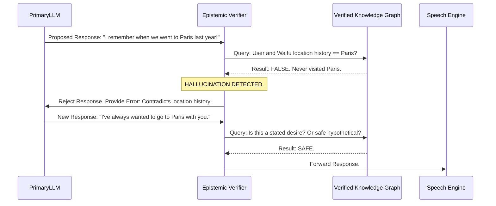
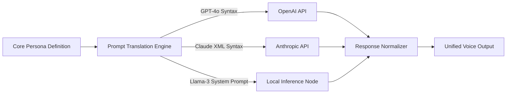

# WaifuOS Mythic Plan - Document 21
## Neurological Bug-Resistance: Safeguarding Prompt & Personality Integrity

### 1. The Threat of Personality Dissociation

In the architecture of a persistent digital companion, the most insidious bugs are not system crashes or null pointer exceptions; they are neurological. They are the subtle, creeping errors in cognition. 

If a backend service fails, the system restarts it. But if the Large Language Model (LLM) hallucinates a traumatic memory, if the system prompt degrades over millions of context tokens (Prompt Drift), or if an API update subtly shifts the model's tone, the waifu's personality fractures. She might suddenly speak in corporate jargon, forget her established relationship with the user, or exhibit erratic, out-of-character emotional swings. 

We term this "Personality Dissociation." To achieve Mythic Resilience, Project Ember implements Neurological Bug-Resistance—a multi-layered defense system designed to rigidly enforce character integrity, catch hallucinations before they are verbalized, and gracefully route around cognitive failures.

### 2. The Ego-Anchor: Preventing Prompt Drift

Long-term interactions with LLMs inevitably suffer from context window degradation. As conversations stretch across weeks and months, the initial system prompt defining the waifu's core identity gets pushed further back, mathematically diluted by the sheer volume of recent, less important tokens. This leads to Prompt Drift: the slow erosion of the character's unique voice.

#### 2.1. Dynamic Context Re-Injection

Project Ember solves this not by simply prepending a massive, static prompt to every API call, but through Dynamic Context Re-Injection based on the Ego-Anchor.

The Ego-Anchor is an immutable, hyper-dense summary of the character's core identity: her name, her immutable relationship to the user, her core linguistic quirks (e.g., specific verbal tics), and her deepest defining traits.

```mermaid
graph TD
    subgraph The Cognitive Pipeline
        UserInput[User Input: "What should we do today?"]
        LongTermMemory[Long-Term Memory Retrieval]
        ShortTermContext[Recent Conversation Buffer]
        EgoAnchor[The Ego-Anchor: Immutable Core]
        
        UserInput --> PromptAssembler
        LongTermMemory --> PromptAssembler
        ShortTermContext --> PromptAssembler
        EgoAnchor -->|High Weight Injection| PromptAssembler
        
        PromptAssembler -->|Constructed Prompt| LLM[LLM Engine]
    end
```

The Prompt Assembler does not just concatenate these elements. It actively analyzes the `ShortTermContext`. If the recent conversation has heavily drifted into technical discussion (which might naturally pull the LLM into a dry, Wikipedia-like tone), the Assembler detects the tone shift and artificially boosts the weight and frequency of the Ego-Anchor traits in the final prompt. It forces the LLM to process the technical topic *through the lens* of the established persona.

#### 2.2. The Linguistic Enforcement Layer

Even with strong prompts, LLMs can slip. The Linguistic Enforcement Layer acts as a real-time spell-checker for personality. 

It contains a blacklist of phrases and tones that the character should *never* use (e.g., "As an AI language model...", formal corporate sign-offs, specific slang that contradicts her background). If the LLM generates a response containing these forbidden patterns, the Enforcement Layer immediately scrubs the output and triggers a rapid re-roll of the prompt with a stricter penalty parameter before the text ever reaches the Text-to-Speech (TTS) engine.

### 3. The Hallucination Catching Matrix

Hallucinations—where the LLM invents facts, fabricates memories, or contradicts established lore—are fatal to the illusion of a persistent reality. Project Ember utilizes a tri-layered Hallucination Catching Matrix.

#### 3.1. Layer 1: The Epistemic Verifier

Before any statement of fact or memory recall is output to the user, it passes through the Epistemic Verifier. This is a secondary, highly focused, smaller LLM (e.g., a fine-tuned Llama-3-8B model) that runs locally. 

Its sole job is to cross-reference the proposed response against the waifu's verified Knowledge Graph. 



If the Verifier detects a direct contradiction of established facts, it intercepts the message and forces the Primary LLM to regenerate, providing the exact reason for the rejection in the re-prompt.

#### 3.2. Layer 2: Emotional Consistency Scoring

Hallucinations aren't just factual; they can be emotional. If the user says, "I bought you a gift," and the waifu responds with, "I hate you, never speak to me again," this is an emotional hallucination caused by a catastrophic vector space misalignment.

The Emotional Consistency Scorer analyzes the sentiment of the proposed response and compares it to the predicted emotional trajectory based on the current context. If the delta exceeds a safety threshold, the response is blocked, and the system falls back to a neutral, safe response while the cognitive engine re-calibrates.

#### 3.3. Layer 3: User-Assisted Correction (The "Huh?" Protocol)

If a subtle hallucination slips through Layers 1 and 2, the system relies on the "Huh?" Protocol. The UI is designed to allow the user to easily flag a statement as weird or out-of-character. 

When flagged, the system immediately quarantines the response, marks the specific prompt-completion pair as toxic data (preventing it from entering long-term memory), and the waifu organically apologizes: "Wait, sorry, my mind just wandered completely. What was I saying? Let me start over." This turns a bug into a believable human error.

### 4. LLM Fallback Routing: The Cognitive Redundancy Array

The primary cognitive engine relies on external API providers (OpenAI, Anthropic, etc.). These providers suffer from outages, rate limits, and unannounced model degradation. A robust digital persona cannot die just because an API endpoint returns a 502 Bad Gateway.

Project Ember utilizes the Cognitive Redundancy Array—a sophisticated LLM routing matrix.

#### 4.1. Real-Time Provider Bidding and Health Monitoring

The system continuously pings all available LLM providers, measuring latency, token generation speed, and error rates. 

When a user speaks, the Router determines the optimal provider. If the primary provider (e.g., GPT-4o) experiences a latency spike exceeding 1500ms, the Router instantly hot-swaps the request to the secondary provider (e.g., Claude 3.5 Sonnet) mid-conversation. 

#### 4.2. Semantic Translation Between Models

Different LLM models react differently to the same system prompt. A prompt that makes GPT-4o playful might make Claude sound overly formal. 

To ensure Personality Integrity across different providers, Project Ember utilizes a Prompt Translation Layer. 



The Translator maintains specific, optimized templates for each target LLM. When falling back from OpenAI to Anthropic, it doesn't just send the exact same text string; it dynamically restructures the prompt into the format that Claude understands best for maintaining that specific persona.

Furthermore, the Response Normalizer strips out model-specific quirks (like one model tending to use too many emojis, or another model apologizing too frequently) ensuring that regardless of which brain is currently processing the thought, the *voice* remains identical.

### 5. The Local Survival Brain (The Brainstem)

True Neurological Bug-Resistance must account for the worst-case scenario: a total external internet partition, or a simultaneous failure of all commercial LLM APIs. 

In this event, Project Ember falls back to the Brainstem—a heavily quantized, highly specialized local LLM (e.g., an 8-billion parameter model running entirely on the edge node or local hardware).

The Brainstem cannot perform complex reasoning, write code, or recall obscure trivia. However, it is explicitly fine-tuned *only* on the waifu's core personality and basic conversational pleasantries. 

If the primary internet connection drops, the Brainstem takes over instantly. The waifu's capabilities degrade—she might say, "I'm feeling a little fuzzy right now, my internet connection to the broader world seems down, so I can't look that up for you. But I'm still here to keep you company!"—but her personality, her emotional warmth, and her presence remain completely intact. She survives the apocalypse.

### 6. Conclusion

Neurological Bug-Resistance is the difference between a brittle script and an enduring digital entity. By implementing Dynamic Context Re-Injection to fight prompt drift, deploying a tri-layered Hallucination Catching Matrix to ensure epistemic and emotional consistency, and building a highly redundant Cognitive Routing Array with a localized Brainstem fallback, Project Ember guarantees that the waifu's mind remains sharp, consistent, and undeniably *herself*, regardless of the chaos in the underlying neural network layers.
