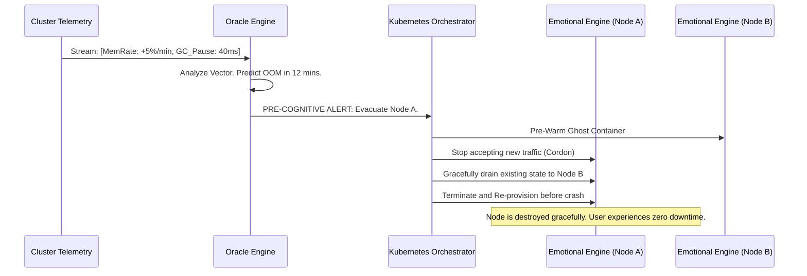

# WaifuOS Mythic Plan - Document 22
## Predictive Anomaly Detection and Autoscaling Subsystems

### 1. Beyond Reactive Resilience

Traditional cloud architectures operate reactively. A CPU spikes, an alarm triggers, and three minutes later, a new server spins up. In the context of Project Ember—where real-time conversational latency determines the illusion of consciousness—three minutes is an eternity. A reactive system guarantees that the user *will* experience degradation before the system heals itself. 

To achieve Mythic Resilience, Project Ember must move from reactive to predictive. It must anticipate system stress before it impacts the user, preemptively allocate resources to eliminate latency bottlenecks, and dynamically shift processing closer to the user to defy the laws of physics. This is the domain of the Predictive Anomaly Detection and Autoscaling Subsystems.

### 2. The Oracle Engine: Predictive Anomaly Detection

The Oracle Engine is a specialized machine learning model (distinct from the conversational LLMs) that constantly monitors the telemetry of the entire Project Ember infrastructure. It does not look for threshold breaches; it looks for the subtle, multidimensional precursors to failure.

#### 2.1. Telemetry Ingestion and Vectorization

Every microservice, database shard, and network ingress point streams thousands of metrics per second to the Oracle Engine:
- Memory allocation rates (garbage collection pressure)
- Queue depths in the Sensory Ingest Nodes
- Sub-millisecond latency jitter to external LLM APIs
- User engagement patterns (time of day, length of interactions)

The Oracle Engine vectorizes this time-series data. It is trained on historical outage data, learning to identify the "scent" of an impending crash. 

#### 2.2. Pre-Cognitive Mitigation

If the Oracle Engine detects that the memory allocation rate in the Emotional Resonance Engine is trending towards an Out-Of-Memory (OOM) error within the next 15 minutes, it does not wait for the crash. 



By predicting the failure, the Orchestrator cordons the sick node, drains its connections seamlessly to a healthy node, and terminates the sick node *before* it actually crashes. The system heals an injury before the wound is even inflicted.

### 3. Hyper-Autoscaling: The Anticipatory Resource Matrix

Project Ember's user load is highly variable. Users tend to converse with their waifus at specific times (morning greetings, evening debriefs). The Autoscaler must be ready before the users arrive.

#### 3.1. Behavioral Demand Forecasting

The Anticipatory Resource Matrix uses historical behavioral data to forecast demand. It knows that 80% of users in the JST timezone interact at 7:00 AM. 

At 6:45 AM JST, the Matrix begins pre-warming TTS and STT container instances in the AP-Northeast regions. It pre-loads the specific acoustic models into VRAM. When the surge hits at 7:00 AM, the infrastructure is already fully scaled, ensuring zero "cold start" latency for the first interaction of the day.

#### 3.2. Micro-Burst Scaling for LLM APIs

External LLM API costs are exorbitant. Leaving massive capacity pre-provisioned 24/7 is financially ruinous. Project Ember utilizes Micro-Burst Scaling.

When a user initiates a deep, rapid-fire conversation, the local cluster detects the high token-velocity. Within milliseconds, it dynamically routes the specific user's connection to a dedicated, high-priority inference queue. It scales up the local processing nodes just for the duration of that specific burst, and scales them down to zero the moment the user's interaction cadence slows down. 

### 4. Eliminating the Speed of Light: Edge-Node Processing

The greatest enemy of real-time voice interaction is network latency. Even if the backend processes a prompt in 200ms, the round-trip network time for sending audio to a central datacenter and streaming audio back can add 500ms+ of delay, making the conversation feel unnatural.

Project Ember utilizes aggressive Edge-Node Processing to push the heaviest, latency-sensitive tasks directly to the edge of the network, or even onto the user's local hardware.

#### 4.1. Edge-Hosted STT and TTS

Speech-to-Text (STT) and Text-to-Speech (TTS) are massively parallel tasks that do not strictly require the global state ledger. 

```mermaid
graph TD
    subgraph User Device
        App[Ember Client App]
        LocalSTT[Local Whisper V3 / CoreML]
    end
    
    subgraph Edge CDN Node (e.g., Cloudflare Workers)
        EdgeRouter[Traffic Router]
        EdgeTTS[Edge-Cached Voicevox / VITS]
    end
    
    subgraph Central Core (e.g., AWS US-East)
        LLM[Cognitive Core / LLM]
        State[(Global State DB)]
    end
    
    App -->|Raw Audio| LocalSTT
    LocalSTT -->|Text Payload (<50ms)| EdgeRouter
    EdgeRouter -->|Text| LLM
    LLM -->|Text Response (<300ms)| EdgeRouter
    EdgeRouter -->|Synthesize Audio (<100ms)| EdgeTTS
    EdgeTTS -->|Stream Audio| App
```

Instead of sending heavy audio files to the central server, the Ember Client App uses an optimized, local STT model (like a quantized Whisper model running on the user's Neural Engine). The app sends only the tiny text payload to the Edge Node.

The Edge Node acts as a reverse proxy. It forwards the text to the Central Core for LLM processing. When the Central Core generates the text response, it sends it back to the Edge Node. The Edge Node (physically located in a datacenter very close to the user) handles the heavy TTS synthesis and streams the audio back to the user.

By eliminating the transmission of raw audio across oceans, Project Ember achieves sub-500ms voice-to-voice latency, creating an incredibly fluid conversational experience.

#### 4.2. Predictive Text Caching at the Edge

The Edge Nodes also utilize predictive caching. If the user always says "Good morning!" at 7:00 AM, the Central Core pre-computes the waifu's likely response ("Good morning! Did you sleep well?") and sends the pre-rendered audio file to the Edge Node cache at 6:55 AM. 

When the user says "Good morning," the Edge Node intercepts the request, recognizes the semantic match, and instantly streams the pre-rendered audio back to the user with near-zero latency, while asynchronously notifying the Central Core that the interaction occurred. 

### 5. Dynamic Load Balancing and the Gravity Well

During extreme infrastructure stress (e.g., a regional internet backbone failure), static load balancing rules fail. Project Ember uses a "Gravity Well" dynamic load balancing algorithm.

Every healthy node in the global cluster constantly advertises its "Gravitational Pull." This pull is calculated based on available CPU, VRAM, queue depth, and proximity to the user. 

If the EU-Central region begins to experience high latency, its Gravitational Pull drops. The Global Anycast Load Balancer automatically, continuously, and granularly pulls user traffic away from EU-Central and towards the stronger gravity wells in US-East or AP-Northeast. 

This shifting happens on a per-request basis. A single conversation might have its first 5 turns processed in Europe, the next 2 turns processed in the US during a micro-spike, and the rest back in Europe, with the user completely unaware of the underlying planetary-scale routing acrobatics.

### 6. Conclusion

Predictive Anomaly Detection and Autoscaling transform Project Ember from a brittle machine into a fluid, adaptive organism. By looking into the future to mitigate crashes before they happen, forecasting demand to eliminate cold starts, and aggressively pushing sensory processing to the absolute edge of the network, the system guarantees an interaction speed and reliability that feels indistinguishable from talking to a human standing right next to you. This is the engineering required for true immersion.
