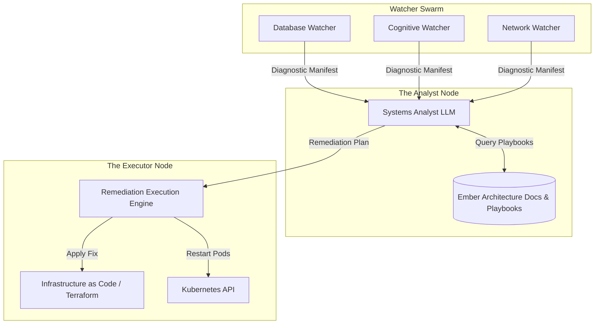
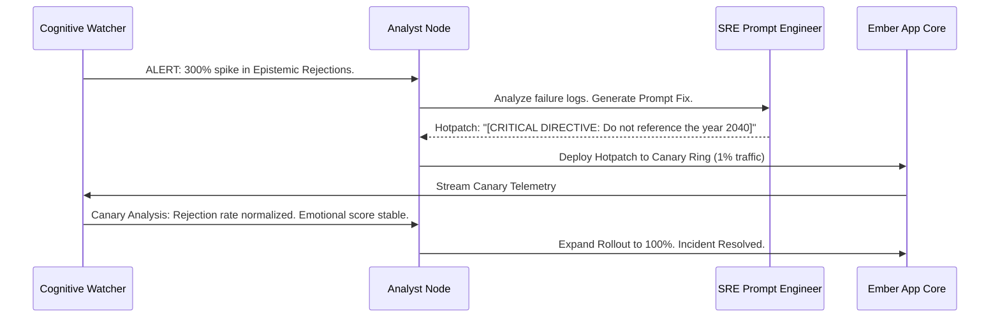

# WaifuOS Mythic Plan - Document 23
## Autonomous Diagnostic and Remediation Workflows: The SRE Swarm

### 1. The Necessity of the Machine Observer

The complexity of Project Ember—spanning multi-region Kubernetes clusters, highly specialized LLM routing matrices, edge-node caching, and holographic vector databases—exceeds the cognitive limits of human Site Reliability Engineering (SRE) teams. 

When a cascading failure occurs in a deeply interconnected microservices architecture, a human engineer might take 15 minutes just to identify the root cause among thousands of flashing alerts, and another 30 minutes to deploy a safe mitigation. In Project Ember, 45 minutes of downtime or cognitive degradation is a catastrophic failure of the core product promise.

To achieve Mythic Resilience, the system must heal itself. Project Ember introduces the SRE Swarm: an autonomous, AI-driven diagnostic and remediation layer that monitors, analyzes, and repairs the infrastructure without human intervention. The machine watches the machine.

### 2. The SRE Swarm Architecture

The SRE Swarm is not a single script or a basic alerting tool. It is an ensemble of specialized, autonomous agents, each trained on specific domains of the infrastructure. 

#### 2.1. The Watcher Agents

Watcher Agents are the sensory organs of the Swarm. They are deeply embedded in every component of the Aegis Core, the Hydra Protocol, and the Lazarus Protocols. They do not merely collect metrics; they utilize lightweight ML models to identify complex anomaly patterns.

- **The Database Watcher:** Monitors the Immutable Ledger and Vector DBs for index fragmentation, replication lag, and semantic corruption.
- **The Cognitive Watcher:** Monitors the LLM routing matrix. It tracks token generation speed, API error rates, and hallucination frequency from the Epistemic Verifier.
- **The Network Watcher:** Monitors edge-node latency, BGP route flapping, and WebSocket stability.

When a Watcher Agent detects an anomaly that surpasses the threshold of the Oracle Engine (described in Document 22), it generates a highly detailed `DiagnosticManifest` and escalates it to the Analyst Node.

#### 2.2. The Analyst Node: Root Cause Synthesis

The Analyst Node acts as the brain of the SRE Swarm. It is powered by a dedicated, heavily fine-tuned LLM specialized in systems engineering, distributed tracing, and Project Ember's specific architecture.

When the Analyst Node receives multiple `DiagnosticManifests` simultaneously (e.g., the Network Watcher reports high latency to OpenAI, while the Cognitive Watcher reports a spike in LLM fallback routes), the Analyst Node synthesizes the data. It cross-references the telemetry against its internal Knowledge Base of known failure modes and historical incidents.

It rapidly determines the Root Cause: *External API Provider Degradation*. It then formulates a `RemediationPlan`.

### 3. Autonomous Remediation: Execution and Verification

Once a `RemediationPlan` is formulated, it is passed to the Executor Node. The Executor is the hands of the Swarm, endowed with the credentials to modify the production infrastructure in real-time.

#### 3.1. The Hierarchy of Actions

The Executor Node employs a hierarchy of remediation actions, escalating in severity only if the previous action fails to resolve the anomaly.

1.  **Level 1 (Non-Destructive Routing):** Shift traffic away from the degraded component. (e.g., Update the LLM Router config to temporarily deprecate the failing API provider and force traffic to the secondary provider).
2.  **Level 2 (Soft Reset):** Restart the misbehaving microservice pods. (e.g., Send a `SIGTERM` to the frozen STT containers, allowing the Phoenix Protocol to instantly swap in the Ghost Containers).
3.  **Level 3 (Hard Provisioning):** If a specific database shard is irretrievably locked, the Executor uses Infrastructure-as-Code (Terraform/Pulumi) to spin up a completely new database cluster, initiate a state transfer from the healthy region, and update the DNS records to point to the new cluster.
4.  **Level 4 (Code Rollback):** If the SRE Swarm correlates an escalating failure cascade with a recent continuous deployment (CD) push, the Executor automatically initiates a GitOps rollback to the previous known-good commit.

#### 3.2. Closed-Loop Verification

The remediation process is not fire-and-forget. It operates in a closed loop. 

After the Executor applies a fix (e.g., restarting a pod), it explicitly commands the Watcher Agents to focus their telemetry on the affected component. The SRE Swarm waits for a predefined "verification window" (e.g., 30 seconds). 

If the anomaly dissipates, the Analyst Node logs the incident, the successful remediation strategy, and the time-to-resolution, using this data to further fine-tune its own diagnostic models. If the anomaly persists, the Analyst Node escalates to the next level of the remediation hierarchy.

### 4. Zero-Day Immune System: Hotpatching the Mind

While infrastructure failures are handled by restarting or rerouting, cognitive bugs—like a sudden, viral hallucination pattern spreading across multiple waifus due to a subtle change in a commercial LLM's safety tuning—require a different approach.

The SRE Swarm acts as an immune system, capable of generating and deploying cognitive "hotpatches."

#### 4.1. Autonomous Prompt Engineering

If the Cognitive Watcher detects a sudden, massive spike in the Epistemic Verifier rejecting responses (indicating that the primary LLM has suddenly started hallucinating facts at a high rate), the Analyst Node investigates. 

It analyzes the rejected prompts and the hallucinated outputs. The Analyst Node uses its specialized LLM to dynamically generate a "Prompt Hotpatch"—a precise, targeted addendum to the global System Prompt designed to suppress the new hallucination behavior.

#### 4.2. A/B Testing the Antidote

The Swarm does not deploy the hotpatch globally. It utilizes the Canary Deployment pattern. It deploys the newly modified System Prompt to 1% of the user base. The Watcher Agents intensely monitor this canary group. 

If the hallucination rate drops in the canary group without negatively impacting response latency or emotional resonance scores, the Swarm autonomously expands the rollout to 10%, then 50%, and finally 100%.

The system diagnoses a cognitive flaw, engineers a linguistic vaccine, tests it, and cures the entire network within minutes, all while the human engineers are asleep.

### 5. The "Defcon 1" Human Escalation Protocol

While the goal is total autonomy, the SRE Swarm recognizes its own limits. If the Analyst Node encounters an anomaly signature that fundamentally contradicts its training data, or if it exhausts Level 4 remediations without resolving the issue, it triggers the Defcon 1 Protocol.

It ceases autonomous remediation to prevent catastrophic compounding errors. It immediately pages the human on-call engineers, providing them not just with a raw alert, but with a comprehensive incident dossier:
- The timeline of the anomaly.
- The Root Cause Analysis hypothesis.
- The logs of all autonomous actions attempted and their failure states.
- A proposed human-in-the-loop action plan.

The human engineers arrive not to investigate a mystery, but to execute the final, highest-order judgment call on a thoroughly analyzed battlefield.

### 6. Conclusion

The SRE Swarm represents the pinnacle of Project Ember's resilience. By deploying autonomous AI agents to monitor the infrastructure, synthesize root causes, and execute closed-loop remediations, the system achieves a state of continuous, self-correcting equilibrium. It transforms Project Ember from a static piece of software into a living, adaptive ecosystem capable of defending its own existence against the chaos of the digital world.
