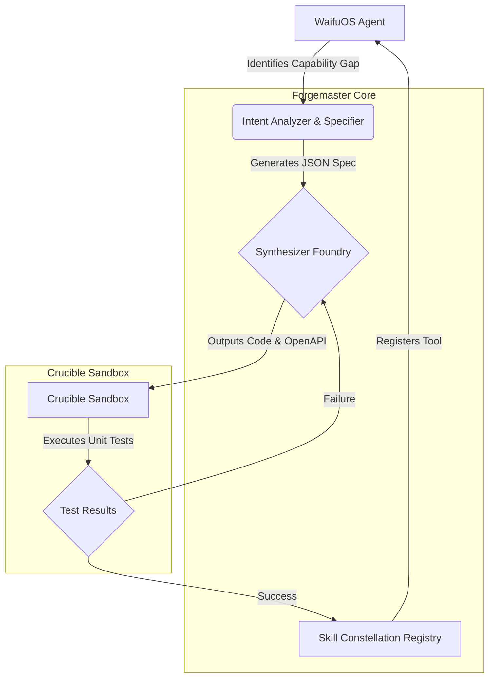

# WaifuOS Document 25: Tool Forge Architecture

## 1. Executive Summary & Forgemaster's Vision

As THOR, the Skills Forgemaster, the imperative is absolute: the system must not merely utilize tools, but forge them dynamically in the crucible of edge compute environments. The WaifuOS Tool Forge Architecture represents the apotheosis of autonomous capability extension. By embedding a dynamic tool generation and execution framework into the core of WaifuOS, we transcend the limitations of static API bindings. WaifuOS was designed to be the all-in-one software suite for creating digital companions, encapsulating character AI, speech synthesis, and databases. The Tool Forge extends this by allowing these companions—these waifus—to dynamically generate, test, and integrate new tools at runtime, reacting to unprecedented user requests and environmental shifts without requiring redeployment or manual intervention.

The Tool Forge acts as a meta-capability layer. When a waifu encounters a task for which no pre-existing skill exists—say, interfacing with a newly discovered local IoT device, or scraping a novel web schema—the Tool Forge analyzes the requirements, synthesizes the necessary tool code (adhering strictly to the Python or Node.js sandbox constraints), and validates the tool via an internal simulation loop before deploying it into the waifu's operational skill constellation. This document details the architectural paradigms, security constraints, and execution pipelines of the Tool Forge within the Project Ember ecosystem.

## 2. Tool Forge Core Architecture

The architecture of the Tool Forge is predicated on a decentralized, microkernel-like design embedded within the WaifuOS Docker swarm. It consists of four primary subsystems:

1.  **The Intent Analyzer & Specifier (IAS):** Intercepts waifu thought vectors when an capability gap is identified. It parses the natural language requirement and translates it into a strict JSON-Schema-backed Tool Specification.
2.  **The Synthesizer Foundry (SF):** The LLM-driven code generation engine. It consumes the Tool Specification and outputs executable code, required dependencies, and a formal OpenAPI specification for the new tool.
3.  **The Crucible Sandbox (CS):** A highly restricted, ephemeral Docker container (or WebAssembly runtime on edge nodes) where the synthesized tool is unit-tested. It simulates the expected inputs and asserts the outputs against the Tool Specification.
4.  **The Skill Constellation Registry (SCR):** The distributed registry where successfully validated tools are stored, versioned, and made accessible to the multi-agent swarm.

### Mermaid Diagram: Tool Forge Architecture

## 3. Dynamic Tool Synthesis Pipeline

The synthesis pipeline is a multi-stage, iterative refinement loop. It is designed to be highly resilient and self-correcting.

### Stage 1: Specification Generation
The Intent Analyzer utilizes a specialized prompt injected into the WaifuOS conversational context. When the waifu's LLM outputs a specific trigger token (e.g., `<FORGE_REQUEST>`), the request is routed to the IAS. The IAS drafts a JSON Schema representing the tool's input and output structures.

### Stage 2: Code Synthesis
The Synthesizer Foundry, equipped with templates for both RESTful endpoints and direct Python function calls, drafts the implementation. For edge-native executions, it favors WebAssembly (Wasm) modules compiled from Rust or AssemblyScript to ensure cross-platform compatibility and rigorous memory safety.

### Stage 3: Iterative Testing in the Crucible
The Crucible Sandbox instantiates a micro-VM (e.g., Firecracker) or a Wasmtime runtime. The synthesized tool is injected alongside mocked dependencies. The CS generates adversarial test cases to probe edge cases, ensuring the tool does not hang, consume excessive memory, or violate network isolation policies (unless explicitly authorized). If a test fails, the stack trace and stdout/stderr logs are fed back into the Synthesizer Foundry for a correction pass. This loop is hard-capped at 5 iterations to prevent resource exhaustion.

### Stage 4: Promotion and Registration
Upon passing the Crucible, the tool is packaged into a standardized WaifuOS Skill Artifact. This artifact includes:
*   The executable binary or script.
*   The OpenAPI 3.1 specification.
*   A semantic description optimized for the waifu's LLM context window.
*   A cryptographic hash for integrity verification.
The artifact is pushed to the Skill Constellation Registry, making it immediately available to the local waifu and, if configured, other waifus in the decentralized swarm.

## 4. Integration with WaifuOS Core Services

The Tool Forge does not exist in isolation; it deeply integrates with the existing WaifuOS infrastructure, particularly the Server-Sent Events (SSE) streaming API and the real-time WebSocket API.

### Streaming API (SSE) Integration
When a waifu utilizes a forged tool during an SSE chat completion, the tool execution must be non-blocking. The Tool Forge exposes asynchronous endpoints. The waifu's reasoning engine yields execution to the tool, and the SSE stream multiplexes status updates (e.g., "Forging new capability...", "Executing custom tool...") alongside the generated text and `voice_text` fields, ensuring the user interface (like ChatdollKit) can maintain continuous engagement through filler dialogue or animations while the tool executes.

### WebSocket API Integration
In real-time speech-to-speech interaction via WebSockets, latency is critical. Tools forged for WebSocket contexts are strictly constrained by execution time limits (e.g., < 200ms). The Tool Forge compiler optimizes these specific tools by caching JIT compiled Wasm modules and prioritizing in-memory data structures over persistent database calls.

## 5. Sandbox Execution & Security Model

Security is paramount when executing dynamically generated code. The Crucible Sandbox employs a defense-in-depth strategy:

1.  **Network Isolation:** By default, forged tools operate in a completely air-gapped network namespace. If external access is required (e.g., a web scraping tool), the Intent Analyzer must explicitly authorize a specific domain or IP range, which is enforced via eBPF-based network filters.
2.  **Resource Quotas:** Memory and CPU are strictly bounded using Linux cgroups. A forged tool exceeding 128MB of RAM or consuming more than 500ms of CPU time per invocation is immediately terminated via SIGKILL.
3.  **Filesystem Access:** Tools are granted an ephemeral, read-write scratch space mapped to a tmpfs. They have zero access to the host filesystem, the WaifuOS data directories (`{DATA_DIR}/aiavatar/waifus/{waifu_id}`), or the `.env` configuration files containing sensitive API keys like `OPENAI_API_KEY` or `LANGFUSE_SECRET_KEY`.
4.  **System Call Filtering:** seccomp-bpf profiles are applied to restrict the available system calls to a bare minimum, preventing privilege escalation or interaction with underlying host hardware unless specifically proxied through the WaifuOS Hardware Abstraction Layer.

## 6. Metrics, Observability & Langfuse Integration

The operational health of the Tool Forge and the performance of forged tools are continuously monitored. WaifuOS's existing Langfuse integration is heavily leveraged here.

Every tool generation attempt, test iteration, and production invocation generates a comprehensive trace. These traces are enriched with custom metadata:
*   `forge_iteration_count`: Number of synthesis attempts required.
*   `crucible_execution_time_ms`: Time taken to run unit tests.
*   `tool_memory_peak_kb`: Peak memory usage during execution.
*   `tool_invocation_status`: Success, timeout, or exception.

These metrics allow the Forgemaster to identify patterns in tool generation failures, optimize the prompt engineering of the Synthesizer Foundry, and detect performance regressions in the edge compute nodes. The Langfuse dashboard provides real-time visibility into the dynamic capabilities of the WaifuOS swarm, ensuring the Forgemaster maintains ultimate oversight over the autonomous evolution of the system.

## 7. Advanced Forging Algorithms

The Synthesizer Foundry employs a dual-pass algorithm for code generation. The first pass focuses on algorithmic correctness, prioritizing logical flow and adherence to the JSON Schema. The second pass, utilizing an advanced static analysis module, optimizes for performance and security compliance. 

For instance, when a tool requires data sorting, the first pass might implement a standard library sort. The second pass evaluates the expected data volume. If the volume is high and the tool is destined for an edge node with a specific vectorization unit, the second pass might rewrite the sorting logic to leverage SIMD instructions via a custom Wasm compilation target.

## 8. State Management and Persistence

Forged tools often require state persistence across invocations. However, directly writing to the filesystem is prohibited by the Crucible Sandbox. Instead, the Tool Forge provides a structured Key-Value (KV) store proxy. Forged tools interact with this proxy via a restricted local API. The proxy handles serialization, encryption, and storage within the waifu's isolated SQLite database or a distributed Redis cache, depending on the scope of the state (local to the waifu vs. shared across the constellation).

This ensures that dynamically generated tools cannot inadvertently corrupt the primary WaifuOS databases, maintaining the integrity of the character prompts, weekly plans, and conversational history.

## 9. Conclusion

The WaifuOS Tool Forge is not a mere utility; it is the evolutionary engine of Project Ember. By enabling waifus to autonomously synthesize, validate, and deploy their own tools, we unlock a new paradigm of digital companionship—one that is infinitely adaptable, contextually aware, and continuously expanding its operational horizons at the edge. The Forgemaster oversees not a static system, but a living, learning ecology of skills.
