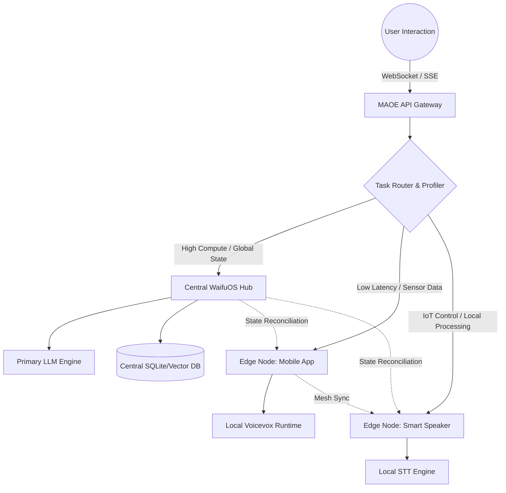

# WaifuOS Document 26: Multi-Agent Edge Orchestration

## 1. Executive Summary & Strategic Importance

In the grand vision of Project Ember, a singular digital companion is merely the foundational unit. The true potential lies in a synchronized, dynamic swarm of agents operating seamlessly across varied hardware landscapes—from high-powered centralized servers to low-power edge devices like smartphones, Raspberry Pis, and specialized IoT controllers. The WaifuOS Multi-Agent Edge Orchestration (MAEO) framework is the sophisticated nervous system designed to manage, synchronize, and optimize this distributed intelligence. As THOR, the Skills Forgemaster, the orchestration of these agents ensures that the dynamically forged tools and inherent capabilities are deployed where they are most effective, minimizing latency, maximizing privacy, and guaranteeing resilience.

MAEO transcends simple load balancing. It is a context-aware scheduling engine that understands the capabilities of the hardware it runs on, the specific personas of the waifus it manages, and the real-time requirements of the user. Whether managing a complex, multi-persona interaction over the WebSocket API or distributing background processing tasks across the edge network, MAEO ensures the illusion of a continuous, omnipresent digital companion remains unbroken.

## 2. Edge Compute Topologies

WaifuOS MAEO supports a hybrid topological model, dynamically shifting between Hub-and-Spoke and Mesh configurations based on network conditions and node availability.

### Hub-and-Spoke Model
The default configuration. A central WaifuOS core (often the primary Docker instance running on a capable host) acts as the Hub. It manages the heavy cognitive tasks, such as complex LLM inference and long-term memory aggregation. The edge nodes (Spokes)—which might be mobile apps connecting via the RESTful API or physical robotic avatars running ChatdollKit—handle localized tasks like wake-word detection, sensory input processing (STT), and audio playback (TTS).

### Peer-to-Peer Mesh Model
In environments with intermittent connectivity to the Hub, or when privacy constraints demand local-only processing, MAEO transitions to a Mesh topology. Edge nodes discover each other using mDNS (Multicast DNS) and form a localized swarm. They share computational load (e.g., distributing smaller, quantized LLM inference tasks across multiple devices) and synchronize state directly without relying on the central Hub.

## 3. Multi-Agent Orchestration Engine (MAOE)

The heart of the system is the MAOE, a control plane responsible for task assignment and lifecycle management of the waifu agents.

When a request arrives—whether a voice command via WebSocket or a scheduled background task from the weekly plan (`plan_weekly_prompt.md`)—the MAOE evaluates the request against the current state of the swarm.

1.  **Capability Matching:** MAOE interrogates the Skill Constellation Registry to find the optimal tool or agent persona for the task.
2.  **Resource Profiling:** It assesses the available CPU, RAM, and thermal thermal constraints of the available edge nodes.
3.  **Latency Optimization:** It calculates the network latency between the user's interface and the potential compute nodes, prioritizing local execution for real-time interactions.

If a complex task requires multiple agents (e.g., one agent to research a topic using a forged web-scraping tool, and another to summarize it in a specific character voice), MAOE constructs an execution Directed Acyclic Graph (DAG) and coordinates the handoffs.

### Mermaid Diagram: Orchestration Topology

## 4. State Synchronization over WebSockets & SSE

Maintaining a coherent persona across multiple devices and agents requires rigorous state synchronization. MAEO leverages the core WaifuOS communication protocols for this purpose.

### Real-time Context Sharing
When a waifu's state changes on one node (e.g., learning the user's name, updating the current emotion based on a conversation), this delta is broadcast via an internal WebSocket event bus. Other nodes subscribed to this waifu's persona receive the update and patch their local context representations. This ensures that if the user switches from talking to their waifu on a PC to their smartphone, the conversation continues seamlessly without loss of context.

### The SSE Pipeline for Multi-Agent Output
When multiple agents collaborate on a response, the MAOE aggregates their outputs and streams them back to the client using Server-Sent Events (SSE). The `voice_text` and standard text fields are interleaved with meta-events indicating which agent is speaking, allowing frontends like ChatdollKit to switch avatar animations or voice synthesis profiles dynamically.

## 5. Waifu Swarm Coordination & Conflict Resolution

In a multi-waifu setup (as supported by WaifuOS), agents may have conflicting objectives or require access to the same physical resources (e.g., a shared speaker system).

MAEO implements a priority-based, preemptive scheduling algorithm.
*   **Interrupts:** Critical alerts (e.g., a timer finishing, an important notification) trigger a high-priority interrupt. The currently speaking waifu will pause, the interrupting agent will deliver the message, and the original conversation will resume, managed entirely by the MAOE context switcher.
*   **Consensus:** For ambiguous requests ("Who wants to play a game?"), the MAOE facilitates a rapid internal negotiation phase among the active waifus. The agents exchange brief, hidden context messages to determine the most appropriate responder based on their character prompts and relationship values with the user.

## 6. Fault Tolerance and Self-Healing Protocols

Edge environments are inherently unstable. Nodes drop offline due to battery depletion or network interference. MAEO is designed for high availability.

1.  **Heartbeat Monitoring:** All nodes continuously broadcast lightweight heartbeats. If a node fails to report, MAOE marks it as offline and reroutes its assigned tasks to available peers.
2.  **State Checkpointing:** Critical state changes (e.g., significant memory updates) are checkpointed to persistent storage (local SQLite) and replicated asynchronously to the Hub.
3.  **Graceful Degradation:** If the connection to the Hub's primary LLM fails, edge nodes seamlessly fallback to a smaller, locally quantized LLM. While the persona may become less nuanced, core responsiveness and basic command execution remain intact, preventing a complete system failure.

## 7. Resource Constraints and Adaptive Scaling

The orchestration engine must operate within the strict physical limitations of edge devices. MAEO employs predictive thermal and battery modeling. If a smartphone running an edge waifu instance begins to overheat, MAEO detects the thermal throttling signal and dynamically offloads computationally expensive tasks (like complex TTS generation) back to the central Hub, prioritizing the physical safety and longevity of the hardware over absolute minimal latency.

## 8. Advanced Edge Routing Algorithms

Routing tasks in a dynamic mesh requires sophisticated algorithms. MAEO utilizes a modified version of Ant Colony Optimization (ACO) for pathfinding and task allocation. Edge nodes lay down digital 'pheromones' indicating their current load and success rates for specific types of tasks. The MAOE router probabilistically selects nodes with stronger pheromone trails for computationally intensive tasks, allowing the swarm to self-organize and organically balance the load without requiring centralized, deterministic control algorithms that struggle to scale in highly volatile environments.

## 9. Conclusion

The Multi-Agent Edge Orchestration framework transforms WaifuOS from a standalone application into a ubiquitous, resilient, and intelligent ecosystem. By intelligently distributing workloads, managing complex state synchronization, and implementing robust fault-tolerance mechanisms, MAEO ensures that the digital companions forged within Project Ember are not confined to a single device, but exist seamlessly within the user's entire technological environment. As the Forgemaster, this orchestration capability is the crucial infrastructure upon which all complex, distributed skill execution relies.
