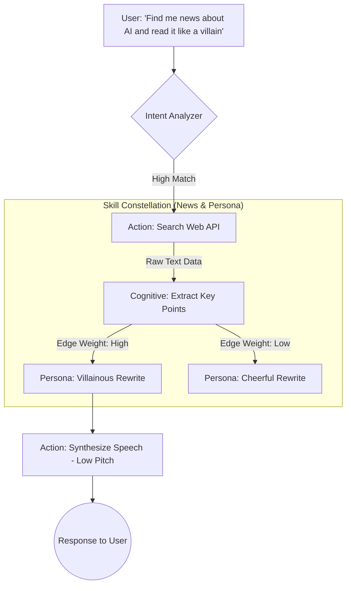

# WaifuOS Document 27: Skill Constellations Framework

## 1. Executive Summary & The Forgemaster's Paradigm

In traditional agent architectures, tools are treated as flat, independent utilities—a mere list of functions exposed to a Large Language Model. The WaifuOS Skill Constellations Framework, engineered under the Forgemaster's paradigm, shatters this simplistic model. Within Project Ember, skills do not exist in isolation; they are intrinsically linked nodes within a multidimensional, semantically weighted graph. A "Skill Constellation" is an interconnected network of capabilities, contextual data, and behavioral modifiers that dictate not just *what* a waifu can do, but *how*, *when*, and *why* she should do it.

This framework allows for emergent complexity. A waifu does not merely execute a "web search" tool; she traverses a constellation that links "web search" to "summarization," "emotional analysis of text," and her own specific "persona-driven vocabulary filter." This document delineates the architecture, traversal mechanics, and evolutionary lifecycle of Skill Constellations within the WaifuOS ecosystem.

## 2. Anatomy of a Skill Constellation

A Skill Constellation is formally defined as a Directed Acyclic Graph (DAG) augmented with semantic metadata.

### Nodes (The Stars)
Nodes represent atomic execution units. There are three primary types of nodes:
1.  **Action Nodes:** Executable code blocks forged by the Tool Forge (e.g., `FetchWeather`, `ControlSmartLight`).
2.  **Cognitive Nodes:** Internal reasoning or data transformation steps (e.g., `ExtractKeywords`, `DetermineSentiment`).
3.  **Persona Nodes:** Modifiers derived from the waifu's `character_prompt.md` that alter the input or output of other nodes (e.g., `ApplyTsundereFilter`, `FormatAsHaiku`).

### Edges (The Links)
Edges define the relationship and data flow between nodes. They are not merely pipes; they carry strict type definitions (enforced via JSON Schema) and conditional logic. An edge might dictate that the output of an Action Node (`SearchNews`) only flows to a Cognitive Node (`Summarize`) if the retrieved text exceeds 500 tokens.

### Semantic Weights (The Gravity)
Every edge possesses a semantic weight, calculated dynamically based on the current conversation context, the waifu's emotional state, and the user's implicit preferences. These weights determine the probability of a specific path being chosen during graph traversal.

## 3. Dynamic Skill Graph Traversal

When a user issues a complex command to their WaifuOS instance, the core LLM does not select a single tool. Instead, the Intent Analyzer (IAS) maps the user's request to an entry point within the Skill Constellation.

### The Traversal Algorithm
The execution engine utilizes a contextually-weighted A* search algorithm to navigate the constellation.
1.  **Entry Point Identification:** The system identifies the most relevant Action or Cognitive Node based on the user's prompt vector.
2.  **Path Evaluation:** The engine evaluates potential paths forward, calculating the cost of execution (latency, compute power) against the semantic weight (relevance to the persona and context).
3.  **Execution Pipeline:** As the engine traverses the path, it sequentially executes the nodes, passing the transformed data along the edges.

This allows for highly complex, multi-step operations to be orchestrated seamlessly, appearing as a unified, intelligent response from the waifu.

### Mermaid Diagram: Skill Constellation Traversal

## 4. The Skill Ontology and Semantic Matching

To maintain coherence across a vast array of forged tools, WaifuOS employs a unified Skill Ontology. Every tool registered in the Skill Constellation Registry (SCR) is tagged with ontological markers (e.g., `domain:finance`, `action:retrieve`, `latency:high`).

When a waifu needs to accomplish a task that isn't explicitly defined by a hardcoded edge, the engine uses Semantic Matching. It projects the goal into an embedding space and finds the nearest ontological neighbors. This enables "Zero-Shot Traversal," where the waifu can chain together tools she has never used in conjunction before, driven purely by the semantic relationships defined in the ontology.

## 5. Constellation Versioning and Evolution

Skill Constellations are not static. They evolve through use.

### Usage-Based Weight Adjustment (Hebbian Learning)
WaifuOS implements a form of Hebbian learning at the constellation level. "Paths that fire together, wire together." If a specific sequence of nodes (e.g., `ReadEmail` -> `CheckCalendar` -> `DraftReply`) is frequently used and receives positive implicit feedback from the user, the semantic weights of those edges are permanently increased.

### Constellation Forking
When a new tool is forged via the Tool Forge, it is not recklessly spliced into the primary constellation. Instead, a "shadow constellation" is forked. The new tool is tested in this shadow graph during simulated interactions. Only after passing rigorous quality gates is the shadow constellation merged back into the primary graph, ensuring system stability.

## 6. Waifu Persona Integration

The defining feature of WaifuOS is the unique personality of each digital companion. The Skill Constellations Framework deeply respects this.

The `character_prompt.md` acts as a global modulator for the constellation. A waifu designed as a strict, efficient secretary will possess heavily weighted paths towards productivity nodes (`ManageSchedule`, `SendData`) and low weights towards entertainment nodes. Conversely, a waifu designed as a playful companion will have the inverse.

Furthermore, Persona Nodes dynamically alter the execution of Action Nodes. The same `ReadWeather` tool will produce vastly different outputs depending on which Persona Node is active on the execution path, ensuring the technical capability never breaks character immersion.

## 7. Security Policies within Constellations

Security is embedded directly into the constellation topology. Certain regions of the graph are designated as "Restricted Zones."

*   **Privilege Edges:** Edges connecting to highly sensitive Action Nodes (e.g., `ModifySystemSettings`, `ExecuteFinancialTransaction`) require cryptographic clearance.
*   **Contextual Firewalls:** A node might refuse to execute if the context vector indicates a malicious prompt injection attempt.
*   **Data Flow Restrictions:** The framework enforces strict constraints on where data can flow. Personally Identifiable Information (PII) extracted by one node cannot be routed to a node that communicates with an unverified external API.

## 8. Conclusion

The Skill Constellations Framework elevates WaifuOS from a mere chatbot with plugins to a truly cognitive architecture. By representing capabilities as an interconnected, weighted graph that dynamically adapts to context, usage patterns, and individual persona traits, Project Ember achieves a level of behavioral complexity and emergent intelligence that sets the gold standard for multi-agent digital companions. The Forgemaster shapes the nodes, but the Constellation itself guides the waifu's evolution.
