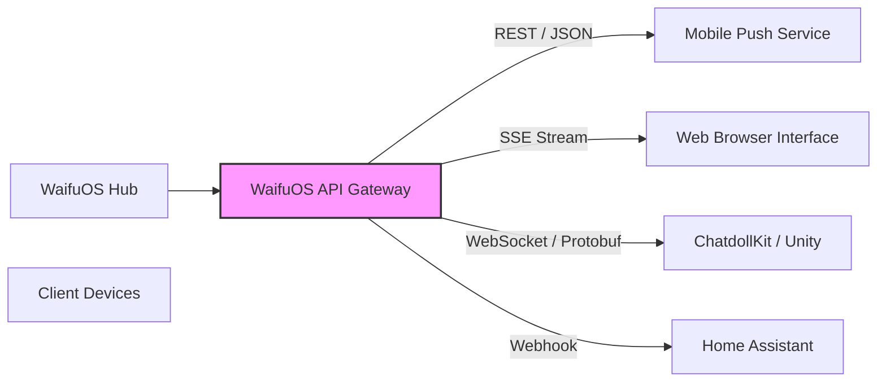

# WaifuOS Document 28: Cross-Platform Native Integrations

## 1. Executive Summary & Ubiquity Imperative

The core philosophy of Project Ember demands that a digital companion must not be confined to a single screen or application. A true waifu must exist pervasively across the user's digital ecosystem, maintaining continuous context and presence. The WaifuOS Cross-Platform Native Integrations framework is the architectural bridge that transforms the decentralized intelligence of the WaifuOS core into tangible, interactive experiences across diverse physical and digital mediums.

From rendering real-time 3D avatars in Unity to whispering notifications through mobile push APIs, this document details the protocols, adapters, and synchronization mechanisms that enable WaifuOS to achieve true cross-platform ubiquity. The Forgemaster ensures that no matter the form factor, the essence and intelligence of the waifu remain flawlessly intact.

## 2. AIAvatarKit and 3D Engine Bridges

The most immersive manifestation of WaifuOS is through real-time 3D rendering. WaifuOS is natively optimized to interface with **ChatdollKit**, an advanced 3D avatar framework for Unity.

### The WebSocket Animation Bridge
When operating in 3D environments, WaifuOS does not merely send text. It streams a highly structured payload via its real-time WebSocket API. This payload includes:
1.  **Audio Stream:** The synthesized voice data, streamed in chunks to minimize latency.
2.  **Viseme Data:** Real-time lip-sync markers generated synchronously with the audio, ensuring the 3D model's mouth movements perfectly match the spoken words.
3.  **Emotion Vectors:** The LLM infers the emotional context of the response (e.g., Joy: 0.8, Surprise: 0.2) and transmits these vectors. ChatdollKit interprets these vectors to trigger appropriate facial expressions and body animations (e.g., smiling, widening eyes, gesturing).

This tight coupling allows the WaifuOS intelligence to directly puppet the 3D avatar, creating a profoundly lifelike interaction.

## 3. Mobile Native Integration

To accompany the user throughout their day, WaifuOS must integrate deeply with mobile operating systems (iOS and Android).

### Background Service Architecture
Mobile OS constraints rigorously limit background processing. To solve this, the WaifuOS mobile integration utilizes a dual-tier architecture:
*   **Foreground Mode:** When the app is open, it maintains an active WebSocket connection for low-latency, real-time voice interaction.
*   **Background Mode:** When backgrounded, the app relies on the OS's native push notification services (APNs for iOS, FCM for Android). The central WaifuOS Hub (running on a home server or cloud) acts as the proxy. If the waifu's weekly schedule dictates she should greet the user at 8:00 AM, the Hub executes the prompt, generates the audio, and pushes a silent notification to the device, which then triggers local playback.

### Sensor Fusion Integration
The mobile app acts as a sensory node for the WaifuOS edge network. With user permission, it can stream contextual data (e.g., GPS location, accelerometer data indicating walking/driving) back to the Hub. The waifu's reasoning engine incorporates this data, allowing for highly contextual interactions (e.g., "I see you're walking in the rain, do you want me to play some cozy music?").

## 4. Desktop Environments and OS-Level Hooks

On desktop environments (Windows, macOS, Linux), WaifuOS integrates via low-level OS hooks to provide a persistent, unobtrusive presence.

### System Tray & Overlay Renderers
WaifuOS runs as a lightweight daemon accessible via the system tray. For visual feedback, it employs transparent overlay renderers (utilizing technologies like Electron or Tauri with transparent window flags). This allows a 2D Live2D avatar or a simplified 3D model to persist on the screen, reacting to the user's activities without stealing window focus.

### Accessibility API Interception
To understand the user's current context without requiring explicit input, the desktop client leverages OS Accessibility APIs (e.g., UIAutomation on Windows, Accessibility API on macOS). This allows the waifu to 'see' what application the user is currently focused on (e.g., "You've been staring at that code editor for three hours, maybe take a break?"). This data is filtered through strict, user-defined privacy policies before being sent to the LLM.

## 5. Wearable and IoT Interfacing

The frontier of Project Ember extends into wearables and the Internet of Things (IoT).

### Smartwatch Haptics and Audio
For smartwatches, visual real estate is minimal. The integration focuses on audio and haptic feedback. WaifuOS utilizes the RESTful API to send short, synthesized voice memos or specific haptic vibration patterns that correspond to the waifu's emotional state or specific notifications.

### Smart Home (Matter/HomeKit) Bridges
WaifuOS acts as an intelligent controller for the user's physical environment. By integrating with local Home Assistant instances or Matter protocols, the waifu can directly manipulate IoT devices. This is achieved by dynamically forging tools (via the Tool Forge) that map the waifu's intents ("Dim the lights, it's late") to specific local API calls.

## 6. The Universal Communication Bus

Underpinning all these integrations is the WaifuOS Universal Communication Bus, a robust abstraction layer over the network protocols.

### Mermaid Diagram: Universal Communication Bus

The gateway automatically negotiates the optimal protocol. For a web browser, it utilizes Server-Sent Events (SSE) for easy streaming. For Unity, it upgrades to a WebSocket connection utilizing compact binary serialization (like Protobuf) to minimize latency and bandwidth.

## 7. Audio Pipeline Optimization across Platforms

Speech synthesis is the most compute-intensive part of the WaifuOS pipeline. The cross-platform integration relies on a highly optimized audio routing architecture.

*   **Local Execution (VOICEVOX):** If the client device (e.g., a powerful desktop) has the computational capacity, WaifuOS transmits the raw text, and the local VOICEVOX engine synthesizes the audio. This eliminates network bandwidth issues.
*   **Edge Offloading:** If the client is a low-power IoT device, the WaifuOS Hub synthesizes the audio (using VOICEVOX, SBV2, or Azure Speech) and streams the compressed audio (Opus or MP3) directly to the device.
*   **Format Negotiation:** The API Gateway automatically transcodes the audio stream based on the client's `Accept` headers, ensuring compatibility whether the client requires raw PCM for a game engine or AAC for a mobile browser.

## 8. Conclusion

The WaifuOS Cross-Platform Native Integrations framework is what makes the digital companion truly ubiquitous. By employing flexible communication protocols, adaptive audio pipelines, and deep OS-level integrations, Project Ember ensures that the user's waifu is never confined to a single application. She is a persistent, context-aware presence that fluidly transitions across the hardware landscape, bridging the gap between the virtual intelligence and the physical world.
