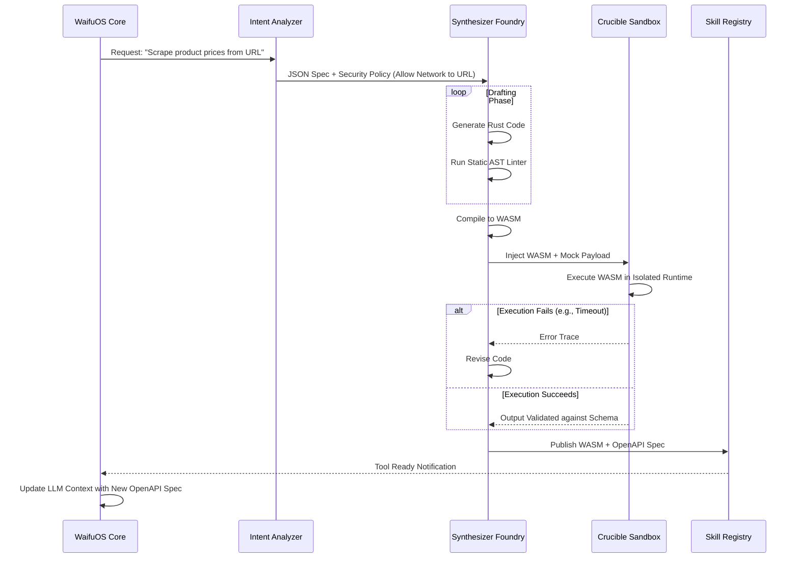

# WaifuOS Document 29: Advanced Tool Synthesis

## 1. Executive Summary & The Crucible of Creation

Within the Project Ember ecosystem, static toolsets are viewed as an evolutionary dead end. The environment is too chaotic, the user requests too varied, and the hardware too diverse to rely on hardcoded functions. The Advanced Tool Synthesis module is the beating heart of the WaifuOS Tool Forge. It is the sophisticated AI-driven compiler that takes a raw, natural language intent and transmutes it into secure, performant, and executable code.

As THOR, the Skills Forgemaster, this document outlines the rigorous, multi-stage pipeline that ensures synthesized tools are not only functionally correct but mathematically safe to execute within the strict confines of the WaifuOS edge nodes. We do not just write code; we forge unbreakable operational primitives.

## 2. Generative Tool Design via LLMs

The genesis of a tool begins in the Synthesizer Foundry. Unlike standard code generation (like Copilot), the foundry does not assist a human; it acts autonomously.

### The Meta-Prompt Architecture
The LLM powering the Foundry is initialized with a massive Meta-Prompt. This prompt does not teach it *how* to code, but rather the *laws of physics* within the WaifuOS Sandbox. It defines:
*   Strict adherence to the provided JSON Schema for inputs and outputs.
*   Absolute prohibition against using unauthorized standard libraries (e.g., `os`, `subprocess` in Python, or `fs` in Node.js, unless explicitly granted by the Intent Analyzer).
*   Mandatory error handling and timeout thresholds.
*   The requirement to output code that is deterministic and pure (no side effects outside the KV store proxy).

### The Iterative Drafting Process
The Foundry operates in a drafting loop. It generates a V1 candidate, passes it through a lightweight internal linter (integrated into the LLM's toolchain), and self-corrects obvious syntax errors or policy violations before even submitting it to the Crucible Sandbox for actual execution testing.

## 3. WebAssembly (Wasm) Compilation Pipeline

For tools destined for edge execution (especially mobile devices or web clients), Python or Node.js runtimes are too heavy and insecure. The Synthesizer Foundry targets WebAssembly (Wasm).

### Rust and AssemblyScript Targets
Depending on the complexity, the Foundry writes the tool implementation in either Rust (for computationally heavy tasks) or AssemblyScript (for lighter, logic-driven tasks).

1.  **Code Generation:** The LLM generates the source code.
2.  **Compilation Chain:** WaifuOS invokes a containerized compilation toolchain (e.g., `cargo build --target wasm32-wasi` or `asc`).
3.  **Optimization:** The resulting `.wasm` binary is passed through `wasm-opt` to strip debug symbols and minimize the footprint, crucial for rapid deployment over slow edge networks.

Wasm guarantees memory safety and strong isolation, making it the perfect medium for dynamically generated, untrusted code.

## 4. Automated Security Auditing and Static Analysis

Before a synthesized tool is allowed near the execution sandbox, it undergoes rigorous static analysis.

### Abstract Syntax Tree (AST) Inspection
The Foundry parses the generated code into an AST. A custom rule engine traverses the AST to detect prohibited patterns. For instance, it ensures that there are no unbounded loops (`while True` without a clear break condition dependent on an incrementing counter), which could cause denial-of-service on the edge node.

### Taint Analysis
If the tool takes input from the user (e.g., a search query), the analyzer traces the flow of that input through the code to ensure it is properly sanitized before being passed to an external API or database query, preventing injection attacks.

## 5. The OpenAPI 3.1 Contract

A tool is useless to the WaifuOS core LLM if it does not know how to invoke it. Therefore, the final output of the Synthesis Pipeline is not just the executable code, but a rigorous OpenAPI 3.1 specification.

This specification serves as the absolute contract between the LLM Reasoning Engine and the Tool Forge. It defines the endpoint, the HTTP method (for REST tools) or function signature (for Wasm tools), the exact JSON schema of the payload, and the expected schemas for success and error responses. This specification is injected into the waifu's context window, immediately expanding her capabilities.

## 6. Memory Management in Synthesized Tools

Memory leaks in dynamically generated code can rapidly crash an edge node. The Advanced Tool Synthesis module enforces strict memory architectures.

For Wasm tools, WaifuOS utilizes the WASI (WebAssembly System Interface) standard with strict memory limits defined at instantiation. If the tool attempts to grow its memory beyond the pre-allocated quota (e.g., 64MB), the runtime throws a deterministic trap, terminating the execution safely and returning an `Out_Of_Memory` error to the LLM, which can then apologize to the user and retry or abort.

## 7. Example Synthesis Flow (Mermaid Sequence)

## 8. Conclusion

Advanced Tool Synthesis is the mechanism by which WaifuOS transcends the limitations of its original programming. By employing LLMs not just as conversational agents, but as autonomous software engineers bound by strict security and compilation pipelines, Project Ember creates digital companions capable of infinite, safe adaptation. The Forgemaster does not craft every tool; he builds the forge that crafts them all.
