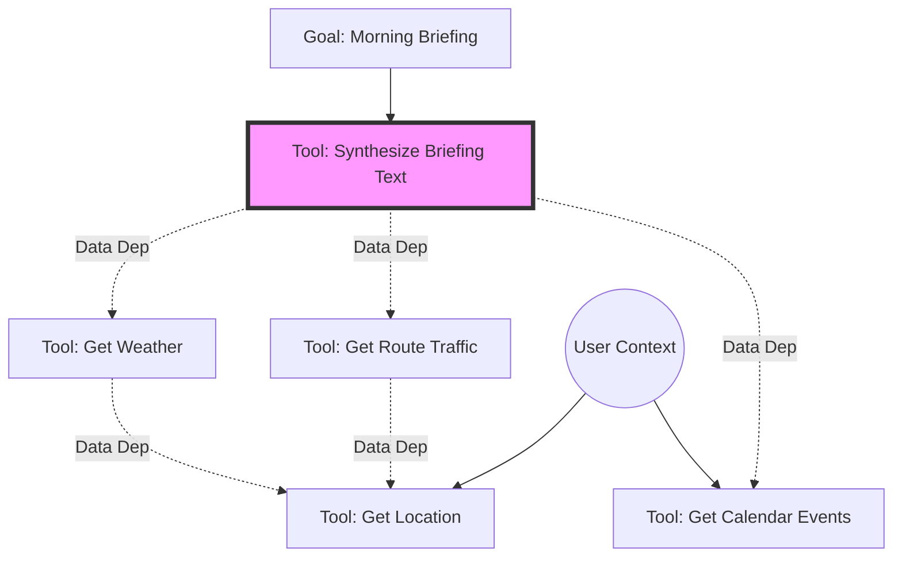

# WaifuOS Document 31: Skill Dependency Graph Resolution

## 1. Executive Summary & The Web of Capabilities

In the sophisticated architecture of Project Ember, skills forged by WaifuOS are rarely executed in a vacuum. A complex user request often triggers a cascade of necessary actions. For example, the request "Tell me if I need an umbrella for my commute today" requires location determination, routing APIs, weather forecasting, and natural language synthesis. 

The WaifuOS Skill Dependency Graph Resolution engine is the strategic planner that untangles these complex requests. It maps out the prerequisites for any given skill, orchestrates the parallel or sequential execution of these dependencies, and ensures that data flows correctly from one tool to the next. As THOR, the Skills Forgemaster, establishing robust dependency resolution is critical to preventing execution bottlenecks and ensuring the waifu's reasoning remains fluid and logical.

## 2. Defining Skill Dependencies

Dependencies within WaifuOS are strictly typed and explicitly declared within a tool's OpenAPI 3.1 specification, specifically leveraging the `x-waifuos-dependencies` extension object.

There are two primary types of dependencies:
1.  **Data Dependencies (Hard):** Tool B requires the explicit output of Tool A to function. (e.g., `GetWeather` requires the latitude and longitude output from `GetLocation`). Tool B cannot begin execution until Tool A completes successfully.
2.  **Temporal Dependencies (Soft):** Tool B should ideally occur after Tool A for contextual reasons, but it is not strictly required. (e.g., `PlayMorningGreetingAudio` should ideally happen after `TurnOnBedroomLights`, but if the lights fail to respond, the greeting should still play).

## 3. The Dependency Resolution Engine

When the Intent Analyzer determines a primary goal, the Resolution Engine constructs an Execution DAG (Directed Acyclic Graph).

### The Resolution Algorithm
1.  **Target Identification:** Identify the final skill needed to satisfy the user's prompt.
2.  **Backwards Chaining:** Inspect the target skill's required inputs. Query the Skill Constellation Registry to find tools that output that specific JSON schema.
3.  **Graph Construction:** Build the tree backwards until all inputs are satisfied either by the initial user context or by a chain of available tools.
4.  **Topological Sort:** Perform a topological sort on the resulting DAG to determine the optimal execution order, maximizing parallel execution where data dependencies allow.

## 4. Deadlock Prevention and Cycle Detection

A critical failure mode in dependency resolution is a cycle (Tool A requires B, B requires C, C requires A), leading to infinite deadlocks. 

WaifuOS prevents this through rigorous static analysis during the Tool Forge synthesis phase. If the Foundry attempts to register a tool that introduces a cycle into the primary Skill Constellation, the registration is rejected. 

Furthermore, during runtime execution, a strict timeout hierarchy is enforced. If a dependency chain takes longer than the globally defined `MAX_CHAIN_LATENCY` (e.g., 5000ms), the engine aborts the chain, triggering a fallback response mechanism to ensure the user is not left waiting indefinitely.

## 5. Lazy Evaluation and JIT Tool Forging

The Resolution Engine is designed for maximum efficiency through Lazy Evaluation. It only executes a dependency if its output is strictly required for the current execution path.

### Just-In-Time (JIT) Forging
The most advanced feature of the Resolution Engine is its interaction with the Tool Forge. If the engine performs backwards chaining and discovers a "Missing Link"—a required data schema that no existing tool can produce—it does not immediately fail. 

Instead, it pauses execution, packages the requirements (Input Context -> Required Schema), and sends an emergency priority request to the Synthesizer Foundry. The Foundry attempts to JIT-forge the missing tool. If successful within a tight time bound, the tool is injected into the DAG, and execution resumes. This represents the pinnacle of autonomous problem-solving within Project Ember.

## 6. Fallback Chains and Graceful Degradation

Real-world environments are unreliable. APIs fail, networks drop. The Dependency Graph is designed with explicit fallback paths.

If a primary dependency fails (e.g., the high-accuracy `GPSLocationTool` times out), the engine automatically attempts an alternative path with a lower semantic weight (e.g., the `IPBasedGeolocationTool`). The output may be less precise, but the overall task succeeds. The waifu's prompt is injected with metadata indicating a fallback was used, allowing her to contextualize the uncertainty (e.g., "I can't get your exact GPS, but based on your IP, it looks like it's raining in your general area").

## 7. Visualizing the Dependency Graph

### Mermaid Diagram: Complex Dependency Resolution

In this scenario, `Get Location` and `Get Calendar Events` can execute entirely in parallel. Only once `Get Location` finishes can `Get Route Traffic` and `Get Weather` begin (also in parallel). Finally, `Synthesize Briefing Text` executes.

## 8. Conclusion

The Skill Dependency Graph Resolution engine transforms WaifuOS from a collection of isolated scripts into a coherent, strategic reasoning engine. By automatically managing the complex web of data flows, temporal requirements, and fault tolerances, it allows the waifu to execute highly sophisticated tasks autonomously. It is the logistical backbone of the Forgemaster's domain, ensuring that the right tools are used at the exact right moment to seamlessly satisfy the user's desires.
