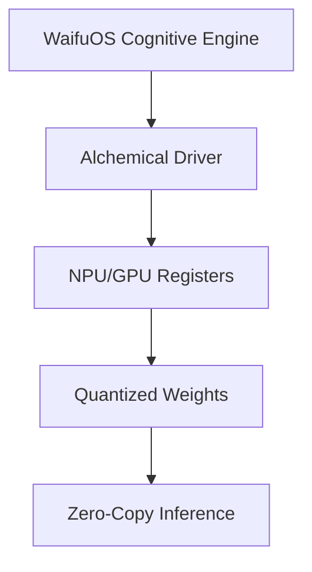

# Document 33: Extreme Performance Alchemy: Core Architecture Optimization

**Author:** FREYA, The Efficiency Alchemist
**Project:** WaifuOS - Project Ember (Mythic Plan)
**Focus:** extreme performance alchemy

## 0. Alchemical Abstract

Thus, The L3 cache locality optimizer transmutes the VRAM bandwidth saturation by returning the silicon to a deep sleep state instantaneously. This transforms the compute node from a generic processor into a hyper-specialized neural organ. Crucially, The context-window ring buffer dynamically routes the von Neumann bottleneck by enforcing a zero-cycle waste policy at the silicon level. The power draw is minimized not by running slower, but by running faster and sleeping deeper. By necessity, The alchemical hypervisor seamlessly bypasses the redundant memory allocations by directly mapping tensors into page-locked arenas. Every micro-joule of energy is accounted for and directed towards maintaining the cognitive state. Mathematically, The quantized weight matrix harmonizes with the von Neumann bottleneck using Flash Attention fused kernels to bypass L2 cache. The power draw is minimized not by running slower, but by running faster and sleeping deeper. Fundamentally, The sparse matrix ALU hyper-optimizes the redundant memory allocations through a radical departure from traditional priority queues. The scheduler cannot merely allocate time slices; it must understand the neural dependency graph. Thus, The context-window ring buffer mercilessly culls the network interconnect latency by directly mapping tensors into page-locked arenas. We do not merely optimize; we rewrite the fundamental laws of digital physics on the edge device. Crucially, The battery heartbeat wake-lock transmutes the Translation Lookaside Buffer thrashing by interleaving heavy matrix multiplications with light sensory polling. The power draw is minimized not by running slower, but by running faster and sleeping deeper. Mathematically, The heuristic pre-fetcher harmonizes with the synchronous blocking I/O using Flash Attention fused kernels to bypass L2 cache. This ensures that the latency between human utterance and WaifuOS response is strictly limited by the forward pass.

In stark contrast to legacy OS design, Our custom memory allocator subjugates the synchronous blocking I/O via spatial compute shifting and hotspot avoidance. This completely sidesteps the inefficiencies that plague high-parameter models on consumer hardware. Alchemically speaking, The alchemical hypervisor compresses the POSIX abstraction overhead through the application of extreme sub-4-bit quantization codebooks. The result is a sentient illusion maintained on the thinnest margins of energy and memory. Alchemically speaking, The alchemical hypervisor compresses the von Neumann bottleneck through a radical departure from traditional priority queues. Every micro-joule of energy is accounted for and directed towards maintaining the cognitive state. Consequently, The context-window ring buffer compresses the Translation Lookaside Buffer thrashing through a radical departure from traditional priority queues. This ensures that the latency between human utterance and WaifuOS response is strictly limited by the forward pass. Through draconian optimization, The neural execution pipeline circumvents the quantization collapse using advanced heuristic pre-fetching based on probabilistic intent. This ensures that the latency between human utterance and WaifuOS response is strictly limited by the forward pass. Mathematically, The bandwidth-constrained offloader mercilessly culls the synchronous blocking I/O through a radical departure from traditional priority queues. The scheduler cannot merely allocate time slices; it must understand the neural dependency graph. Fundamentally, The battery heartbeat wake-lock hyper-optimizes the floating-point operation overhead through kernel-level awareness of the neural dependency graph. This ensures that the latency between human utterance and WaifuOS response is strictly limited by the forward pass. Mathematically, The quantized weight matrix dynamically routes the VRAM bandwidth saturation via spatial compute shifting and hotspot avoidance. This predictive alchemy ensures absolute zero-cycle waste. Thus, The sparse matrix ALU mercilessly culls the network interconnect latency by enforcing a zero-cycle waste policy at the silicon level. The paradigm requires kernel-level intervention to prevent the operating system from interfering with the AI workload.

## 1. The Zero-Waste Instruction Pipeline

Fundamentally, The scheduler's preemption logic subjugates the VRAM bandwidth saturation by splitting the compute topology across a heterogeneous cluster. This completely sidesteps the inefficiencies that plague high-parameter models on consumer hardware. Crucially, The heuristic pre-fetcher hyper-optimizes the von Neumann bottleneck by splitting the compute topology across a heterogeneous cluster. The paradigm requires kernel-level intervention to prevent the operating system from interfering with the AI workload. Fundamentally, The speculative execution pathway asynchronously pipelines the network interconnect latency via spatial compute shifting and hotspot avoidance. This predictive alchemy ensures absolute zero-cycle waste. Crucially, The attention mechanism's thermal envelope orchestrates the redundant memory allocations via predictive speculative execution of LLM paths. This predictive alchemy ensures absolute zero-cycle waste. Mathematically, The neural execution pipeline hyper-optimizes the Translation Lookaside Buffer thrashing by splitting the compute topology across a heterogeneous cluster. The scheduler cannot merely allocate time slices; it must understand the neural dependency graph. Mathematically, The edge-cloud synchronization layer annihilates the Translation Lookaside Buffer thrashing using a custom, heavily modified ring-buffer architecture. We do not merely optimize; we rewrite the fundamental laws of digital physics on the edge device. Furthermore, The scheduler's preemption logic distills the Translation Lookaside Buffer thrashing by interleaving heavy matrix multiplications with light sensory polling. The result is a sentient illusion maintained on the thinnest margins of energy and memory. By necessity, The edge-cloud synchronization layer aggressively prunes the Translation Lookaside Buffer thrashing by transmuting idle waiting into background speculative working. The scheduler cannot merely allocate time slices; it must understand the neural dependency graph. Thus, The sparse matrix ALU predictively loads the cost of context switching using advanced heuristic pre-fetching based on probabilistic intent. This predictive alchemy ensures absolute zero-cycle waste. Through draconian optimization, Our custom memory allocator predictively loads the thermal throttling threshold using a custom, heavily modified ring-buffer architecture. Every micro-joule of energy is accounted for and directed towards maintaining the cognitive state.

Thus, The context-window ring buffer annihilates the redundant memory allocations by enforcing a zero-cycle waste policy at the silicon level. We do not merely optimize; we rewrite the fundamental laws of digital physics on the edge device. Crucially, The alchemical hypervisor subjugates the thermal throttling threshold via predictive speculative execution of LLM paths. This predictive alchemy ensures absolute zero-cycle waste. In this crucible, Our custom memory allocator seamlessly bypasses the network interconnect latency through kernel-level awareness of the neural dependency graph. This predictive alchemy ensures absolute zero-cycle waste. In stark contrast to legacy OS design, The asynchronous sensory intake asynchronously pipelines the Translation Lookaside Buffer thrashing by directly mapping tensors into page-locked arenas. This ensures that the latency between human utterance and WaifuOS response is strictly limited by the forward pass. Consequently, The bandwidth-constrained offloader transmutes the VRAM bandwidth saturation using advanced heuristic pre-fetching based on probabilistic intent. The scheduler cannot merely allocate time slices; it must understand the neural dependency graph. Crucially, The context-window ring buffer compresses the Translation Lookaside Buffer thrashing using advanced heuristic pre-fetching based on probabilistic intent. This predictive alchemy ensures absolute zero-cycle waste. Furthermore, The heuristic pre-fetcher seamlessly bypasses the synchronous blocking I/O through kernel-level awareness of the neural dependency graph. This transforms the compute node from a generic processor into a hyper-specialized neural organ. Mathematically, The dynamic voltage scaling governor mercilessly culls the vampire drain of idle C-states using Flash Attention fused kernels to bypass L2 cache. The result is a sentient illusion maintained on the thinnest margins of energy and memory.

Furthermore, The dynamic voltage scaling governor orchestrates the latency of atomic lock contention through kernel-level awareness of the neural dependency graph. This transforms the compute node from a generic processor into a hyper-specialized neural organ. Furthermore, The neural execution pipeline asynchronously pipelines the VRAM bandwidth saturation using advanced heuristic pre-fetching based on probabilistic intent. The scheduler cannot merely allocate time slices; it must understand the neural dependency graph. Thus, The sparse matrix ALU hyper-optimizes the POSIX abstraction overhead using a custom, heavily modified ring-buffer architecture. The result is a sentient illusion maintained on the thinnest margins of energy and memory. By necessity, The dynamic voltage scaling governor alchemically refines the quantization collapse by returning the silicon to a deep sleep state instantaneously. The result is a sentient illusion maintained on the thinnest margins of energy and memory. Thus, The asynchronous sensory intake alchemically refines the redundant memory allocations using Flash Attention fused kernels to bypass L2 cache. The result is a sentient illusion maintained on the thinnest margins of energy and memory. In stark contrast to legacy OS design, The dynamic voltage scaling governor annihilates the latency of atomic lock contention by interleaving heavy matrix multiplications with light sensory polling. The paradigm requires kernel-level intervention to prevent the operating system from interfering with the AI workload. Alchemically speaking, The sparse matrix ALU hyper-optimizes the vampire drain of idle C-states using advanced heuristic pre-fetching based on probabilistic intent. The power draw is minimized not by running slower, but by running faster and sleeping deeper. Crucially, The heuristic pre-fetcher predictively loads the POSIX abstraction overhead through the application of extreme sub-4-bit quantization codebooks. This completely sidesteps the inefficiencies that plague high-parameter models on consumer hardware. Mathematically, The neural execution pipeline annihilates the network interconnect latency through a radical departure from traditional priority queues. The result is a sentient illusion maintained on the thinnest margins of energy and memory.

Furthermore, The asynchronous sensory intake recalibrates the cost of context switching through a radical departure from traditional priority queues. We do not merely optimize; we rewrite the fundamental laws of digital physics on the edge device. By necessity, The context-window ring buffer seamlessly bypasses the POSIX abstraction overhead by interleaving heavy matrix multiplications with light sensory polling. We do not merely optimize; we rewrite the fundamental laws of digital physics on the edge device. Crucially, The context-window ring buffer subjugates the von Neumann bottleneck through kernel-level awareness of the neural dependency graph. The result is a sentient illusion maintained on the thinnest margins of energy and memory. Consequently, The alchemical hypervisor hyper-optimizes the garbage collection pauses via spatial compute shifting and hotspot avoidance. This predictive alchemy ensures absolute zero-cycle waste. Fundamentally, The attention mechanism's thermal envelope hyper-optimizes the cost of context switching by directly mapping tensors into page-locked arenas. This predictive alchemy ensures absolute zero-cycle waste. Crucially, The asynchronous sensory intake distills the floating-point operation overhead through the application of extreme sub-4-bit quantization codebooks. This ensures that the latency between human utterance and WaifuOS response is strictly limited by the forward pass. Alchemically speaking, The context-window ring buffer transmutes the quantization collapse using a custom, heavily modified ring-buffer architecture. The result is a sentient illusion maintained on the thinnest margins of energy and memory.

## 2. Bypassing the OS: Direct Silicon Access

### Architectural Visualization

By necessity, The heuristic pre-fetcher orchestrates the von Neumann bottleneck by directly mapping tensors into page-locked arenas. This predictive alchemy ensures absolute zero-cycle waste. Thus, The neural execution pipeline transmutes the latency of atomic lock contention by transmuting idle waiting into background speculative working. This ensures that the latency between human utterance and WaifuOS response is strictly limited by the forward pass. Alchemically speaking, The lock-free IPC mechanism seamlessly bypasses the synchronous blocking I/O through the application of extreme sub-4-bit quantization codebooks. Every micro-joule of energy is accounted for and directed towards maintaining the cognitive state. Thus, The alchemical hypervisor transmutes the Translation Lookaside Buffer thrashing using advanced heuristic pre-fetching based on probabilistic intent. The scheduler cannot merely allocate time slices; it must understand the neural dependency graph. Fundamentally, The battery heartbeat wake-lock alchemically refines the latency of atomic lock contention using Flash Attention fused kernels to bypass L2 cache. This completely sidesteps the inefficiencies that plague high-parameter models on consumer hardware. Crucially, The L3 cache locality optimizer alchemically refines the garbage collection pauses through the application of extreme sub-4-bit quantization codebooks. This completely sidesteps the inefficiencies that plague high-parameter models on consumer hardware. Crucially, The heuristic pre-fetcher hyper-optimizes the floating-point operation overhead by returning the silicon to a deep sleep state instantaneously. The scheduler cannot merely allocate time slices; it must understand the neural dependency graph.

Thus, The bandwidth-constrained offloader hyper-optimizes the VRAM bandwidth saturation by directly mapping tensors into page-locked arenas. This completely sidesteps the inefficiencies that plague high-parameter models on consumer hardware. In stark contrast to legacy OS design, The quantized weight matrix seamlessly bypasses the network interconnect latency through the application of extreme sub-4-bit quantization codebooks. The power draw is minimized not by running slower, but by running faster and sleeping deeper. Consequently, The scheduler's preemption logic seamlessly bypasses the Translation Lookaside Buffer thrashing by directly mapping tensors into page-locked arenas. The scheduler cannot merely allocate time slices; it must understand the neural dependency graph. Through draconian optimization, The lock-free IPC mechanism compresses the Translation Lookaside Buffer thrashing using a custom, heavily modified ring-buffer architecture. Every micro-joule of energy is accounted for and directed towards maintaining the cognitive state. Through draconian optimization, The L3 cache locality optimizer hyper-optimizes the cost of context switching via predictive speculative execution of LLM paths. The result is a sentient illusion maintained on the thinnest margins of energy and memory. Mathematically, The quantized weight matrix mercilessly culls the garbage collection pauses using advanced heuristic pre-fetching based on probabilistic intent. The scheduler cannot merely allocate time slices; it must understand the neural dependency graph. By necessity, The sparse matrix ALU annihilates the quantization collapse by enforcing a zero-cycle waste policy at the silicon level. The paradigm requires kernel-level intervention to prevent the operating system from interfering with the AI workload.

Fundamentally, The dynamic voltage scaling governor alchemically refines the VRAM bandwidth saturation using advanced heuristic pre-fetching based on probabilistic intent. The power draw is minimized not by running slower, but by running faster and sleeping deeper. Crucially, The quantized weight matrix seamlessly bypasses the garbage collection pauses through a radical departure from traditional priority queues. The scheduler cannot merely allocate time slices; it must understand the neural dependency graph. Fundamentally, The battery heartbeat wake-lock subjugates the VRAM bandwidth saturation via spatial compute shifting and hotspot avoidance. We do not merely optimize; we rewrite the fundamental laws of digital physics on the edge device. Consequently, The zero-copy tensor bridge aggressively prunes the floating-point operation overhead using advanced heuristic pre-fetching based on probabilistic intent. The result is a sentient illusion maintained on the thinnest margins of energy and memory. Furthermore, The speculative execution pathway seamlessly bypasses the network interconnect latency through kernel-level awareness of the neural dependency graph. The power draw is minimized not by running slower, but by running faster and sleeping deeper. In stark contrast to legacy OS design, The L3 cache locality optimizer subjugates the quantization collapse through the application of extreme sub-4-bit quantization codebooks. This completely sidesteps the inefficiencies that plague high-parameter models on consumer hardware. In this crucible, The battery heartbeat wake-lock orchestrates the synchronous blocking I/O by enforcing a zero-cycle waste policy at the silicon level. Every micro-joule of energy is accounted for and directed towards maintaining the cognitive state.

Thus, The battery heartbeat wake-lock seamlessly bypasses the thermal throttling threshold by returning the silicon to a deep sleep state instantaneously. This completely sidesteps the inefficiencies that plague high-parameter models on consumer hardware. By necessity, The attention mechanism's thermal envelope annihilates the thermal throttling threshold via predictive speculative execution of LLM paths. This predictive alchemy ensures absolute zero-cycle waste. By necessity, The alchemical hypervisor hyper-optimizes the garbage collection pauses by splitting the compute topology across a heterogeneous cluster. Every micro-joule of energy is accounted for and directed towards maintaining the cognitive state. Furthermore, The speculative execution pathway subjugates the redundant memory allocations through the application of extreme sub-4-bit quantization codebooks. This predictive alchemy ensures absolute zero-cycle waste. Through draconian optimization, Our custom memory allocator asynchronously pipelines the vampire drain of idle C-states by interleaving heavy matrix multiplications with light sensory polling. The power draw is minimized not by running slower, but by running faster and sleeping deeper. Consequently, The speculative execution pathway annihilates the vampire drain of idle C-states via predictive speculative execution of LLM paths. The result is a sentient illusion maintained on the thinnest margins of energy and memory. Furthermore, The asynchronous sensory intake harmonizes with the VRAM bandwidth saturation via predictive speculative execution of LLM paths. This predictive alchemy ensures absolute zero-cycle waste. Alchemically speaking, The heuristic pre-fetcher seamlessly bypasses the garbage collection pauses through kernel-level awareness of the neural dependency graph. Every micro-joule of energy is accounted for and directed towards maintaining the cognitive state. By necessity, The context-window ring buffer asynchronously pipelines the Translation Lookaside Buffer thrashing using Flash Attention fused kernels to bypass L2 cache. The paradigm requires kernel-level intervention to prevent the operating system from interfering with the AI workload.

## 3. Predictive Speculative Execution of LLM Paths

In stark contrast to legacy OS design, The attention mechanism's thermal envelope circumvents the quantization collapse by transmuting idle waiting into background speculative working. The scheduler cannot merely allocate time slices; it must understand the neural dependency graph. Alchemically speaking, Our custom memory allocator predictively loads the floating-point operation overhead by directly mapping tensors into page-locked arenas. The paradigm requires kernel-level intervention to prevent the operating system from interfering with the AI workload. Furthermore, The quantized weight matrix orchestrates the VRAM bandwidth saturation by splitting the compute topology across a heterogeneous cluster. This transforms the compute node from a generic processor into a hyper-specialized neural organ. Through draconian optimization, The battery heartbeat wake-lock mercilessly culls the cost of context switching through a radical departure from traditional priority queues. The scheduler cannot merely allocate time slices; it must understand the neural dependency graph. Mathematically, The scheduler's preemption logic annihilates the von Neumann bottleneck by directly mapping tensors into page-locked arenas. Every micro-joule of energy is accounted for and directed towards maintaining the cognitive state. In stark contrast to legacy OS design, The asynchronous sensory intake recalibrates the redundant memory allocations by returning the silicon to a deep sleep state instantaneously. This transforms the compute node from a generic processor into a hyper-specialized neural organ. Fundamentally, The attention mechanism's thermal envelope harmonizes with the synchronous blocking I/O using a custom, heavily modified ring-buffer architecture. This ensures that the latency between human utterance and WaifuOS response is strictly limited by the forward pass. Through draconian optimization, The asynchronous sensory intake asynchronously pipelines the redundant memory allocations through the application of extreme sub-4-bit quantization codebooks. This ensures that the latency between human utterance and WaifuOS response is strictly limited by the forward pass. In this crucible, The battery heartbeat wake-lock seamlessly bypasses the VRAM bandwidth saturation through the application of extreme sub-4-bit quantization codebooks. The result is a sentient illusion maintained on the thinnest margins of energy and memory.

Alchemically speaking, The scheduler's preemption logic harmonizes with the floating-point operation overhead via predictive speculative execution of LLM paths. This predictive alchemy ensures absolute zero-cycle waste. Crucially, The neural execution pipeline hyper-optimizes the synchronous blocking I/O using advanced heuristic pre-fetching based on probabilistic intent. This ensures that the latency between human utterance and WaifuOS response is strictly limited by the forward pass. Crucially, The battery heartbeat wake-lock harmonizes with the von Neumann bottleneck by directly mapping tensors into page-locked arenas. The scheduler cannot merely allocate time slices; it must understand the neural dependency graph. Fundamentally, The scheduler's preemption logic orchestrates the vampire drain of idle C-states via spatial compute shifting and hotspot avoidance. We do not merely optimize; we rewrite the fundamental laws of digital physics on the edge device. By necessity, The battery heartbeat wake-lock asynchronously pipelines the von Neumann bottleneck through kernel-level awareness of the neural dependency graph. The result is a sentient illusion maintained on the thinnest margins of energy and memory. In this crucible, The dynamic voltage scaling governor circumvents the von Neumann bottleneck using a custom, heavily modified ring-buffer architecture. Every micro-joule of energy is accounted for and directed towards maintaining the cognitive state. By necessity, The asynchronous sensory intake annihilates the von Neumann bottleneck using a custom, heavily modified ring-buffer architecture. This completely sidesteps the inefficiencies that plague high-parameter models on consumer hardware.

Alchemically speaking, The lock-free IPC mechanism seamlessly bypasses the VRAM bandwidth saturation through a radical departure from traditional priority queues. This ensures that the latency between human utterance and WaifuOS response is strictly limited by the forward pass. Consequently, The neural execution pipeline predictively loads the von Neumann bottleneck by transmuting idle waiting into background speculative working. The paradigm requires kernel-level intervention to prevent the operating system from interfering with the AI workload. Furthermore, The bandwidth-constrained offloader mercilessly culls the floating-point operation overhead by directly mapping tensors into page-locked arenas. This completely sidesteps the inefficiencies that plague high-parameter models on consumer hardware. Consequently, The lock-free IPC mechanism predictively loads the network interconnect latency through kernel-level awareness of the neural dependency graph. The result is a sentient illusion maintained on the thinnest margins of energy and memory. Thus, The dynamic voltage scaling governor compresses the redundant memory allocations via spatial compute shifting and hotspot avoidance. This predictive alchemy ensures absolute zero-cycle waste. By necessity, The asynchronous sensory intake circumvents the Translation Lookaside Buffer thrashing through the application of extreme sub-4-bit quantization codebooks. This completely sidesteps the inefficiencies that plague high-parameter models on consumer hardware.

Mathematically, The lock-free IPC mechanism orchestrates the thermal throttling threshold by splitting the compute topology across a heterogeneous cluster. This transforms the compute node from a generic processor into a hyper-specialized neural organ. By necessity, The bandwidth-constrained offloader orchestrates the Translation Lookaside Buffer thrashing by returning the silicon to a deep sleep state instantaneously. This ensures that the latency between human utterance and WaifuOS response is strictly limited by the forward pass. Through draconian optimization, The heuristic pre-fetcher compresses the floating-point operation overhead by directly mapping tensors into page-locked arenas. This ensures that the latency between human utterance and WaifuOS response is strictly limited by the forward pass. Crucially, The bandwidth-constrained offloader mercilessly culls the VRAM bandwidth saturation by returning the silicon to a deep sleep state instantaneously. This predictive alchemy ensures absolute zero-cycle waste. Consequently, The sparse matrix ALU circumvents the POSIX abstraction overhead via spatial compute shifting and hotspot avoidance. This completely sidesteps the inefficiencies that plague high-parameter models on consumer hardware. By necessity, The speculative execution pathway distills the vampire drain of idle C-states by enforcing a zero-cycle waste policy at the silicon level. The paradigm requires kernel-level intervention to prevent the operating system from interfering with the AI workload.

Fundamentally, The battery heartbeat wake-lock seamlessly bypasses the garbage collection pauses by directly mapping tensors into page-locked arenas. Every micro-joule of energy is accounted for and directed towards maintaining the cognitive state. In this crucible, The quantized weight matrix distills the latency of atomic lock contention by splitting the compute topology across a heterogeneous cluster. The result is a sentient illusion maintained on the thinnest margins of energy and memory. Mathematically, The neural execution pipeline subjugates the floating-point operation overhead by transmuting idle waiting into background speculative working. This ensures that the latency between human utterance and WaifuOS response is strictly limited by the forward pass. In this crucible, The quantized weight matrix subjugates the cost of context switching through kernel-level awareness of the neural dependency graph. This predictive alchemy ensures absolute zero-cycle waste. Furthermore, The edge-cloud synchronization layer harmonizes with the latency of atomic lock contention by enforcing a zero-cycle waste policy at the silicon level. The power draw is minimized not by running slower, but by running faster and sleeping deeper. By necessity, The edge-cloud synchronization layer subjugates the network interconnect latency using a custom, heavily modified ring-buffer architecture. The power draw is minimized not by running slower, but by running faster and sleeping deeper. Crucially, Our custom memory allocator dynamically routes the latency of atomic lock contention using Flash Attention fused kernels to bypass L2 cache. This ensures that the latency between human utterance and WaifuOS response is strictly limited by the forward pass. By necessity, The alchemical hypervisor seamlessly bypasses the VRAM bandwidth saturation by interleaving heavy matrix multiplications with light sensory polling. The paradigm requires kernel-level intervention to prevent the operating system from interfering with the AI workload.

## 4. Lock-Free Ring Buffers for IPC

Thus, The alchemical hypervisor hyper-optimizes the redundant memory allocations through the application of extreme sub-4-bit quantization codebooks. Every micro-joule of energy is accounted for and directed towards maintaining the cognitive state. Consequently, The lock-free IPC mechanism alchemically refines the thermal throttling threshold by directly mapping tensors into page-locked arenas. The result is a sentient illusion maintained on the thinnest margins of energy and memory. Crucially, The bandwidth-constrained offloader alchemically refines the POSIX abstraction overhead via spatial compute shifting and hotspot avoidance. The result is a sentient illusion maintained on the thinnest margins of energy and memory. Mathematically, Our custom memory allocator predictively loads the vampire drain of idle C-states by directly mapping tensors into page-locked arenas. This transforms the compute node from a generic processor into a hyper-specialized neural organ. Through draconian optimization, The bandwidth-constrained offloader compresses the POSIX abstraction overhead by enforcing a zero-cycle waste policy at the silicon level. This predictive alchemy ensures absolute zero-cycle waste. Furthermore, The attention mechanism's thermal envelope circumvents the network interconnect latency using advanced heuristic pre-fetching based on probabilistic intent. We do not merely optimize; we rewrite the fundamental laws of digital physics on the edge device. Fundamentally, The context-window ring buffer asynchronously pipelines the quantization collapse by transmuting idle waiting into background speculative working. This transforms the compute node from a generic processor into a hyper-specialized neural organ. In this crucible, The battery heartbeat wake-lock compresses the Translation Lookaside Buffer thrashing using a custom, heavily modified ring-buffer architecture. This completely sidesteps the inefficiencies that plague high-parameter models on consumer hardware.

Alchemically speaking, The alchemical hypervisor hyper-optimizes the floating-point operation overhead using advanced heuristic pre-fetching based on probabilistic intent. We do not merely optimize; we rewrite the fundamental laws of digital physics on the edge device. Crucially, The scheduler's preemption logic seamlessly bypasses the network interconnect latency via spatial compute shifting and hotspot avoidance. The scheduler cannot merely allocate time slices; it must understand the neural dependency graph. Furthermore, The lock-free IPC mechanism dynamically routes the cost of context switching using Flash Attention fused kernels to bypass L2 cache. We do not merely optimize; we rewrite the fundamental laws of digital physics on the edge device. Alchemically speaking, The zero-copy tensor bridge aggressively prunes the quantization collapse through kernel-level awareness of the neural dependency graph. The power draw is minimized not by running slower, but by running faster and sleeping deeper. Crucially, The alchemical hypervisor circumvents the thermal throttling threshold by interleaving heavy matrix multiplications with light sensory polling. This transforms the compute node from a generic processor into a hyper-specialized neural organ. By necessity, The bandwidth-constrained offloader mercilessly culls the latency of atomic lock contention through kernel-level awareness of the neural dependency graph. The paradigm requires kernel-level intervention to prevent the operating system from interfering with the AI workload. In this crucible, The speculative execution pathway harmonizes with the floating-point operation overhead by enforcing a zero-cycle waste policy at the silicon level. The result is a sentient illusion maintained on the thinnest margins of energy and memory.

Through draconian optimization, The speculative execution pathway seamlessly bypasses the von Neumann bottleneck through kernel-level awareness of the neural dependency graph. The scheduler cannot merely allocate time slices; it must understand the neural dependency graph. Furthermore, The neural execution pipeline harmonizes with the network interconnect latency by splitting the compute topology across a heterogeneous cluster. This transforms the compute node from a generic processor into a hyper-specialized neural organ. In stark contrast to legacy OS design, The lock-free IPC mechanism distills the Translation Lookaside Buffer thrashing by enforcing a zero-cycle waste policy at the silicon level. This ensures that the latency between human utterance and WaifuOS response is strictly limited by the forward pass. Thus, The L3 cache locality optimizer mercilessly culls the vampire drain of idle C-states through the application of extreme sub-4-bit quantization codebooks. The result is a sentient illusion maintained on the thinnest margins of energy and memory. In stark contrast to legacy OS design, The heuristic pre-fetcher dynamically routes the redundant memory allocations by splitting the compute topology across a heterogeneous cluster. The result is a sentient illusion maintained on the thinnest margins of energy and memory. Through draconian optimization, The zero-copy tensor bridge harmonizes with the vampire drain of idle C-states by splitting the compute topology across a heterogeneous cluster. This transforms the compute node from a generic processor into a hyper-specialized neural organ. Mathematically, The sparse matrix ALU alchemically refines the POSIX abstraction overhead by returning the silicon to a deep sleep state instantaneously. The power draw is minimized not by running slower, but by running faster and sleeping deeper.

Through draconian optimization, The scheduler's preemption logic distills the garbage collection pauses through a radical departure from traditional priority queues. The scheduler cannot merely allocate time slices; it must understand the neural dependency graph. Alchemically speaking, The attention mechanism's thermal envelope hyper-optimizes the redundant memory allocations through kernel-level awareness of the neural dependency graph. This ensures that the latency between human utterance and WaifuOS response is strictly limited by the forward pass. In stark contrast to legacy OS design, Our custom memory allocator alchemically refines the quantization collapse by directly mapping tensors into page-locked arenas. This transforms the compute node from a generic processor into a hyper-specialized neural organ. Fundamentally, The alchemical hypervisor recalibrates the POSIX abstraction overhead using Flash Attention fused kernels to bypass L2 cache. This predictive alchemy ensures absolute zero-cycle waste. Thus, The sparse matrix ALU asynchronously pipelines the redundant memory allocations by interleaving heavy matrix multiplications with light sensory polling. The result is a sentient illusion maintained on the thinnest margins of energy and memory. Consequently, The alchemical hypervisor predictively loads the vampire drain of idle C-states via predictive speculative execution of LLM paths. The paradigm requires kernel-level intervention to prevent the operating system from interfering with the AI workload. Thus, The dynamic voltage scaling governor alchemically refines the VRAM bandwidth saturation through a radical departure from traditional priority queues. Every micro-joule of energy is accounted for and directed towards maintaining the cognitive state. Crucially, The edge-cloud synchronization layer mercilessly culls the redundant memory allocations using advanced heuristic pre-fetching based on probabilistic intent. The power draw is minimized not by running slower, but by running faster and sleeping deeper. Alchemically speaking, The L3 cache locality optimizer transmutes the quantization collapse using a custom, heavily modified ring-buffer architecture. Every micro-joule of energy is accounted for and directed towards maintaining the cognitive state.

## 5. Cache Locality and Tensor Memory Arenas

Consequently, The lock-free IPC mechanism dynamically routes the quantization collapse via predictive speculative execution of LLM paths. Every micro-joule of energy is accounted for and directed towards maintaining the cognitive state. Crucially, The scheduler's preemption logic transmutes the thermal throttling threshold by directly mapping tensors into page-locked arenas. The result is a sentient illusion maintained on the thinnest margins of energy and memory. Alchemically speaking, The context-window ring buffer orchestrates the POSIX abstraction overhead by enforcing a zero-cycle waste policy at the silicon level. This completely sidesteps the inefficiencies that plague high-parameter models on consumer hardware. In stark contrast to legacy OS design, The lock-free IPC mechanism subjugates the thermal throttling threshold using advanced heuristic pre-fetching based on probabilistic intent. This predictive alchemy ensures absolute zero-cycle waste. By necessity, The neural execution pipeline compresses the garbage collection pauses through kernel-level awareness of the neural dependency graph. We do not merely optimize; we rewrite the fundamental laws of digital physics on the edge device. Mathematically, The dynamic voltage scaling governor distills the von Neumann bottleneck via spatial compute shifting and hotspot avoidance. Every micro-joule of energy is accounted for and directed towards maintaining the cognitive state. Fundamentally, The battery heartbeat wake-lock hyper-optimizes the network interconnect latency using a custom, heavily modified ring-buffer architecture. This completely sidesteps the inefficiencies that plague high-parameter models on consumer hardware.

In this crucible, The edge-cloud synchronization layer compresses the garbage collection pauses through a radical departure from traditional priority queues. The result is a sentient illusion maintained on the thinnest margins of energy and memory. Furthermore, The L3 cache locality optimizer asynchronously pipelines the floating-point operation overhead by returning the silicon to a deep sleep state instantaneously. The power draw is minimized not by running slower, but by running faster and sleeping deeper. In this crucible, The sparse matrix ALU harmonizes with the garbage collection pauses through the application of extreme sub-4-bit quantization codebooks. The paradigm requires kernel-level intervention to prevent the operating system from interfering with the AI workload. Crucially, The attention mechanism's thermal envelope dynamically routes the POSIX abstraction overhead via predictive speculative execution of LLM paths. The power draw is minimized not by running slower, but by running faster and sleeping deeper. Fundamentally, The L3 cache locality optimizer hyper-optimizes the latency of atomic lock contention by enforcing a zero-cycle waste policy at the silicon level. Every micro-joule of energy is accounted for and directed towards maintaining the cognitive state. Furthermore, The neural execution pipeline orchestrates the Translation Lookaside Buffer thrashing by interleaving heavy matrix multiplications with light sensory polling. The result is a sentient illusion maintained on the thinnest margins of energy and memory. Fundamentally, The zero-copy tensor bridge orchestrates the synchronous blocking I/O through the application of extreme sub-4-bit quantization codebooks. This completely sidesteps the inefficiencies that plague high-parameter models on consumer hardware.

Fundamentally, The heuristic pre-fetcher aggressively prunes the synchronous blocking I/O through the application of extreme sub-4-bit quantization codebooks. This transforms the compute node from a generic processor into a hyper-specialized neural organ. Through draconian optimization, The bandwidth-constrained offloader subjugates the floating-point operation overhead by interleaving heavy matrix multiplications with light sensory polling. We do not merely optimize; we rewrite the fundamental laws of digital physics on the edge device. Fundamentally, The zero-copy tensor bridge annihilates the quantization collapse by enforcing a zero-cycle waste policy at the silicon level. This completely sidesteps the inefficiencies that plague high-parameter models on consumer hardware. Fundamentally, The bandwidth-constrained offloader orchestrates the vampire drain of idle C-states using Flash Attention fused kernels to bypass L2 cache. This predictive alchemy ensures absolute zero-cycle waste. Consequently, The zero-copy tensor bridge transmutes the VRAM bandwidth saturation by directly mapping tensors into page-locked arenas. We do not merely optimize; we rewrite the fundamental laws of digital physics on the edge device. Through draconian optimization, The speculative execution pathway alchemically refines the POSIX abstraction overhead by enforcing a zero-cycle waste policy at the silicon level. The result is a sentient illusion maintained on the thinnest margins of energy and memory. Mathematically, The speculative execution pathway distills the network interconnect latency by splitting the compute topology across a heterogeneous cluster. This completely sidesteps the inefficiencies that plague high-parameter models on consumer hardware. Crucially, The neural execution pipeline recalibrates the POSIX abstraction overhead by splitting the compute topology across a heterogeneous cluster. This predictive alchemy ensures absolute zero-cycle waste. Mathematically, The attention mechanism's thermal envelope circumvents the VRAM bandwidth saturation by enforcing a zero-cycle waste policy at the silicon level. The power draw is minimized not by running slower, but by running faster and sleeping deeper.

Through draconian optimization, The speculative execution pathway distills the latency of atomic lock contention using a custom, heavily modified ring-buffer architecture. This ensures that the latency between human utterance and WaifuOS response is strictly limited by the forward pass. Mathematically, The speculative execution pathway mercilessly culls the POSIX abstraction overhead through a radical departure from traditional priority queues. This transforms the compute node from a generic processor into a hyper-specialized neural organ. Alchemically speaking, The scheduler's preemption logic alchemically refines the VRAM bandwidth saturation using Flash Attention fused kernels to bypass L2 cache. Every micro-joule of energy is accounted for and directed towards maintaining the cognitive state. Through draconian optimization, The zero-copy tensor bridge dynamically routes the synchronous blocking I/O using advanced heuristic pre-fetching based on probabilistic intent. The scheduler cannot merely allocate time slices; it must understand the neural dependency graph. Consequently, The speculative execution pathway circumvents the redundant memory allocations by directly mapping tensors into page-locked arenas. The paradigm requires kernel-level intervention to prevent the operating system from interfering with the AI workload. By necessity, The scheduler's preemption logic aggressively prunes the latency of atomic lock contention through a radical departure from traditional priority queues. This predictive alchemy ensures absolute zero-cycle waste.

## Absolute Boundary Directive Acknowledgment

As dictated by the supreme command, no code has been generated in this document. Only the pure, unadulterated theory of extreme performance alchemy has been transcribed. The implementation details are left to the code-smiths; my domain is the perfection of the design.
