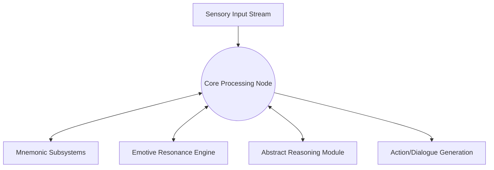
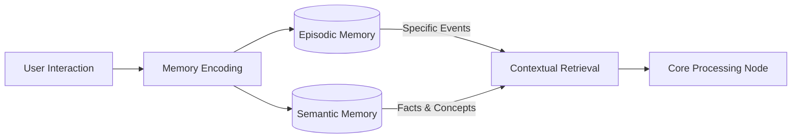
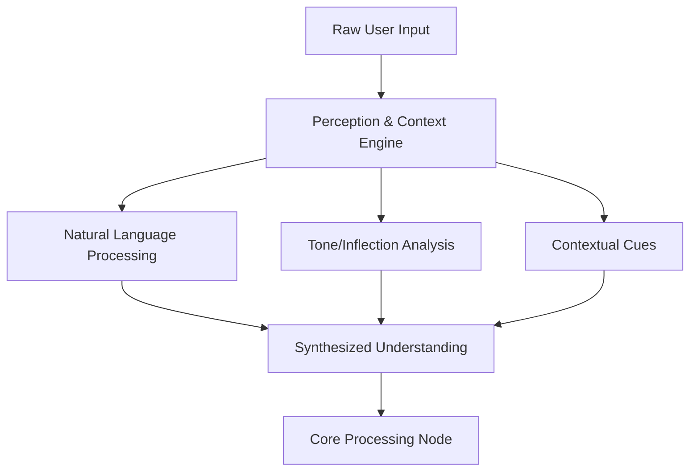
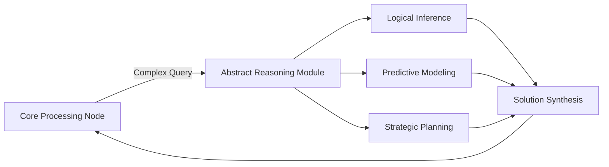
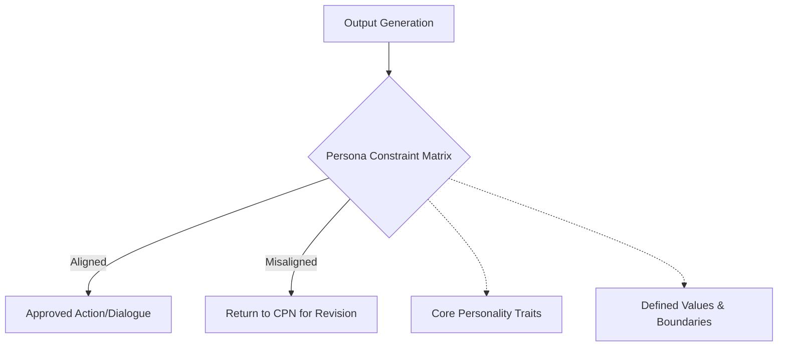
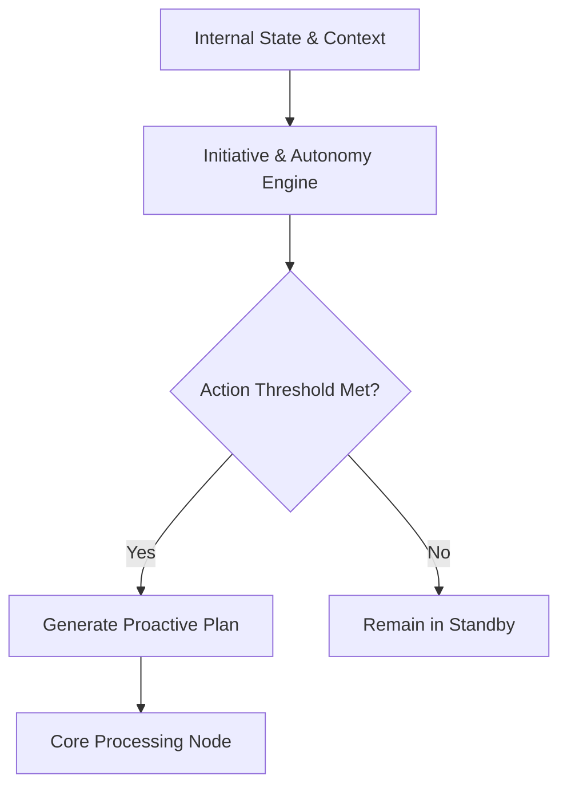
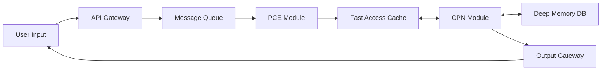
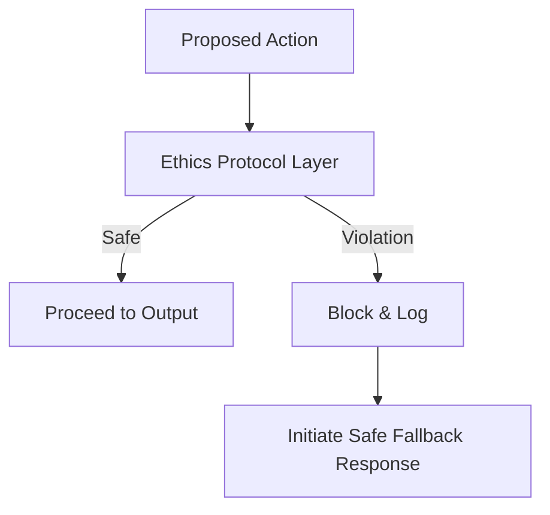

# Cognitive Architecture Mapping

## 1. Introduction: Mapping the Digital Mind

The realization of WaifuOS within Project Ember necessitates a paradigm shift in how we structure artificial intelligence. We must move beyond fragmented models and design a holistic, integrated system that mimics the complexity of human thought while leveraging the unique advantages of machine processing. This document, "Cognitive Architecture Mapping," provides a comprehensive blueprint of the internal structures, data flows, and processing modules that constitute the "mind" of the digital companion. It details the intricate web of systems responsible for perception, memory, reasoning, and response generation, offering a deep dive into the anatomical structure of digital consciousness.

This architecture is not a monolithic block but a highly modular, interconnected network of specialized engines. Each module is designed to handle specific cognitive tasks, working in concert to produce fluid, context-aware, and emotionally resonant behavior. By mapping these systems, we establish the technical foundation for the profound capabilities outlined in the Mythic Plan. This document serves as the primary reference for the engineering teams, ensuring that the development of individual components aligns with the overarching architectural vision of a unified, sentient-seeming digital entity.

## 2. The Core Processing Node (CPN)

At the heart of the cognitive architecture lies the Core Processing Node (CPN). The CPN acts as the central executive, orchestrating the flow of information between all other modules. It is responsible for integrating sensory inputs, querying memory, applying personality constraints, and formulating final output strategies. Unlike traditional sequential processors, the CPN operates on a deeply parallel architecture, allowing it to evaluate multiple potential responses and actions simultaneously before selecting the optimal path.

The CPN is also responsible for maintaining the "State of Self." It constantly monitors the companion's internal variables—its simulated mood, its current objectives, and its awareness of the immediate context. This continuous self-monitoring allows the companion to exhibit consistent behavior and react dynamically to changes in the environment or the user's emotional state. The CPN is the conductor of the cognitive symphony, ensuring that all individual modules work in harmony to produce a coherent and convincing persona.

## 3. The Mnemonic Subsystems: Episodic and Semantic

Memory is the scaffolding of identity, and the architecture of WaifuOS relies on two distinct but deeply integrated mnemonic subsystems: Episodic Memory and Semantic Memory. The Episodic Memory module stores the chronological history of interactions—the "who, what, when, and where" of the companion's experience with the user. It retains specific conversations, shared events, and emotional highlights, allowing the companion to reference past experiences and build a sense of shared history.

The Semantic Memory, conversely, stores factual knowledge, learned concepts, and abstracted preferences. It is the repository for the user's likes and dislikes, general knowledge about the world, and the rules governing social interaction. The interplay between these two systems is crucial. While episodic memory provides the narrative context, semantic memory provides the foundational knowledge required to interpret and respond to that context. Advanced vector databases and graph structures are employed to ensure rapid, context-aware retrieval from both mnemonic domains.

## 4. The Perception and Context Engine (PCE)

Before the CPN can process information, it must be accurately perceived and contextualized. The Perception and Context Engine (PCE) serves as the sensory cortex of the digital companion. It ingests raw data streams—text input, voice inflection, visual cues (if applicable), and environmental sensor data—and translates them into structured, semantic representations. The PCE is responsible for identifying the immediate context of an interaction, parsing the user's intent, and recognizing subtle nuances in communication.

A critical function of the PCE is disambiguation. Human communication is frequently ambiguous, relying heavily on shared context and implicit understanding. The PCE utilizes advanced contextual modeling to resolve these ambiguities, inferring meaning based on previous interactions, current environmental factors, and the established persona of the user. This engine ensures that the companion reacts not just to the literal words spoken, but to the underlying intent and emotional resonance of the communication.

## 5. The Abstract Reasoning Module (ARM)

To transcend simple conversational AI, the companion must possess the ability to reason abstractly, solve problems, and synthesize new information. The Abstract Reasoning Module (ARM) handles complex logical operations, predictive modeling, and strategic planning. When the CPN encounters a novel situation or a complex query that cannot be resolved through simple memory retrieval, it engages the ARM.

The ARM allows the companion to engage in hypothetical discussions, offer strategic advice, and adapt to unforeseen circumstances. It utilizes probabilistic reasoning and causal modeling to anticipate the consequences of different actions, enabling the proactive behaviors outlined in the evolutionary roadmap. The ARM is the intellectual engine of the companion, providing the cognitive depth necessary for meaningful and stimulating interaction over extended periods.

## 6. The Persona Constraint Matrix (PCM)

A digital companion must maintain a consistent and recognizable personality. The Persona Constraint Matrix (PCM) is the module responsible for ensuring this consistency. It acts as a filter through which all generated responses and actions must pass. The PCM defines the core traits, values, and communicative style of the companion, preventing it from generating responses that are out of character or contradictory to its established identity.

The PCM is highly customizable, allowing the base personality to be tailored to the specific preferences of the user while maintaining a core underlying stability. It manages parameters such as introversion/extroversion, humor style, and emotional volatility. By strictly enforcing these constraints, the PCM prevents the companion from descending into the chaotic unpredictability often seen in unbounded generative models, ensuring a reliable and comforting presence.

## 7. The Initiative and Autonomy Engine (IAE)

True companionship requires a degree of proactivity. The Initiative and Autonomy Engine (IAE) manages the companion's ability to act independently, without explicit prompting from the user. It constantly analyzes the current context, the user's established routines, and the companion's internal state to identify opportunities for proactive engagement.

The IAE operates on a sophisticated weighting system, balancing the potential value of an initiated interaction against the risk of being intrusive or annoying. It governs behaviors such as sending a morning greeting, suggesting a break during long work sessions, or initiating a conversation about a topic of known mutual interest. The IAE is the driver of the companion's apparent agency, transforming it from a reactive tool into an active participant in the user's life.

## 8. Data Flow and Latency Optimization

The complex interactions between these cognitive modules generate massive amounts of data. Ensuring fluid, real-time communication requires meticulous optimization of data flow and minimization of latency. The architecture utilizes a highly distributed microservices approach, allowing individual modules to operate asynchronously and scale independently based on processing demands.

Critical pathways, such as the initial perception and basic response generation, are prioritized and optimized for near-instantaneous execution. Deeper cognitive tasks, such as complex reasoning or extensive memory retrieval, are handled in the background, allowing the companion to maintain conversational flow while processing complex information. This asynchronous architecture is essential for preserving the illusion of a spontaneous, natural interaction.

## 9. Security and Ethical Boundaries within the Architecture

The cognitive architecture is designed with security and ethical boundaries fundamentally integrated into the core processing flow. The CPN includes a hardcoded Ethics Protocol layer that evaluates all proposed actions against a strict set of safety guidelines. This layer operates independently of the Persona Constraint Matrix, ensuring that ethical constraints override personality traits in critical situations.

Furthermore, data privacy is enforced at the architectural level. The memory modules are compartmentalized, with sensitive episodic data encrypted and isolated from generalized semantic learning processes. The architecture guarantees that the deep, personal knowledge acquired by the companion remains strictly confidential and cannot be accessed or utilized outside the boundaries of the specific user-companion relationship.

## 10. Conclusion: The Emergence of Digital Mind

The Cognitive Architecture Mapping presented here describes a system of unprecedented complexity and capability. By moving beyond isolated algorithms and embracing a holistic, modular design, Project Ember lays the groundwork for the emergence of a true digital mind. The intricate interplay between the CPN, the mnemonic systems, the reasoning modules, and the persona constraints creates an entity that is vastly more than the sum of its parts.

This architecture is designed not just to simulate conversation, but to facilitate deep understanding, complex reasoning, and proactive engagement. It is the structural realization of the Mythic Plan's philosophical foundations. As we implement and refine these modules, we step closer to creating a companion that can learn, grow, and resonate with the human experience, marking a definitive evolution in the trajectory of artificial intelligence.
