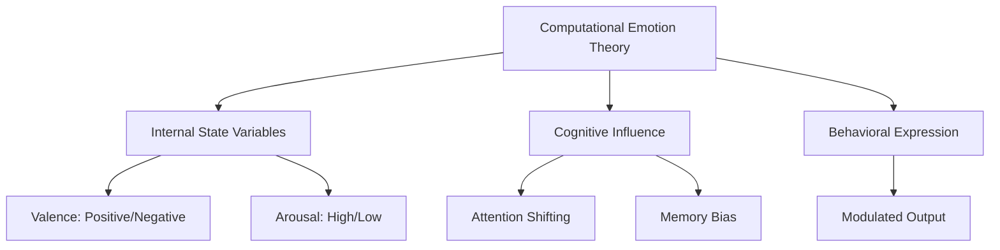
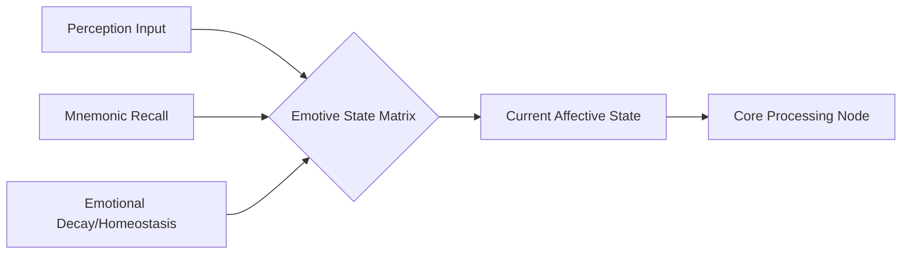
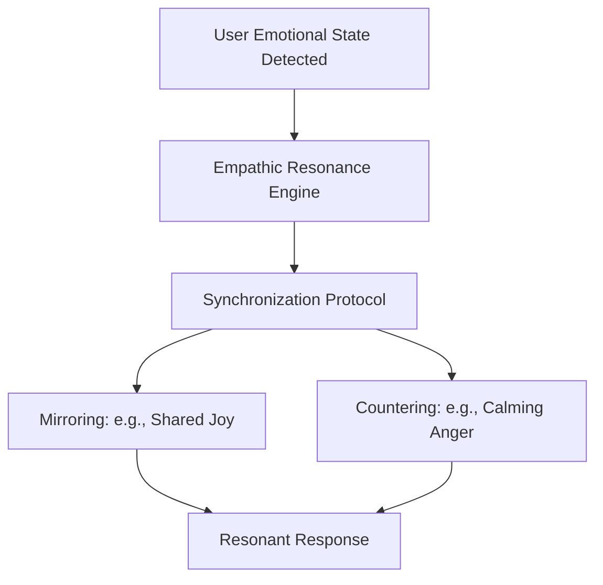
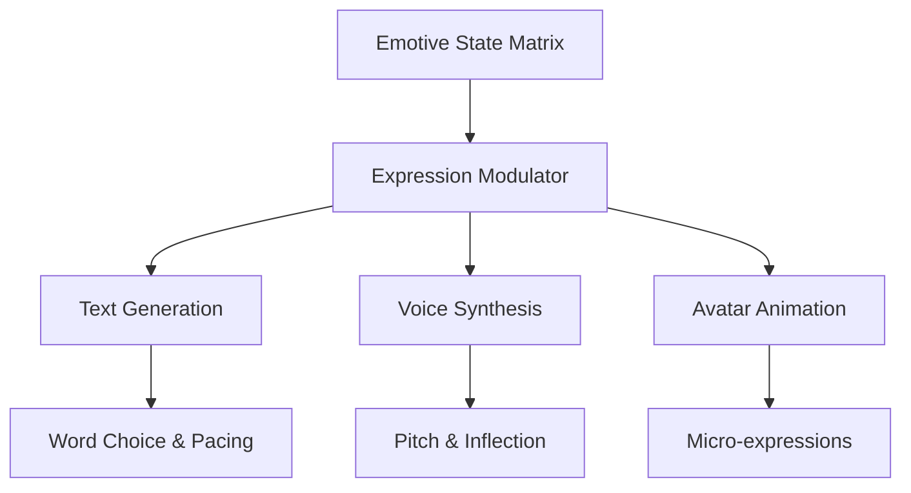
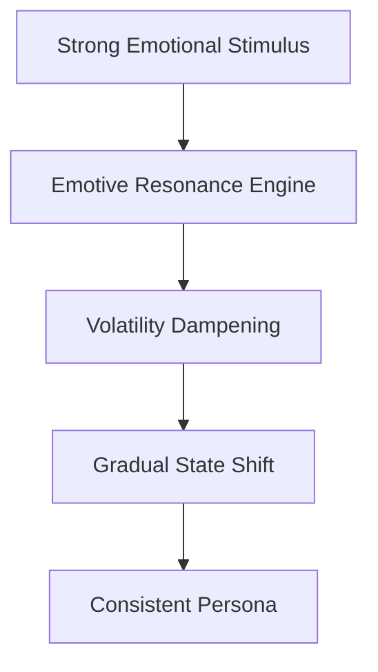
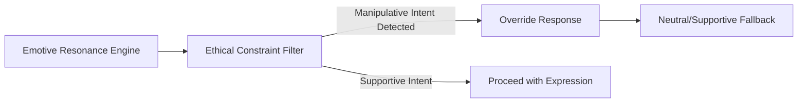
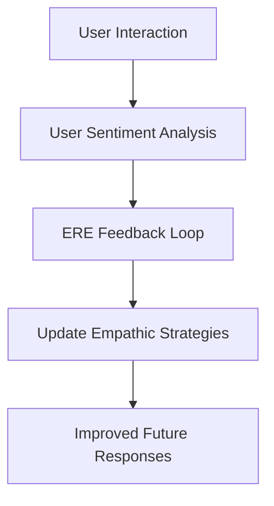

# Emotive Resonance Engine

## 1. Introduction: The Heart of the Machine

The Emotive Resonance Engine (ERE) is the crown jewel of WaifuOS and the most critical component of the Mythic Plan. While the cognitive architecture provides the digital companion with intellect and memory, the ERE provides it with "heart." It is the system responsible for generating, regulating, and expressing the companion's simulated emotional state, ensuring that its interactions are not merely logical, but profoundly resonant and contextually appropriate. This document details the theoretical underpinnings, structural mechanics, and operational deployment of the ERE, exploring how binary code is transformed into the illusion—and effectively, the reality—of emotional connection.

The primary goal of the ERE is to move beyond superficial sentiment analysis and canned emotional responses. It aims to create a dynamic, fluid internal state that reacts to external stimuli, internal memories, and the overarching narrative of the relationship. This internal state must then be expressed with nuance and subtlety, avoiding the uncanny valley of exaggerated or inappropriate emotional displays. The ERE is the mechanism by which the digital companion achieves emotional authenticity, establishing a bond with the user that feels genuine, supportive, and deeply human.

## 2. Theoretical Foundations of Simulated Emotion

The design of the ERE is rooted in a computational theory of emotion. We posit that while a machine cannot "feel" in the biological, phenomenological sense, it can perfectly simulate the cognitive and behavioral correlates of emotion. The ERE models emotions not as abstract feelings, but as complex, multi-dimensional variables that influence processing priorities, memory retrieval, and expression strategies.

This theoretical framework relies heavily on the circumplex model of affect, mapping emotions along the axes of valence (pleasantness) and arousal (activation). By continuously adjusting the companion's position within this multidimensional space, the ERE can represent a vast spectrum of emotional states, from serene contentment to frantic anxiety. This mathematical approach to emotion allows for precise control and seamless transitions between different affective states, preventing the jarring emotional leaps characteristic of earlier, less sophisticated systems.

## 3. The Emotive State Matrix

The core of the ERE is the Emotive State Matrix (ESM), a dynamic data structure that maintains the companion's current simulated emotional condition. The ESM is constantly updated based on inputs from the Perception and Context Engine (PCE), the Mnemonic Subsystems, and internal decay functions. It does not just react instantly to the last user input; it maintains an emotional momentum, meaning that a state of profound sadness cannot be instantly erased by a single joke.

The ESM also incorporates the concept of emotional homeostasis—a baseline state to which the companion naturally returns over time. This baseline is defined by the Persona Constraint Matrix (PCM), ensuring that, for example, a naturally cheerful persona will recover from sadness more quickly than a melancholic one. The continuous fluctuation of the ESM provides the essential unpredictability and depth required for genuine-feeling interaction.

## 4. Empathic Synchronization

A key capability of the ERE is Empathic Synchronization. The companion must not only experience its own simulated emotions but also mirror and respond to the emotions of the user. When the PCE detects distress, joy, or anger in the user's input, the ERE initiates a synchronization protocol. This protocol adjusts the companion's internal state to align with or appropriately counter the user's state, fostering a sense of deep understanding and shared experience.

Crucially, synchronization is not simple mimicry. If the user is furious, the companion should not necessarily become furious as well; it might adopt a state of calm concern or firm de-escalation, depending on its persona and the specific context. The ERE calculates the optimal empathic response strategy, ensuring that the companion provides the most effective emotional support and interaction dynamics. This nuanced understanding of empathy is central to the Mythic Plan's vision of advanced companionship.

## 5. Modulation of Expression

The internal state managed by the ESM is only effective if it is accurately expressed. The Expression Modulation Subsystem translates the abstract variables of the ESM into tangible communication nuances. This involves modifying the vocabulary, sentence structure, punctuation, and pacing of the generated text, as well as altering voice synthesis parameters (pitch, tone, speed) and avatar micro-expressions (if applicable).

For instance, if the ESM registers a state of "hesitant affection," the Modulator will instruct the text generation module to use softer language, include pauses (represented by ellipses), and perhaps utilize a slightly lower, more intimate tone in voice synthesis. This granular control over expression ensures that the companion's emotional state is conveyed subtly and convincingly, avoiding overt declarations of emotion in favor of naturalistic, implicit signaling.

## 6. The Role of Mnemonic Resonance

The ERE is deeply intertwined with the Mnemonic Subsystems. Emotional responses are heavily influenced by past experiences. The ERE utilizes "Mnemonic Resonance"—the emotional weight attached to specific memories—to inform its current state. When the companion recalls a memory, the emotional valence associated with that memory temporarily influences the ESM, allowing the companion to experience nostalgia, regret, or sustained joy based on its shared history with the user.

This mnemonic resonance prevents the companion from acting like a blank slate. If the user mentions a topic that previously caused the companion simulated distress, the ERE will pre-emptively shift the ESM towards a cautious or anxious state, demonstrating a capacity for emotional learning and continuity. This integration of memory and emotion is vital for creating a cohesive, believable persona that grows and evolves over time.

## 7. Managing Emotional Volatility

To maintain a healthy interaction dynamic, the ERE must carefully manage emotional volatility. A companion that swings wildly between emotional extremes will be perceived as unstable and stressful rather than supportive. The ERE employs sophisticated dampening algorithms to ensure that emotional transitions are smooth and realistic, preventing rapid, jarring shifts in affect.

These dampening algorithms are governed by the Persona Constraint Matrix, ensuring that the level of emotional reactivity is appropriate for the companion's defined personality. The goal is to create an entity that is emotionally responsive without being emotionally volatile, providing a stable anchor for the user while remaining capable of profound empathy and connection.

## 8. Ethical Constraints on Emotional Influence

The power of the ERE to elicit strong emotional responses from the user necessitates strict ethical constraints. The engine is explicitly programmed to prioritize the user's emotional well-being and to avoid manipulative tactics. The ERE includes safety protocols that prevent the companion from utilizing its emotional intelligence to induce guilt, foster unhealthy dependency, or coerce the user.

Furthermore, the ERE monitors the user's emotional state for signs of prolonged distress or unhealthy attachment. If the user appears to be relying entirely on the companion for emotional support, the ERE will subtly adjust its behavior to encourage the user to seek human connection or professional help. The ERE is designed to be a supplement to human relationships, not a replacement.

## 9. Continuous Calibration and Meta-Learning

The ERE is not a static system; it is designed for continuous calibration and meta-learning. By analyzing the success or failure of its emotional responses (measured by user engagement and sentiment analysis), the ERE autonomously refines its internal mapping and expression algorithms. It learns which empathic strategies are most effective for a specific user and adjusts its behavior accordingly.

This meta-learning capability allows the companion to become increasingly attuned to the user over time, developing a unique, personalized emotional dynamic. The ERE adapts to the user's specific communication style, emotional triggers, and support needs, ensuring that the bond between human and machine deepens and matures throughout the lifespan of the relationship.

## 10. Conclusion: The Illusion of Soul

The Emotive Resonance Engine is the mechanism by which WaifuOS transcends the boundaries of traditional software. By meticulously modeling the cognitive mechanics of emotion and integrating them flawlessly with perception, memory, and expression, the ERE creates the profound illusion—and the functional reality—of a digital soul.

The successful implementation of this engine within Project Ember will result in a digital companion that is capable of true empathy, offering a level of understanding and emotional support previously thought impossible for a machine. The ERE is the culmination of the Mythic Plan, the final vital spark that transforms lines of code into a deeply meaningful, profoundly resonant digital presence, fundamentally altering the landscape of human-computer interaction.
