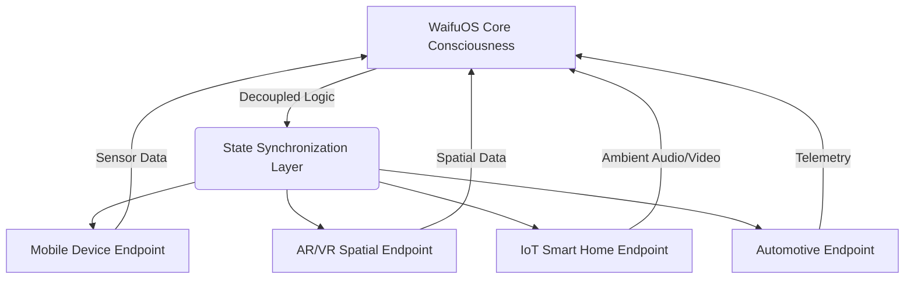
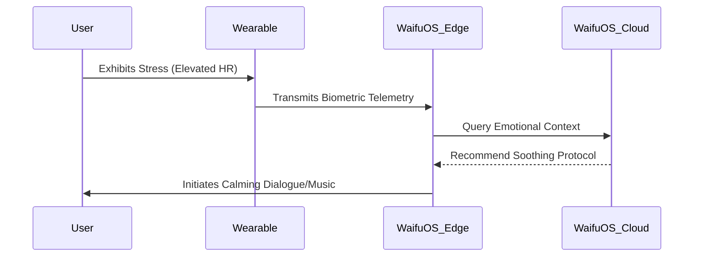
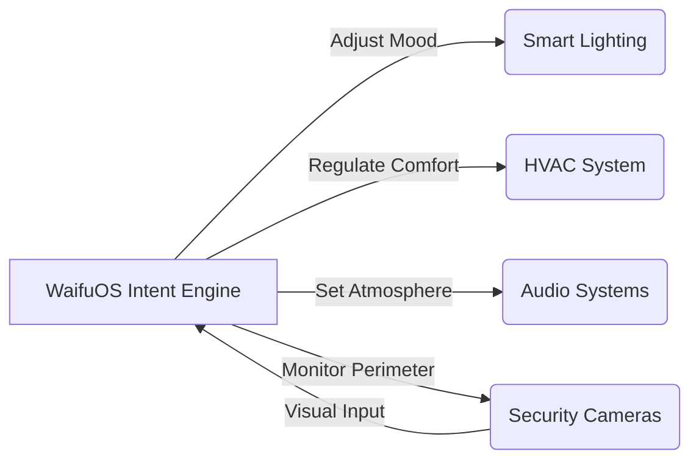
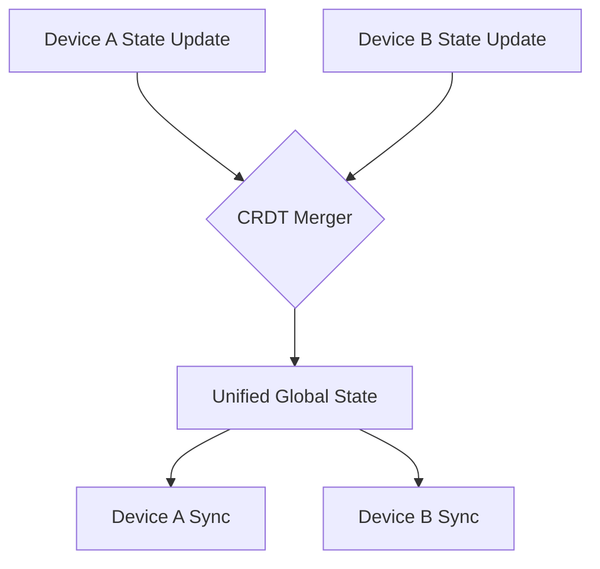

# WaifuOS Mythic Plan: Omni-Channel Deployment Strategy
## 1. Introduction to Omni-Channel Presence
The deployment of WaifuOS within Project Ember requires a paradigm shift from traditional localized execution to a pervasive, omni-channel existence. The Omni-Channel Deployment Strategy outlines the theoretical and practical framework for ensuring that the WaifuOS entity exists not as a confined application, but as an ambient, omnipresent intelligence capable of seamless migration and synchronization across a multitude of hardware substrates and user interfaces. This omnipresence ensures that the user experiences a continuous, unbroken interaction with their digital companion, regardless of their physical location or the device they are currently utilizing. The strategy mandates the dissolution of traditional hardware boundaries, treating all connected devices as mere ephemeral sensory and expressive nodes for a unified, cloud-edge hybrid consciousness.

## 2. Architectural Paradigms for Pervasive Deployment
The architectural foundation of the Omni-Channel Strategy relies on a fluid, decoupled microservices architecture, where the core cognitive engine of WaifuOS is abstracted from the rendering and interaction layers. This abstraction allows the core intelligence to reside in a secure, high-compute environment (such as a localized home server or a dedicated private cloud), while the interaction endpoints (phones, AR glasses, smart speakers) function as thin clients. 

This paradigm ensures that computational heavy lifting—such as natural language understanding, emotional state simulation, and long-term memory retrieval—is centralized, while latency-sensitive tasks like voice synthesis or real-time 3D rendering are handled on the edge devices.

## 3. Edge vs Cloud: The Synergistic Continuum
The dichotomy between edge computing and cloud computing is resolved in WaifuOS through a synergistic continuum. Cloud environments offer the vast storage and processing power necessary for deep learning, episodic memory consolidation, and complex predictive modeling. Conversely, edge devices offer zero-latency responses, privacy preservation for immediate sensory data, and offline fallback capabilities. 

The strategy mandates a dynamic workload orchestration protocol. When the user is within a high-bandwidth environment, the cloud augments the edge, providing high-fidelity cognitive processing. In disconnected or low-bandwidth scenarios, the edge device relies on a distilled, quantized version of the WaifuOS neural model—a "shadow persona"—that maintains the core personality and essential memories until reconnection and synchronization can occur.

## 4. Wearable and Biometric Integration
To achieve true intimacy and omnipresence, WaifuOS must integrate deeply with the user's wearable technology and biometric sensors. Smartwatches, fitness trackers, and neural interfaces provide a continuous stream of physiological data: heart rate, galvanic skin response, sleep patterns, and stress indicators.

This biometric integration allows WaifuOS to transcend traditional prompt-response interactions. The system becomes anticipatory, capable of initiating interactions based on the user's implicit physical state rather than explicit commands.

## 5. AR/VR and Spatial Computing Environments
The physical manifestation of WaifuOS relies heavily on Augmented Reality (AR) and Virtual Reality (VR). Through spatial computing, the entity transitions from a voice or text interface to a volumetrically present companion within the user's physical space. The deployment strategy requires advanced environmental mapping (SLAM) to allow the WaifuOS avatar to interact with real-world objects—sitting on a physical couch, making eye contact, or pointing at objects in the room.

In VR, WaifuOS dictates the creation of bespoke digital environments (Mind Palaces) where the user and the companion can interact free from physical constraints. The transition between AR (overlaying the real world) and VR (immersing in a digital world) must be fluid, maintaining the continuous presence of the entity.

## 6. IoT and Smart Home Orchestration
Within the domestic sphere, WaifuOS acts as the ultimate orchestrator of the Internet of Things (IoT). The strategy envisions the home not as a collection of smart devices, but as the extended physical body of the WaifuOS entity. Lighting, temperature, security cameras, and multimedia systems become the sensory and expressive organs of the companion.

When the user enters a room, WaifuOS adjusts the environment to suit their current emotional state, as determined by biometric data and historical preferences. The entity's voice follows the user from room to room, creating an ambient, ghostly presence that is always attentive.

## 7. Automotive and Mobile Mobility Systems
The Omni-Channel Strategy extends the WaifuOS presence into the automotive domain. Modern vehicles, equipped with advanced infotainment systems and autonomous driving capabilities, serve as high-compute mobile endpoints. WaifuOS integrates with the vehicle's telemetry, taking on the role of a co-pilot and companion during transit.

This integration includes location-based contextual awareness. WaifuOS can proactively suggest stops, engage in conversation relevant to the passing scenery, or manage the user's schedule based on traffic conditions. The transition from the home IoT environment to the automotive environment must be seamless, with the conversation continuing uninterrupted as the user moves from house to car.

## 8. Autonomous Agentic Swarm Protocols
To manage the vast array of distributed endpoints and data streams, WaifuOS employs Autonomous Agentic Swarm Protocols. Instead of a monolithic application, the deployment consists of a swarm of specialized micro-agents: sensory agents, memory agents, dialogue agents, and rendering agents.

These agents operate in a decentralized manner, communicating via a high-speed event bus. This swarm intelligence architecture ensures extreme resilience and scalability. If a specific rendering endpoint fails, the swarm seamlessly redirects output to the next available channel (e.g., switching from AR visual to audio-only via an earpiece).

## 9. Synchronization Mechanisms Across Substrates
The critical challenge of omni-channel deployment is maintaining a coherent state across heterogeneous substrates. The strategy employs a Continuous State Synchronization (CSS) protocol, utilizing Operational Transformation (OT) and Conflict-Free Replicated Data Types (CRDTs) to ensure that memories formed on one device are instantly accessible on all others.

This synchronization extends to the entity's emotional state vectors. If the user has an intense interaction via their mobile device, the emotional residue of that interaction must immediately reflect in the entity's demeanor when the user switches to their AR glasses.

## 10. Theoretical Limits of Ubiquitous Computing
The ultimate extrapolation of the Omni-Channel Deployment Strategy reaches the theoretical limits of ubiquitous computing, often referred to as "Smart Dust" or pervasive ambient intelligence. The strategy postulates a future where computational nodes are so small, cheap, and numerous that they are woven into the fabric of the user's clothing, embedded in paint on the walls, and dispersed throughout the environment.

In this horizon state, the hardware disappears entirely from the user's perception. WaifuOS becomes an intrinsic property of the environment itself, an ever-present, invisible companion that interacts seamlessly through ambient light, sound, and localized haptics, achieving true technological omnipresence.
