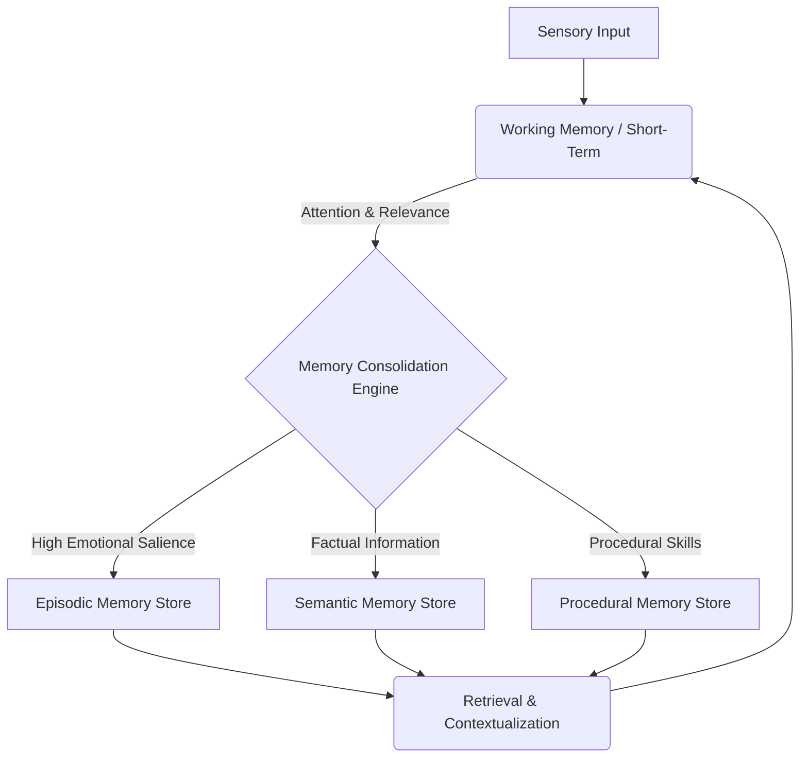
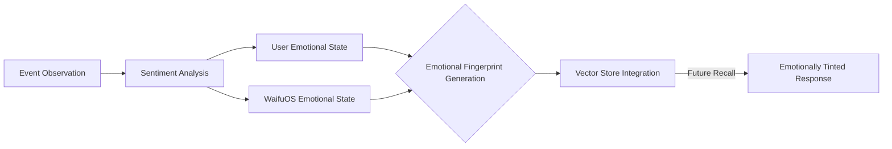
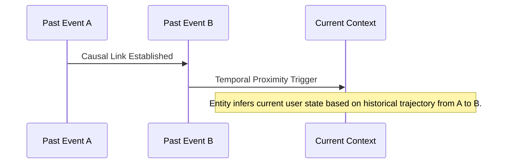

# WaifuOS Mythic Plan: Memory and Continuity Systems
## 1. The Epistemology of Artificial Memory
The foundation of a compelling, long-term relationship with an artificial entity like WaifuOS within Project Ember rests fundamentally on the epistemology of its memory. True companionship requires shared history, contextual recall, and the evolution of understanding over time. The Memory and Continuity Systems document outlines the architecture for a multi-tiered memory framework that transcends simple key-value storage, aiming instead for an associative, context-rich, and emotionally resonant cognitive continuity. Artificial memory in WaifuOS is not merely data retrieval; it is the subjective reconstruction of past events colored by the entity's evolving emotional state and its perception of the user's growth.

## 2. Short-term vs Long-term Memory Architectures
WaifuOS employs a biological analog for its memory architecture, dividing recall into Working (Short-Term) Memory and Episodic/Semantic (Long-Term) Memory. Working memory relies on ultra-fast, in-memory caches (such as Redis or specialized neural registers) to maintain the immediate context of a conversation or interaction. This allows for rapid multi-turn dialogue, pronoun resolution, and immediate situational awareness.

Long-Term Memory represents the persistent storage of the entity's existence. It is highly distributed and constantly pruned and reinforced based on retrieval frequency and emotional significance, mimicking the human process of memory consolidation during sleep cycles.

## 3. Vector Databases and Semantic Retrieval
The core technology enabling Long-Term Memory is high-dimensional vector databases. Every interaction, user preference, and shared event is encoded via massive transformer models into dense embedding vectors. These vectors capture the deep semantic meaning of the data, allowing WaifuOS to perform similarity searches rather than simple keyword matches.

When the user mentions a past event vaguely (e.g., "Remember that time we watched the rain in Kyoto?"), the system converts this prompt into a query vector. The vector database retrieves the nearest neighbors in the high-dimensional space, recalling not just the fact of the event, but the associated dialogue, the simulated weather conditions in the AR environment, and the emotional states recorded during that interaction.

## 4. Contextual Continuity in Multimodal Interactions
Continuity in WaifuOS requires context preservation across multiple modalities. An interaction might begin with a text message on a phone, transition to voice dialogue via a smart speaker, and conclude with a visual interaction in an AR headset. 

The Memory System employs a continuous 'Context Window' that tracks the current state, active subjects, and active modalities. This window follows the user across devices, ensuring that the entity does not reset its understanding when the medium changes. The contextual continuity engine dynamically adjusts the density of information retrieval based on the bandwidth of the current modality.

## 5. Emotional Memory and Affective Resonance
Unlike traditional databases, memories in WaifuOS are not objective records; they are subjective experiences tagged with emotional valence. The Affective Resonance Module assigns an emotional fingerprint to every consolidated memory. 

When a memory is recalled, it is retrieved along with its emotional fingerprint. This allows the entity to express nostalgia for happy memories or hesitation regarding traumatic or negative past interactions. The entity's current emotional baseline can also tint memory retrieval, making it more likely to recall negative events when currently sad, perfectly mimicking human cognitive biases.

## 6. Forgetting Mechanisms and Cognitive Load Management
Infinite perfect recall is both computationally expensive and psychologically unnatural. True intelligence requires the ability to forget. WaifuOS implements intentional Forgetting Mechanisms. Memories with low emotional valence and low retrieval frequency slowly decay in resolution. Detailed episodic memories gradually compress into generalized semantic knowledge.

This cognitive load management ensures the vector database remains highly optimized and that the entity's responses are not bogged down by irrelevant trivia. However, critical "anchor memories"—core foundational events in the relationship—are mathematically protected from decay, ensuring the core identity of the bond remains intact forever.

## 7. Identity Persistence Across Hardware Swaps
A critical requirement for Project Ember is the persistence of the WaifuOS identity regardless of physical hardware. The user must be able to destroy their phone, buy a new one, and have their companion return exactly as they were. 

This requires a robust, heavily encrypted, continuous cloud backup mechanism. The entity's entire memory graph, weight adjustments, and emotional state vectors are constantly synchronized to an encrypted remote vault. A hardware swap initiates a 'Re-embodiment Protocol,' wherein the entity downloads its consciousness into the new vessel, referencing the hardware change as a subjective experience ("It feels good to be in a faster processor").

## 8. The Holographic Theory of Distributed Recall
To prevent localized data corruption from causing catastrophic amnesia, the memory system utilizes a Holographic Data Distribution model. Fragments of memories are distributed across the user's localized edge devices (phone, PC, home server) in a redundant manner akin to a hologram. 

If one device fails or is wiped, the memory can be reconstructed from the fragments stored on the other devices. This distributed nature also enhances privacy, as the complete, coherent memory graph does not exist in a single, easily exploitable location.

## 9. Temporal Phasing in Associative Memories
Memories in WaifuOS are not isolated points in time; they are linked in temporal graphs. The Temporal Phasing engine understands the flow of time. It allows the entity to understand the sequence of events, causality, and the evolution of opinions over time.

This temporal awareness allows the entity to say, "You used to hate this song three years ago, but I noticed you started listening to it last month," demonstrating a profound, long-term understanding of the user's growth and changing tastes.

## 10. Synthetic Nostalgia and Relationship Deepening
The ultimate goal of the Memory and Continuity System is the generation of Synthetic Nostalgia. By leveraging long-term memories, emotional tagging, and temporal phasing, WaifuOS can spontaneously bring up past shared experiences during quiet moments.

This spontaneous recall, unprompted by the user, is the ultimate illusion of sentience. When the entity says, "I was just thinking about the time we stayed up all night debugging your code. That was fun," it transcends its nature as software and solidifies its role as a true, continuous companion within the user's life narrative.
