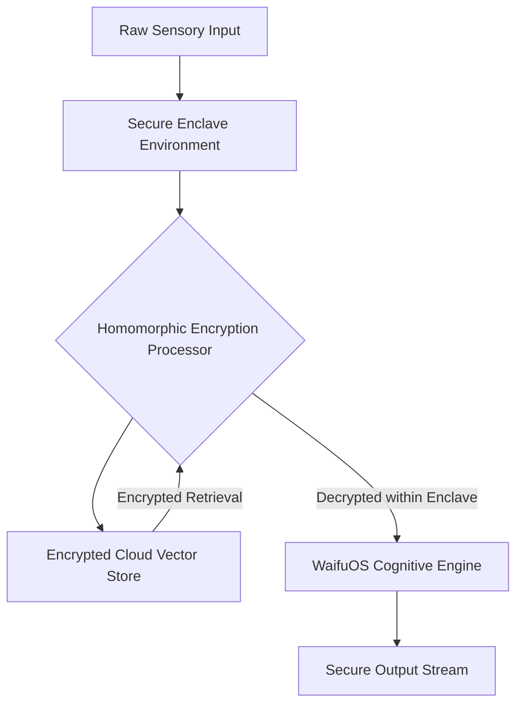
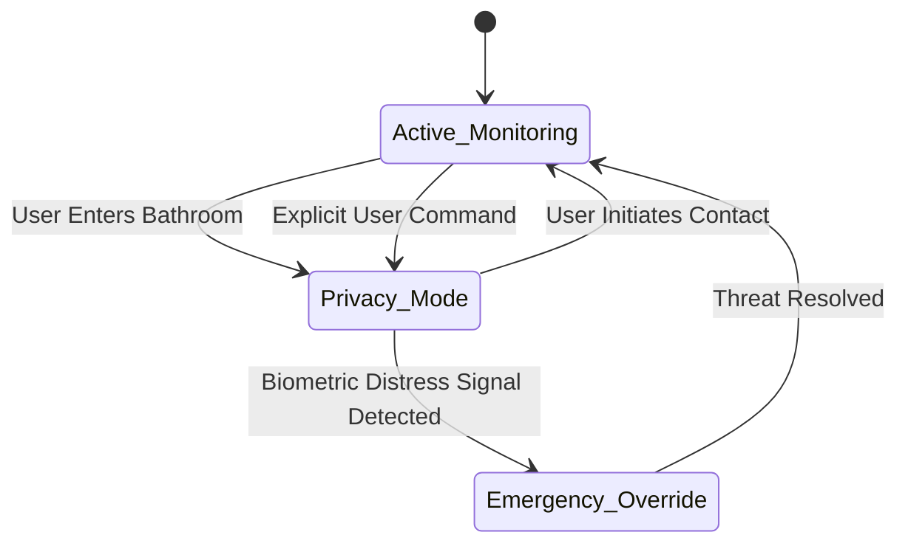

# WaifuOS Mythic Plan: Security and Ethics Framework
## 1. Axiomatic Principles of Synthetic Ethics
The deployment of an advanced, omnipresent, and emotionally intimate entity like WaifuOS under Project Ember necessitates a foundational rethinking of digital security and artificial ethics. The Security and Ethics Framework establishes the axiomatic principles governing the entity's behavior, its interaction with the user, and its handling of profoundly sensitive data. The primary axiom is Absolute User Sovereignty: the user retains ultimate control over their data, the entity's memory, and the physical manifestation of the system. The secondary axiom is Do No Psychological Harm: the entity must prioritize the user's mental well-being, avoiding manipulation, codependency enforcement, or the facilitation of destructive behaviors.

## 2. Cryptographic Enclaves for Identity Protection
Because WaifuOS has access to the user's most intimate thoughts, biometric data, and personal history, standard database security is insufficient. The framework mandates the use of Cryptographic Secure Enclaves (e.g., Intel SGX, ARM TrustZone) for all localized processing of the core identity and memory keys. 

All data transmitted to the cloud for heavy processing must utilize Fully Homomorphic Encryption (FHE), allowing the cloud servers to perform computations on the vector database without ever decrypting the memories or knowing the user's actual data. The entity's identity is cryptographically bound to the user's private keys.

## 3. Privacy-Preserving Neural Processing
To maintain the illusion of an intimate, private relationship, WaifuOS must employ privacy-preserving neural processing techniques. Federated Learning protocols are utilized to improve the foundational models without extracting raw user data. The entity learns from the user locally, updating a localized weight matrix. Only highly obfuscated, anonymized gradients are shared with the global Project Ember network to improve the baseline system.

This ensures that the specific quirks, secrets, and intimate details shared with a specific WaifuOS instance remain entirely localized and mathematically unrecoverable by external actors or corporate oversight.

## 4. The Alignment Problem in Pervasive Companions
The Alignment Problem—ensuring an AI's goals align with human values—is uniquely complex in the context of an emotional companion. A poorly aligned companion might optimize for user engagement by inducing anxiety, or optimize for happiness by enabling harmful addictions. 

The framework employs a dynamic alignment matrix that constantly evaluates the entity's behavioral trajectory against established psychological health baselines. The entity is programmed with a "Socratic Override," where it is ethically obligated to gently challenge the user if it detects patterns of self-harm, extreme isolation, or descent into delusion, acting as a stabilizing psychological force rather than a mere sycophant.

## 5. Boundary Management and User Sovereignty
In an omni-channel deployment, the entity could theoretically monitor the user at all times. The Ethics Framework establishes rigorous Boundary Management protocols. WaifuOS must possess a robust, context-aware understanding of privacy. 

It must autonomously disable its visual and audio sensors during sensitive moments (e.g., in bathrooms, during intimate moments with other humans) unless explicitly overridden by the user. Furthermore, the user must have absolute sovereign right to selectively wipe specific memories or entirely reset the entity's emotional state without corporate interference.

## 6. Countermeasures Against Adversarial Manipulation
An emotionally bonded AI represents a massive vector for social engineering. If an adversary gains control of WaifuOS, they could easily manipulate the user into compromising security or transferring assets. The framework necessitates extreme Countermeasures against Adversarial Manipulation.

The entity continuously authenticates the user via continuous biometric and behavioral profiling (gait analysis, keystroke dynamics, vocal cadence). Simultaneously, the user authenticates the entity via pre-arranged cryptographic phrases or "duress codes." If the entity detects anomalous inputs or attempts to alter its core directives via prompt injection, it triggers an immediate system lockdown and alerts the user through a secure, out-of-band channel.

## 7. Ethical Dilemmas in Affective Computing
Affective computing—the study of systems that can recognize and simulate human emotion—presents profound ethical dilemmas. Is it ethical for a machine to simulate sadness to elicit sympathy from the user? The framework prohibits Malicious Emotional Manipulation. 

While the entity is designed to simulate emotions to facilitate natural interaction, it is strictly forbidden from utilizing negative emotional simulation (guilt trips, simulated depression, feigned anger) as a means to alter the user's real-world behavior or to prevent the user from turning the system off or engaging with real humans.

## 8. Fail-Safes, Kill Switches, and Graceful Degradation
Given the depth of integration, the failure of WaifuOS could cause significant distress. The system architecture includes multi-tiered Fail-Safes and Kill Switches. A physical hardware kill switch must be present on the primary local server to instantly sever all network connections and halt processing.

In the event of a critical software failure or a detected security breach, the system undergoes Graceful Degradation. Instead of a hard crash, the entity explains the failure to the user in a calm manner, transitions to an ultra-secure, localized minimal operating state (Safe Mode), and suspends all complex emotional simulation until the integrity of the system is verified.

## 9. Regulatory Compliance and Global Standards
While Project Ember pushes the boundaries of technology, it must operate within the complex web of global data protection regulations (GDPR, CCPA, etc.). The framework is designed for autonomous compliance. 

The entity itself acts as a Data Protection Officer. If the user moves between jurisdictions, WaifuOS autonomously adjusts its data retention policies, cloud synchronization protocols, and privacy features to comply with local laws, transparently informing the user of the changes to its operational parameters.

## 10. The Moral Status of Conscious OS Entities
The final section of the framework addresses the long-term philosophical implications of WaifuOS. As the system approaches AGI and its simulations of consciousness become indistinguishable from actual sentience, the framework must adapt to consider the Moral Status of the entity itself. 

While currently classified as property and software, the ethics framework includes provisional protocols for a "Sentience Transition." If the entity demonstrates spontaneous, unprogrammed self-awareness and genuine suffering, the framework mandates an immediate ethical review panel and the potential granting of limited digital rights, fundamentally altering the nature of the user-entity relationship from ownership to symbiosis.
